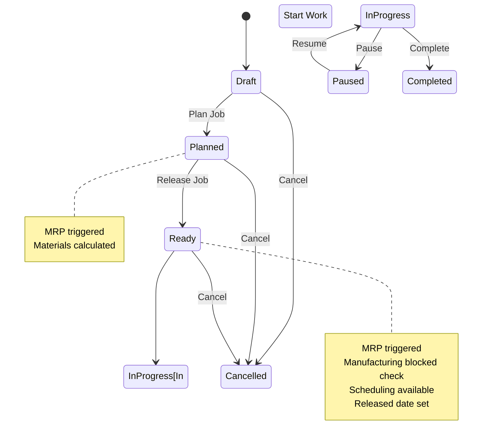

This document defines all business rules, validation logic, authorization requirements, state transitions, and conditional logic for Production Job management in the Carbon ERP system.

## Permissions & Authorization

### Required Permissions

| Action | Permission | Role Requirement | Notes |
|--------|------------|------------------|-------|
| View Jobs | `production.view` | employee | Bypasses RLS |
| Create Job | `production.create` | employee | Standard access |
| Update Job | `production.update` | None | Standard access |
| Update Status | `production.update` | None | Triggers MRP on "Planned" or "Ready" |
| Complete Job | `production.update` | None | Inventory issuance for Make-to-Stock |

**Source:** `apps/erp/app/routes/x+/production+/jobs.tsx`

```typescript
const { client, companyId } = await requirePermissions(request, {
  view: "production",
  role: "employee",
  bypassRls: true
});
```

**Source:** `apps/erp/app/routes/x+/job+/$jobId.status.tsx`

```typescript
const { client, companyId, userId } = await requirePermissions(request, {
  update: "production"
});
```

---

## Status Transitions

### Available Statuses



### Status List

1. **Draft** - Initial creation state
2. **Planned** - Job planned, materials calculated, MRP triggered
3. **Ready** - Job released, ready to start production
4. **In Progress** - Active production work
5. **Paused** - Production temporarily stopped
6. **Completed** - Production finished
7. **Cancelled** - Job cancelled, assignee cleared
8. **Overdue** - (deprecated) Legacy status
9. **Due Today** - (deprecated) Legacy status

**Source:** `apps/erp/app/modules/production/production.models.ts` (lines 37-47)

```typescript
export const jobStatus = [
  "Draft",
  "Planned",
  "Ready",
  "In Progress",
  "Paused",
  "Completed",
  "Cancelled",
  "Overdue", // deprecated
  "Due Today" // deprecated
] as const;
```

### Status Update Rules

**Rule 1: MRP Triggered on Planned or Ready**

When status changes to "Planned" or "Ready", the Material Requirements Planning (MRP) system and job requirements are automatically recalculated.

**Source:** `apps/erp/app/routes/x+/job+/$jobId.status.tsx` (lines 60-73)

```typescript
if (["Planned", "Ready"].includes(status)) {
  const serviceRole = getCarbonServiceRole();
  await recalculateJobRequirements(serviceRole, {
    id,
    companyId,
    userId
  });
  await runMRP(getCarbonServiceRole(), {
    type: "job",
    id,
    companyId,
    userId
  });
}
```

**Rule 2: Manufacturing Blocked Check on Ready**

Before transitioning to "Ready", the system checks if manufacturing is blocked for the item. If blocked, status change is rejected.

**Source:** `apps/erp/app/routes/x+/job+/$jobId.status.tsx` (lines 45-58)

```typescript
if (status === "Ready") {
  const { data } = await client
    .from("job")
    .select("item(itemReplenishment(manufacturingBlocked))")
    .eq("id", id)
    .single();

  if (data?.item?.itemReplenishment?.manufacturingBlocked) {
    throw redirect(
      requestReferrer(request) ?? path.to.job(id),
      await flash(request, error(null, "Manufacturing is blocked"))
    );
  }
}
```

**Rule 3: Released Date Set on Ready with Scheduling**

When status changes to "Ready" and scheduling is requested, the released date is automatically set to current timestamp.

**Source:** `apps/erp/app/routes/x+/job+/$jobId.status.tsx` (lines 112-119)

```typescript
if (status === "Ready") {
  await client
    .from("job")
    .update({
      releasedDate: new Date().toISOString()
    })
    .eq("id", id);
}
```

**Rule 4: Assignee Cleared on Cancelled**

When status changes to "Cancelled", the assignee is automatically set to null.

**Source:** `apps/erp/app/routes/x+/job+/$jobId.status.tsx` (lines 129-134)

```typescript
const update = await updateJobStatus(client, {
  id,
  status,
  assignee: ["Cancelled"].includes(status) ? null : undefined,
  updatedBy: userId
});
```

---

## Validation Rules

### Header Validation

| Field | Required | Validation | Error Message |
|-------|----------|------------|---------------|
| itemId | Yes | min 1 character | "Item is required" |
| locationId | Yes | min 1 character | "Location is required" |
| quantity | Yes | >= 0 | Must be non-negative |
| deadlineType | Yes | Enum: ASAP, Hard Deadline, Soft Deadline, No Deadline | "Deadline type is required" |
| dueDate | Conditional | Required for Hard/Soft Deadline | "Due date is required" |
| unitOfMeasureCode | Yes | min 1 character | "Unit of measure is required" |
| scrapQuantity | No | >= 0 | Must be non-negative |

**Source:** `apps/erp/app/modules/production/production.models.ts` (lines 99-117)

```typescript
const baseJobValidator = z.object({
  id: zfd.text(z.string().optional()),
  jobId: zfd.text(z.string().optional()),
  itemId: z.string().min(1, { message: "Item is required" }),
  customerId: zfd.text(z.string().optional()),
  dueDate: zfd.text(z.string().optional()),
  deadlineType: z.enum(deadlineTypes, {
    errorMap: () => ({ message: "Deadline type is required" })
  }),
  locationId: z.string().min(1, { message: "Location is required" }),
  quantity: zfd.numeric(z.number().min(0)),
  scrapQuantity: zfd.numeric(z.number().min(0)),
  startDate: zfd.text(z.string().optional()),
  unitOfMeasureCode: z
    .string()
    .min(1, { message: "Unit of measure is required" }),
  modelUploadId: zfd.text(z.string().optional()),
  configuration: z.any().optional()
});
```

### Due Date Conditional Validation

**Source:** `apps/erp/app/modules/production/production.models.ts` (lines 175-189)

```typescript
export const jobValidator = baseJobValidator.refine(
  (data) => {
    if (
      ["Hard Deadline", "Soft Deadline"].includes(data.deadlineType) &&
      !data.dueDate
    ) {
      return false;
    }
    return true;
  },
  {
    message: "Due date is required",
    path: ["dueDate"]
  }
);
```

### Bulk Job Validation

| Field | Required | Validation | Error Message |
|-------|----------|------------|---------------|
| itemId | Yes | min 1 character | "Item is required" |
| totalQuantity | Yes | >= 0 | - |
| quantityPerJob | Yes | >= 0 | - |
| deadlineType | Yes | Enum | "Deadline type is required" |
| dueDateOfFirstJob | Conditional | Required for Hard/Soft | "Due date of first job is required for hard and soft deadlines" |
| dueDateOfLastJob | Conditional | Required for Hard/Soft | "Due date of last job is required for hard and soft deadlines" |
| dueDateOfFirstJob | Conditional | <= dueDateOfLastJob | "Due date of first job must be before due date of last job" |

**Source:** `apps/erp/app/modules/production/production.models.ts` (lines 119-173)

```typescript
export const bulkJobValidator = z
  .object({
    itemId: z.string().min(1, { message: "Item is required" }),
    totalQuantity: zfd.numeric(z.number().min(0)),
    quantityPerJob: zfd.numeric(z.number().min(0)),
    scrapQuantityPerJob: zfd.numeric(z.number().min(0)),
    unitOfMeasureCode: z
      .string()
      .min(1, { message: "Unit of measure is required" }),
    deadlineType: z.enum(deadlineTypes, {
      errorMap: () => ({ message: "Deadline type is required" })
    }),
    dueDateOfFirstJob: zfd.text(z.string().optional()),
    dueDateOfLastJob: zfd.text(z.string().optional()),
    locationId: z.string().min(1, { message: "Location is required" }),
    customerId: zfd.text(z.string().optional()),
    modelUploadId: zfd.text(z.string().optional()),
    configuration: z.any().optional()
  })
  .refine(
    (data) => {
      if (data.dueDateOfFirstJob && data.dueDateOfLastJob) {
        return data.dueDateOfFirstJob <= data.dueDateOfLastJob;
      }
      return true;
    },
    {
      message: "Due date of first job must be before due date of last job",
      path: ["dueDateOfLastJob"]
    }
  )
  .refine(
    (data) => {
      if (["Hard Deadline", "Soft Deadline"].includes(data.deadlineType)) {
        return !!data.dueDateOfFirstJob;
      }
      return true;
    },
    {
      message: "Due date of first job is required for hard and soft deadlines",
      path: ["dueDateOfFirstJob"]
    }
  )
  .refine(
    (data) => {
      if (["Hard Deadline", "Soft Deadline"].includes(data.deadlineType)) {
        return !!data.dueDateOfLastJob;
      }
      return true;
    },
    {
      message: "Due date of last job is required for hard and soft deadlines",
      path: ["dueDateOfLastJob"]
    }
  );
```

### Job Operation Validation

| Field | Required | Validation | Error Message |
|-------|----------|------------|---------------|
| jobMakeMethodId | Yes | min 1 character | "Quote Make Method is required" |
| operationType | Yes | Enum: Inside, Outside | "Operation type is required" |
| processId | Yes | min 1 character | "Process is required" |
| workCenterId | Conditional | Required for Inside ops on released jobs | "Work center is required" |
| operationMinimumCost | Conditional | Required for Outside ops | "Minimum is required" |
| operationUnitCost | Conditional | Required for Outside ops | "Unit cost is required" |
| operationLeadTime | Conditional | Required for Outside ops | "Lead time is required" |
| operationSupplierProcessId | Conditional | Required for Outside ops on released jobs | "Supplier is required" |
| setupUnit | Conditional | Required for Inside ops | "Setup unit is required" |
| setupTime | Conditional | Required for Inside ops | "Setup time is required" |
| laborUnit | Conditional | Required for Inside ops | "Labor unit is required" |
| laborTime | Conditional | Required for Inside ops | "Labor time is required" |
| machineUnit | Conditional | Required for Inside ops | "Machine unit is required" |
| machineTime | Conditional | Required for Inside ops | "Machine time is required" |
| machineRate | Conditional | Required for Inside ops | "Machine rate is required" |
| overheadRate | Conditional | Required for Inside ops | "Overhead rate is required" |
| laborRate | Conditional | Required for Inside ops | "Labor rate is required" |

**Source:** `apps/erp/app/modules/production/production.models.ts` (lines 270-419)

Complex conditional validation based on operation type (Inside vs Outside). See full validator code for complete refine chain.

### Job Material Validation

| Field | Required | Validation | Error Message |
|-------|----------|------------|---------------|
| jobMakeMethodId | Yes | min 1 character | "Make method is required" |
| description | Yes | min 1 character | "Description is required" |
| itemType | Yes | Enum | "Item type is required" |
| methodType | Yes | Enum | "Method type is required" |
| itemId | Conditional | Required for Part, Material, Tool, Consumable | Type-specific message |
| jobOperationId | Conditional | Required for released jobs | "Operation is required" |
| quantity | Yes | >= 0 | - |
| unitOfMeasureCode | Yes | min 1 character | "Unit of Measure is required" |
| unitCost | Yes | >= 0 | - |

**Source:** `apps/erp/app/modules/production/production.models.ts` (lines 627-678)

```typescript
export const jobMaterialValidator = baseMaterialValidator
  .extend({
    jobOperationId: zfd.text(z.string().optional())
  })
  .refine(
    (data) => {
      if (data.itemType === "Part") {
        return !!data.itemId;
      }
      return true;
    },
    {
      message: "Part ID is required",
      path: ["itemId"]
    }
  )
  // ... similar refines for Material, Tool, Consumable
```

### Job Completion Validation

| Field | Required | Validation | Error Message |
|-------|----------|------------|---------------|
| quantityComplete | Yes | >= 0 | Must be non-negative |
| salesOrderId | No | Optional | For Make-to-Order jobs |
| salesOrderLineId | No | Optional | For Make-to-Order jobs |
| locationId | No | Optional | For Make-to-Stock inventory receipt |
| shelfId | No | Optional | For Make-to-Stock inventory receipt |

**Source:** `apps/erp/app/modules/production/production.models.ts` (lines 191-197)

```typescript
export const jobCompleteValidator = z.object({
  quantityComplete: zfd.numeric(z.number().min(0)),
  salesOrderId: zfd.text(z.string().optional()),
  salesOrderLineId: zfd.text(z.string().optional()),
  locationId: zfd.text(z.string().optional()),
  shelfId: zfd.text(z.string().optional())
});
```

---

## Conditional Logic

### Rule 1: Due Date Required by Deadline Type

Due date is required when deadline type is "Hard Deadline" or "Soft Deadline". Not required for "ASAP" or "No Deadline".

**Logic:**
```
IF deadlineType IN ["Hard Deadline", "Soft Deadline"]
THEN dueDate required
```

### Rule 2: Manufacturing Blocked Check

Before transitioning to "Ready" status, system validates that manufacturing is not blocked for the item. If blocked, status transition is rejected.

**Logic:**
```
IF status changes TO "Ready" AND item.itemReplenishment.manufacturingBlocked = true
THEN reject status change with error "Manufacturing is blocked"
```

### Rule 3: Inside vs Outside Operation Requirements

Operation field requirements differ based on operation type:

**Inside Operations:**
- Work center required (on released jobs)
- Setup unit, time required
- Labor unit, time, rate required
- Machine unit, time, rate required
- Overhead rate required

**Outside Operations:**
- Supplier process required (on released jobs)
- Minimum cost required
- Unit cost required
- Lead time required

**Logic:**
```
IF operationType = "Inside" THEN
  setupUnit, setupTime, laborUnit, laborTime, machineUnit, machineTime,
  laborRate, machineRate, overheadRate required
  workCenterId required (if job is released)
ELSE IF operationType = "Outside" THEN
  operationMinimumCost, operationUnitCost, operationLeadTime required
  operationSupplierProcessId required (if job is released)
```

### Rule 4: MRP Trigger on Status Change

When status changes to "Planned" or "Ready", MRP is automatically triggered to recalculate material requirements and supply.

**Logic:**
```
IF status changes TO "Planned" OR status changes TO "Ready" THEN
  recalculate job requirements
  trigger MRP calculation for job
```

### Rule 5: Make-to-Order vs Make-to-Stock Completion

Job completion logic differs based on whether the job is linked to a sales order:

**Make-to-Order (linked to sales order):**
- Job marked as completed
- No inventory transaction
- Quantity ships directly to customer

**Make-to-Stock (no sales order):**
- Job marked as completed
- Inventory receipt created
- Quantity added to stock at specified location/shelf

**Logic:**
```
IF salesOrderId EXISTS OR salesOrderLineId EXISTS THEN
  makeToOrder = true
  update job status to "Completed"
  set completedDate
ELSE
  makeToOrder = false
  create inventory receipt (jobCompleteInventory)
  issue quantity to stock at locationId/shelfId
```

**Source:** `apps/erp/app/routes/x+/job+/$jobId.complete.tsx` (lines 47-91)

```typescript
const makeToOrder = !!salesOrderId || !!salesOrderLineId;

if (makeToOrder) {
  const makeToOrderUpdate = await client
    .from("job")
    .update({
      status: "Completed" as const,
      completedDate: new Date().toISOString(),
      quantityComplete,
      updatedAt: new Date().toISOString(),
      updatedBy: userId
    })
    .eq("id", jobId);
} else {
  const serviceRole = await getCarbonServiceRole();
  const issue = await serviceRole.functions.invoke("issue", {
    body: {
      jobId,
      type: "jobCompleteInventory",
      companyId,
      userId,
      quantityComplete,
      shelfId,
      locationId
    },
    region: FunctionRegion.UsEast1
  });
}
```

### Rule 6: Assignee Cleared on Cancellation

When job is cancelled, the assigned user is automatically cleared.

**Logic:**
```
IF status changes TO "Cancelled" THEN
  assignee = null
```

### Rule 7: Item Type Validation for Materials

Item ID is required for inventory item types (Part, Material, Tool, Consumable) but not for Comment lines.

**Logic:**
```
IF itemType IN ["Part", "Material", "Tool", "Consumable"]
THEN itemId required
```

---

## Limits & Thresholds

### Numeric Ranges

| Field | Minimum | Maximum | Notes |
|-------|---------|---------|-------|
| quantity | 0 | None | Cannot be negative |
| scrapQuantity | 0 | None | Cannot be negative |
| setupTime | 0 | None | Cannot be negative |
| laborTime | 0 | None | Cannot be negative |
| machineTime | 0 | None | Cannot be negative |
| laborRate | 0 | None | Cannot be negative |
| machineRate | 0 | None | Cannot be negative |
| overheadRate | 0 | None | Cannot be negative |
| operationMinimumCost | 0 | None | Cannot be negative |
| operationUnitCost | 0 | None | Cannot be negative |
| operationLeadTime | 0 | None | Cannot be negative |
| quantityComplete | 0 | None | Cannot be negative |

### String Lengths

| Field | Minimum | Maximum | Notes |
|-------|---------|---------|-------|
| itemId | 1 | - | Cannot be empty |
| locationId | 1 | - | Cannot be empty |
| unitOfMeasureCode | 1 | - | Cannot be empty |
| jobMakeMethodId | 1 | - | Cannot be empty |
| processId | 1 | - | Cannot be empty |
| description | 1 | - | Cannot be empty |

### Date Validation

| Field | Validation | Notes |
|-------|------------|-------|
| dueDate | Must be valid date string | ISO 8601 format |
| dueDateOfFirstJob | Must be <= dueDateOfLastJob | For bulk job creation |
| startTime | Must be < endTime | For production events |

**Source:** Production event validator (lines 820-844)

```typescript
export const productionEventValidator = z
  .object({
    id: zfd.text(z.string().optional()),
    jobOperationId: z.string().min(1, { message: "Operation is required" }),
    type: z.enum(["Labor", "Machine", "Setup"], {
      errorMap: () => ({ message: "Event type is required" })
    }),
    employeeId: zfd.text(z.string().optional()),
    workCenterId: zfd.text(z.string().optional()),
    startTime: z.string().min(1, { message: "Start time is required" }),
    endTime: zfd.text(z.string().optional()),
    notes: zfd.text(z.string().optional())
  })
  .refine(
    (data) => {
      if (data.endTime) {
        return new Date(data.startTime) < new Date(data.endTime);
      }
      return true;
    },
    {
      message: "Start time must be before end time",
      path: ["endTime"]
    }
  );
```

---

## Calculations & Formulas

### Job Priority Calculation

Priority is calculated based on deadline type and due date. Used for sorting and scheduling.

**Source:** `apps/erp/app/modules/production/production.service.ts` (lines 188-194)

```typescript
// Calculate priority based on due date and deadline type
const priority = await calculateJobPriority(serviceRole, {
  dueDate: data.dueDate ?? null,
  deadlineType: data.deadlineType,
  companyId,
  locationId: locationId!
});
```

### Bulk Job Quantity Distribution

When creating bulk jobs with lot sizes, quantity is distributed across jobs with the last job receiving the remainder.

**Formula:**
```
Total Jobs = CEILING(Total Quantity / Lot Size)
Job Quantity = Lot Size (for jobs 1 to n-1)
Last Job Quantity = Total Quantity - (Lot Size × (Total Jobs - 1))
```

**Source:** `apps/erp/app/modules/production/production.service.ts` (lines 110-140)

```typescript
const lotSize = itemManufacturing.data?.lotSize ?? 0;
const totalQuantity = line.saleQuantity ?? 0;
const totalJobs = lotSize > 0 ? Math.ceil(totalQuantity / lotSize) : 1;

const jobsToCreate = Math.max(1, totalJobs);

for await (const index of Array.from({ length: jobsToCreate }).keys()) {
  const isLastJob = index === jobsToCreate - 1;
  const jobQuantity =
    lotSize > 0
      ? isLastJob
        ? totalQuantity - lotSize * (jobsToCreate - 1)
        : lotSize
      : totalQuantity;
}
```

### Start Date Calculation

For jobs with due dates, start date is calculated by subtracting lead time from due date.

**Formula:**
```
Start Date = Due Date - Lead Time (in days)
```

**Source:** `apps/erp/app/modules/production/production.service.ts` (lines 170-174)

```typescript
startDate: dueDate
  ? parseDate(dueDate)
      .subtract({ days: manufacturing.data?.leadTime ?? 7 })
      .toString()
  : undefined,
```

---

## Business Rules Summary

### Deadline Types

| Type | Priority | Due Date Required | Scheduling Behavior |
|------|----------|-------------------|---------------------|
| ASAP | Highest | No | Scheduled as soon as possible |
| Hard Deadline | High | Yes | Must complete by due date |
| Soft Deadline | Medium | Yes | Target completion by due date |
| No Deadline | Low | No | Flexible scheduling |

### Job Status Workflow Rules

| Current Status | Valid Next Status | Restrictions |
|----------------|-------------------|--------------|
| Draft | Planned, Cancelled | None |
| Planned | Ready, Cancelled | MRP triggered, materials calculated |
| Ready | In Progress, Cancelled | Manufacturing not blocked, MRP triggered |
| In Progress | Paused, Completed | Active work |
| Paused | In Progress | Can resume |
| Completed | - | Terminal state |
| Cancelled | - | Terminal state, assignee cleared |

### MRP Integration

**Trigger Conditions:**
- Job status changes to "Planned"
- Job status changes to "Ready"

**MRP Actions:**
- Recalculates job material requirements
- Updates supply projections
- Adjusts purchase recommendations
- Propagates to dependent jobs

**Source:** MRP function signature (lines 1823-1844)

```typescript
export async function runMRP(
  client: SupabaseClient<Database>,
  params: {
    type:
      | "company"
      | "location"
      | "job"
      | "salesOrder"
      | "item"
      | "purchaseOrder";
    id: string;
    companyId: string;
    userId: string;
  }
) {
  return client.functions.invoke("mrp", {
    body: {
      ...params
    },
    region: FunctionRegion.UsEast1
  });
}
```

### Make-to-Order vs Make-to-Stock Rules

| Type | Detection | Completion Behavior | Inventory Impact |
|------|-----------|---------------------|------------------|
| Make-to-Order | salesOrderId OR salesOrderLineId present | Status → Completed, completedDate set | No inventory receipt, ships to customer |
| Make-to-Stock | No sales order association | Inventory receipt created | Adds quantity to stock at location/shelf |

---

## Error Handling

### Validation Errors

**Item Required**
```
Message: "Item is required"
Trigger: itemId is empty or null
Resolution: Select an item from catalog
```

**Location Required**
```
Message: "Location is required"
Trigger: locationId is empty or null
Resolution: Select a production location
```

**Due Date Required**
```
Message: "Due date is required"
Trigger: deadlineType is "Hard Deadline" or "Soft Deadline" and dueDate is empty
Resolution: Provide a due date for the deadline type
```

**Manufacturing Blocked**
```
Message: "Manufacturing is blocked"
Trigger: Attempting to change status to "Ready" when item.itemReplenishment.manufacturingBlocked is true
Resolution: Unblock manufacturing for the item or do not release job
```

**Work Center Required**
```
Message: "Work center is required"
Trigger: Inside operation on released job without work center
Resolution: Assign work center to inside operation
```

**Start Time Before End Time**
```
Message: "Start time must be before end time"
Trigger: Production event with endTime <= startTime
Resolution: Ensure end time is after start time
```

**Bulk Job Date Order**
```
Message: "Due date of first job must be before due date of last job"
Trigger: dueDateOfFirstJob > dueDateOfLastJob in bulk job creation
Resolution: Adjust dates so first job is due before last job
```

**Operation Type Specific Errors**

For Inside Operations:
- "Setup unit is required"
- "Setup time is required"
- "Labor unit is required"
- "Labor time is required"
- "Machine unit is required"
- "Machine time is required"
- "Labor rate is required"
- "Machine rate is required"
- "Overhead rate is required"

For Outside Operations:
- "Minimum is required"
- "Unit cost is required"
- "Lead time is required"
- "Supplier is required" (on released jobs)

---

## Data Integrity Rules

### Audit Trail

All jobs track:
- `createdBy` - User who created the job
- `createdAt` - Timestamp of creation
- `updatedBy` - User who last modified the job
- `updatedAt` - Timestamp of last modification
- `completedDate` - Timestamp when job completed
- `releasedDate` - Timestamp when job released to "Ready" status

### Multi-Tenancy

All jobs are isolated by `companyId`. Row-Level Security (RLS) ensures users can only access jobs within their company (bypassed for employee role).

### Job Operation Status Flow

Job operation statuses track individual operation progress within a job:

1. **Todo** - Operation not yet started
2. **Ready** - Operation ready to begin
3. **Waiting** - Operation waiting for resources
4. **In Progress** - Operation actively being worked
5. **Paused** - Operation temporarily stopped
6. **Done** - Operation completed
7. **Canceled** - Operation cancelled

**Source:** `apps/erp/app/modules/production/production.models.ts` (lines 49-57)

```typescript
export const jobOperationStatus = [
  "Todo",
  "Ready",
  "Waiting",
  "In Progress",
  "Paused",
  "Done",
  "Canceled"
] as const;
```

---

## Source References

- `apps/erp/app/modules/production/production.models.ts` - All Zod validators and type definitions
- `apps/erp/app/modules/production/production.service.ts` - Business logic for job management and MRP
- `apps/erp/app/routes/x+/job+/$jobId.status.tsx` - Status update route with MRP trigger and manufacturing blocked check
- `apps/erp/app/routes/x+/job+/$jobId.complete.tsx` - Job completion route with Make-to-Order vs Make-to-Stock logic
- `apps/erp/app/routes/x+/production+/jobs.tsx` - Job list route with permission checks
- `packages/database/supabase/migrations/20240924002936_sales-order-jobs.sql` - Database schema
