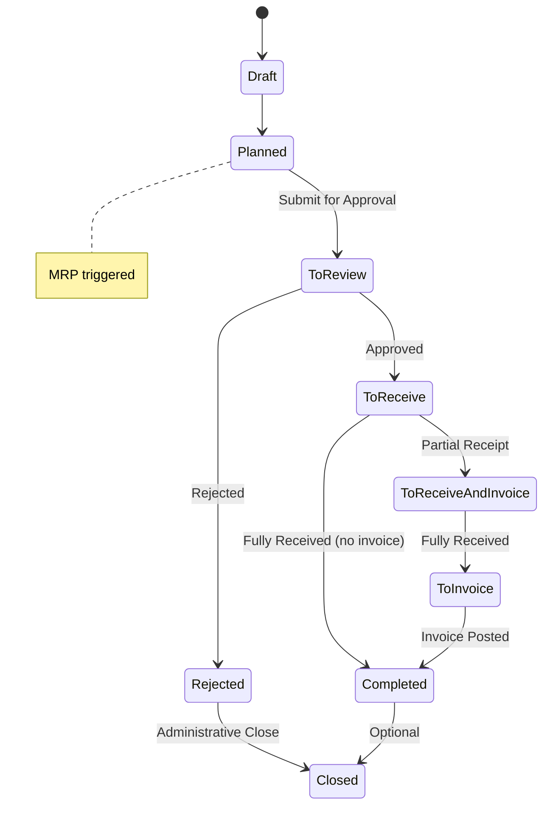

This document defines all business rules, validation logic, authorization requirements, state transitions, and conditional logic for Purchase Order management in the Carbon ERP system.

## Permissions & Authorization

### Required Permissions

| Action | Permission | Role Requirement | Notes |
|--------|------------|------------------|-------|
| Create Purchase Order | `purchasing.create` | None | Bypasses RLS |
| View Purchase Order | `purchasing.view` | None | Standard access |
| Update Purchase Order | `purchasing.update` | None | Standard access |
| Update Status | `purchasing.update` | None | Triggers MRP on "Planned" |
| Delete Purchase Order | `purchasing.delete` | None | If allowed by configuration |

**Source:** `apps/erp/app/routes/x+/purchase-order+/new.tsx`

```typescript
const { client, companyId, userId } = await requirePermissions(request, {
  create: "purchasing",
  bypassRls: true
});
```

**Source:** `apps/erp/app/routes/x+/purchase-order+/$orderId.status.tsx`

```typescript
const { client, userId, companyId } = await requirePermissions(request, {
  update: "purchasing"
});
```

---

## Status Transitions

### Available Statuses



### Status List

1. **Draft** - Initial creation state
2. **Planned** - Order planned but not submitted (triggers MRP)
3. **To Review** - Awaiting approval
4. **To Receive** - Approved, awaiting receipt
5. **To Receive and Invoice** - Partially received, invoice pending
6. **To Invoice** - Fully received, invoice pending
7. **Completed** - Fully received and invoiced
8. **Rejected** - Order rejected during review
9. **Closed** - Administrative closure

**Source:** `apps/erp/app/modules/purchasing/purchasing.models.ts` (lines 50-60)

```typescript
export const purchaseOrderStatusType = [
  "Draft",
  "Planned",
  "To Review",
  "To Receive",
  "To Receive and Invoice",
  "To Invoice",
  "Completed",
  "Rejected",
  "Closed"
] as const;
```

### Status Update Rules

**Rule 1: MRP Triggered on Planned**

When status changes to "Planned", the Material Requirements Planning (MRP) system is automatically triggered.

**Source:** `apps/erp/app/routes/x+/purchase-order+/$orderId.status.tsx` (lines 38-64)

```typescript
const [update] = await Promise.all([
  updatePurchaseOrderStatus(client, {
    id,
    status,
    assignee: ["Closed"].includes(status) ? null : undefined,
    updatedBy: userId
  })
]);

if (status === "Planned") {
  await runMRP(getCarbonServiceRole(), {
    type: "purchaseOrder",
    id,
    companyId,
    userId
  });
}
```

**Rule 2: Assignee Cleared on Closed**

When status changes to "Closed", the assignee is automatically set to null.

---

## Validation Rules

### Header Validation

| Field | Required | Validation | Error Message |
|-------|----------|------------|---------------|
| purchaseOrderType | Yes | Purchase or Outside Processing | "Type is required" |
| supplierId | Yes | min 1 character | "Supplier is required" |
| supplierLocationId | No | Valid location | - |
| supplierContactId | No | Valid contact | - |
| supplierReference | No | - | - |
| currencyCode | No | Valid currency | - |
| exchangeRate | No | >= 0 | - |

**Source:** `apps/erp/app/modules/purchasing/purchasing.models.ts` (lines 91-106)

```typescript
export const purchaseOrderValidator = z.object({
  id: zfd.text(z.string().optional()),
  purchaseOrderId: zfd.text(z.string().optional()),
  purchaseOrderType: z.enum(purchaseOrderTypeType, {
    errorMap: (issue, ctx) => ({
      message: "Type is required"
    })
  }),
  supplierId: z.string().min(1, { message: "Supplier is required" }),
  supplierLocationId: zfd.text(z.string().optional()),
  supplierContactId: zfd.text(z.string().optional()),
  supplierReference: zfd.text(z.string().optional()),
  currencyCode: zfd.text(z.string().optional()),
  exchangeRate: zfd.numeric(z.number().optional()),
  exchangeRateUpdatedAt: zfd.text(z.string().optional())
});
```

### Line Item Validation

| Field | Required | Validation | Error Message |
|-------|----------|------------|---------------|
| purchaseOrderId | Yes | min 1 character | "Order is required" |
| purchaseOrderLineType | Yes | Valid enum | Must be Part, Material, Tool, Consumable, Comment, Service, Fixture |
| itemId | Conditional | Required for inventory types | "Part is required" |
| locationId | No | Valid location | - |
| purchaseQuantity | No | Numeric | - |
| supplierUnitPrice | No | Numeric | - |
| conversionFactor | No | > 0, default 1 | For unit conversions |

**Source:** `apps/erp/app/modules/purchasing/purchasing.models.ts` (lines 162-200)

```typescript
export const purchaseOrderLineValidator = z
  .object({
    id: zfd.text(z.string().optional()),
    purchaseOrderId: z.string().min(1, { message: "Order is required" }),
    purchaseOrderLineType: z.enum(methodItemType),
    itemId: zfd.text(z.string().optional()),
    locationId: zfd.text(z.string().optional()),
    purchaseQuantity: zfd.numeric(z.number().optional()),
    supplierUnitPrice: zfd.numeric(z.number().optional()),
    // ... other fields
  })
  .refine(
    (data) =>
      ["Part", "Service", "Material", "Tool", "Fixture", "Consumable"].includes(
        data.purchaseOrderLineType
      )
        ? data.itemId
        : true,
    { message: "Part is required", path: ["itemId"] }
  );
```

### Delivery Configuration Validation

**Source:** `apps/erp/app/modules/purchasing/purchasing.models.ts` (lines 244-292)

```typescript
export const purchaseOrderDeliveryValidator = z
  .object({
    locationId: zfd.text(z.string().optional()),
    deliveryDate: zfd.text(z.string().optional()),
    shippingMethodId: zfd.text(z.string().optional()),
    shippingTermId: zfd.text(z.string().optional()),
    dropShipment: zfd.checkbox(),
    customerId: zfd.text(z.string().optional()),
    customerLocationId: zfd.text(z.string().optional())
  })
  .refine(
    (data) => {
      if (data.dropShipment && !data.customerId) {
        return false;
      }
      return true;
    },
    {
      message: "Customer is required for drop shipment",
      path: ["customerId"]
    }
  )
  .refine(
    (data) => {
      if (data.dropShipment && !data.customerLocationId) {
        return false;
      }
      return true;
    },
    {
      message: "Customer location is required for drop shipment",
      path: ["customerLocationId"]
    }
  )
  .refine(
    (data) => {
      if (!data.dropShipment && !data.locationId) {
        return false;
      }
      return true;
    },
    {
      message: "Location is required",
      path: ["locationId"]
    }
  );
```

---

## Conditional Logic

### Rule 1: Item ID Required by Line Type

Item ID is required for inventory item types: Part, Service, Material, Tool, Fixture, Consumable.

**Logic:**
```
IF lineType IN ["Part", "Service", "Material", "Tool", "Fixture", "Consumable"]
THEN itemId required
```

### Rule 2: Drop Shipment Validation

When drop shipment is enabled, customer and customer location are required. Regular location is NOT required.

**Logic:**
```
IF dropShipment === true THEN
  customerId required
  customerLocationId required
  locationId NOT required
ELSE
  locationId required
  customerId NOT required
  customerLocationId NOT required
```

### Rule 3: MRP Trigger on Planned Status

When status changes to "Planned", MRP is automatically triggered to recalculate material requirements.

**Logic:**
```
IF status changes TO "Planned" THEN
  trigger MRP calculation
```

### Rule 4: Assignee Cleared on Closed

When status changes to "Closed", assignee is set to null.

**Logic:**
```
IF status changes TO "Closed" THEN
  assignee = null
```

---

## Limits & Thresholds

### Numeric Ranges

| Field | Minimum | Maximum | Notes |
|-------|---------|---------|-------|
| exchangeRate | 0 | None | Cannot be negative |
| purchaseQuantity | None | None | Can be any numeric value |
| supplierUnitPrice | None | None | Can be any numeric value |
| conversionFactor | 0 (exclusive) | None | Must be > 0, defaults to 1 |

### String Lengths

| Field | Minimum | Maximum | Notes |
|-------|---------|---------|-------|
| supplierId | 1 | - | Cannot be empty |
| purchaseOrderId | 1 | - | Cannot be empty |
| itemId | 1 | - | When required |

---

## Calculations & Formulas

### Unit Price Conversion

When purchase UOM differs from inventory UOM, conversion factor is used:

```
Inventory Unit Price = (Supplier Unit Price × Exchange Rate) / Conversion Factor
```

**Example:**
- Supplier Unit Price: $50 per case
- Exchange Rate: 1.0 (USD to USD)
- Conversion Factor: 100 (100 units per case)

```
Inventory Unit Price = (50 × 1.0) / 100 = $0.50 per unit
```

### Line Total Calculation

```
Line Total = Purchase Quantity × Supplier Unit Price
```

### Extended Amount (Base Currency)

```
Extended Amount = Line Total × Exchange Rate
```

---

## Business Rules Summary

### Purchase Order Types

| Type | Use Case | Special Rules |
|------|----------|---------------|
| Purchase | Standard material/part purchase | Standard receiving |
| Outside Processing | Subcontracted manufacturing | Can link to job operations |

### Drop Shipment Rules

1. Drop shipment requires customer and customer location
2. Regular receiving location is NOT required for drop shipment
3. Drop shipment items ship directly from supplier to customer
4. Receiving location and drop shipment are mutually exclusive

### MRP Integration

**Trigger Conditions:**
- Purchase order status changes to "Planned"

**MRP Actions:**
- Recalculates supply projections
- Updates planned orders
- Adjusts purchase recommendations
- Propagates to dependent jobs

### Status Progression Rules

| Current Status | Valid Next Status | Restrictions |
|----------------|-------------------|--------------|
| Draft | Planned, Closed | None |
| Planned | To Review, Closed | MRP triggered |
| To Review | To Receive, Rejected | Approval required |
| To Receive | To Receive and Invoice, Completed | Based on receiving |
| To Receive and Invoice | To Invoice, Completed | Based on receiving progress |
| To Invoice | Completed | Invoice required |
| Rejected | Closed | Cannot receive |
| Completed | Closed | Optional administrative close |

---

## Error Handling

### Validation Errors

**Supplier Required**
```
Message: "Supplier is required"
Trigger: supplierId is empty or null
Resolution: Select a valid supplier
```

**Part Required**
```
Message: "Part is required"
Trigger: lineType is inventory type and itemId is empty
Resolution: Select an item from catalog
```

**Customer Required for Drop Shipment**
```
Message: "Customer is required for drop shipment"
Trigger: dropShipment is true and customerId is empty
Resolution: Select customer for drop shipment destination
```

**Location Required**
```
Message: "Location is required"
Trigger: dropShipment is false and locationId is empty
Resolution: Select receiving location
```

**Conversion Factor Invalid**
```
Message: "Conversion factor must be greater than 0"
Trigger: conversionFactor <= 0
Resolution: Enter positive conversion factor (default is 1)
```

---

## Data Integrity Rules

### Audit Trail

All purchase orders track:
- `createdBy` - User who created the order
- `createdAt` - Timestamp of creation
- `updatedBy` - User who last modified the order
- `updatedAt` - Timestamp of last modification

### Multi-Tenancy

All purchase orders are isolated by `companyId`. Row-Level Security (RLS) ensures users can only access orders within their company.

### Conversion Factor Rules

1. Defaults to 1 if not specified
2. Must be greater than 0
3. Handles unit differences (e.g., buy in cases, stock in each)
4. Used to calculate inventory unit cost from supplier pricing

**Example Use Cases:**
- Buy in cases (100 units), track in each: factor = 100
- Buy in kg, track in g: factor = 1000
- Buy in boxes (12 units), track in each: factor = 12

---

## Source References

- `apps/erp/app/modules/purchasing/purchasing.models.ts` - All Zod validators and type definitions
- `apps/erp/app/modules/purchasing/purchasing.service.ts` - Business logic for PO management
- `apps/erp/app/routes/x+/purchase-order+/new.tsx` - Order creation route with permission checks
- `apps/erp/app/routes/x+/purchase-order+/$orderId.status.tsx` - Status update route with MRP trigger
- `packages/database/supabase/migrations/20230510035345_purchasing.sql` - Database schema
