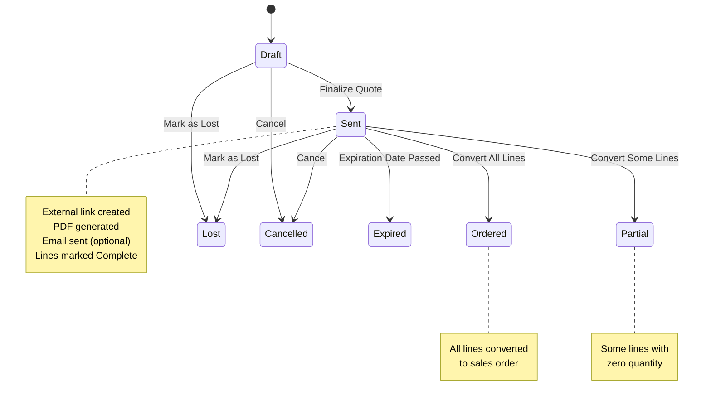

This document defines all business rules, validation logic, authorization requirements, state transitions, and conditional logic for Quote management in the Carbon ERP system.

## Permissions & Authorization

### Required Permissions

| Action | Permission | Role Requirement | Notes |
|--------|------------|------------------|-------|
| View Quotes | `sales.view` | employee OR customer | Customers can view their own quotes |
| Create Quote | `sales.create` | employee | Bypasses RLS |
| Update Quote | `sales.update` | employee OR customer | Customers can update their own quotes |
| Delete Quote | `sales.delete` | employee | Standard access |
| Finalize Quote | `sales.create` | employee | Bypasses RLS, triggers PDF generation |

**Source:** `apps/erp/app/routes/x+/quote+/new.tsx` (lines 23-28)

```typescript
const { client, companyId, userId } = await requirePermissions(request, {
  create: "sales",
  bypassRls: true
});
```

**Source:** `apps/erp/app/routes/x+/quote+/$quoteId.finalize.tsx` (lines 30-34)

```typescript
const { client, companyId, userId } = await requirePermissions(request, {
  create: "sales",
  role: "employee",
  bypassRls: true
});
```

### Row-Level Security (RLS) Policies

Quotes implement multi-user RLS allowing both employee and customer access:

**For Employees:**
- SELECT with `sales_view` permission
- INSERT with `sales_create` permission
- UPDATE with `sales_update` permission
- DELETE with `sales_delete` permission

**For Customers:**
- SELECT with `sales_view` permission (own quotes only)
- UPDATE with `sales_update` permission (own quotes only)
- Cannot INSERT or DELETE

**Source:** `packages/database/supabase/migrations/20240715043906_quote-rls.sql`

---

## Status Transitions

### Quote Header Statuses



### Quote Status List

1. **Draft** - Initial creation state, being worked on
2. **Sent** - Quote finalized and sent to customer
3. **Ordered** - Fully converted to sales order (all lines)
4. **Partial** - Partially converted to sales order (some lines with zero quantity)
5. **Lost** - Quote was not accepted by customer
6. **Cancelled** - Quote cancelled
7. **Expired** - Quote past expiration date

**Source:** `apps/erp/app/modules/sales/sales.models.ts` (lines 147-155)

```typescript
export const quoteStatusType = [
  "Draft",
  "Sent",
  "Ordered",
  "Partial",
  "Lost",
  "Cancelled",
  "Expired"
] as const;
```

### Quote Line Statuses

```mermaid
stateDiagram-v2
    [*] --> NotStarted[Not Started]
    NotStarted --> InProgress[In Progress]
    InProgress --> Complete
    InProgress --> NoQuote[No Quote]
    NotStarted --> NoQuote[No Quote]

    note right of Complete
        Line ready for
        customer review
    end note

    note right of NoQuote
        Cannot quote this line
        Reason tracked in
        noQuoteReason field
    end note
```

### Quote Line Status List

1. **Not Started** - Line not yet worked on (previously "Draft")
2. **In Progress** - Line being estimated/quoted
3. **Complete** - Line estimation finished, ready for review
4. **No Quote** - Cannot provide quote (reason in `noQuoteReason` field)

**Source:** `apps/erp/app/modules/sales/sales.models.ts` (lines 140-145)

```typescript
export const quoteLineStatusType = [
  "Not Started",
  "In Progress",
  "Complete",
  "No Quote"
] as const;
```

### Status Update Rules

**Rule 1: Finalize Transitions Quote to Sent**

When quote is finalized, status changes to "Sent" and all non-"No Quote" lines change to "Complete".

**Source:** `apps/erp/app/modules/sales/sales.service.ts` (lines 1519-1546)

```typescript
export async function finalizeQuote(
  client: SupabaseClient<Database>,
  quoteId: string,
  userId: string
) {
  const quoteUpdate = await client
    .from("quote")
    .update({
      status: "Sent",
      updatedAt: today(getLocalTimeZone()).toString(),
      updatedBy: userId
    })
    .eq("id", quoteId);

  if (quoteUpdate.error) {
    return quoteUpdate;
  }

  return client
    .from("quoteLine")
    .update({
      status: "Complete",
      updatedAt: today(getLocalTimeZone()).toString(),
      updatedBy: userId
    })
    .neq("status", "No Quote")
    .eq("quoteId", quoteId);
}
```

**Rule 2: No Quote Lines Excluded from Finalization**

Lines with status "No Quote" are NOT updated to "Complete" during finalization and are NOT converted to sales order lines.

**Rule 3: External Link Created on Finalization**

When quote is finalized, an external link is created or updated for customer access to the quote PDF.

**Source:** `apps/erp/app/routes/x+/quote+/$quoteId.finalize.tsx` (lines 50-68)

```typescript
const [externalLink] = await Promise.all([
  upsertExternalLink(client, {
    id: quote.data.externalLinkId ?? undefined,
    documentType: "Quote",
    documentId: quoteId,
    customerId: quote.data.customerId,
    expiresAt: quote.data.expirationDate,
    companyId
  })
]);

if (externalLink.data && quote.data.externalLinkId !== externalLink.data.id) {
  await client
    .from("quote")
    .update({
      externalLinkId: externalLink.data.id,
      completedDate: now(getLocalTimeZone()).toAbsoluteString()
    })
    .eq("id", quoteId);
}
```

---

## Validation Rules

### Quote Header Validation

| Field | Required | Validation | Error Message |
|-------|----------|------------|---------------|
| customerId | Yes | min 1 character | "Customer is required" |
| status | No | Enum | Defaults to "Draft" |
| salesPersonId | No | Valid user | - |
| estimatorId | No | Valid user | - |
| customerLocationId | No | Valid location | - |
| customerContactId | No | Valid contact | - |
| customerEngineeringContactId | No | Valid contact | - |
| locationId | No | Company location | - |
| dueDate | No | Valid date | - |
| expirationDate | No | Valid date | - |
| currencyCode | No | Valid currency | - |
| exchangeRate | No | Numeric | - |

**Source:** `apps/erp/app/modules/sales/sales.models.ts` (lines 157-177)

```typescript
export const quoteValidator = z.object({
  id: zfd.text(z.string().optional()),
  quoteId: zfd.text(z.string().optional()),
  salesPersonId: zfd.text(z.string().optional()),
  estimatorId: zfd.text(z.string().optional()),
  customerId: z.string().min(1, { message: "Customer is required" }),
  customerLocationId: zfd.text(z.string().optional()),
  customerContactId: zfd.text(z.string().optional()),
  customerEngineeringContactId: zfd.text(z.string().optional()),
  customerReference: zfd.text(z.string().optional()),
  locationId: zfd.text(z.string().optional()),
  status: z.enum(quoteStatusType).optional(),
  notes: z.any().optional(),
  dueDate: zfd.text(z.string().optional()),
  expirationDate: zfd.text(z.string().optional()),
  currencyCode: zfd.text(z.string().optional()),
  exchangeRate: zfd.numeric(z.number().optional()),
  exchangeRateUpdatedAt: zfd.text(z.string().optional()),
  digitalQuoteAcceptedBy: zfd.text(z.string().optional()),
  digitalQuoteAcceptedByEmail: zfd.text(z.string().optional())
});
```

### Quote Line Validation

| Field | Required | Validation | Error Message |
|-------|----------|------------|---------------|
| quoteId | Yes | min 1 character | - |
| itemId | Yes | min 1 character | "Part is required" |
| status | Yes | Enum | "Status is required" |
| description | Yes | min 1 character | "Description is required" |
| methodType | Yes | Enum: Make, Buy, Service, etc. | "Method is required" |
| unitOfMeasureCode | Yes | min 1 character | "Unit of measure is required" |
| quantity | Yes | Array of numbers, min 0.00001 | "Quantity is required" |
| taxPercent | Yes | 0 to 1 | "Tax percent must be between 0 and 1" |
| noQuoteReason | No | Text | For "No Quote" status lines |

**Source:** `apps/erp/app/modules/sales/sales.models.ts` (lines 186-212)

```typescript
export const quoteLineValidator = z.object({
  id: zfd.text(z.string().optional()),
  quoteId: z.string(),
  itemId: z.string().min(1, { message: "Part is required" }),
  status: z.enum(quoteLineStatusType, {
    errorMap: () => ({ message: "Status is required" })
  }),
  estimatorId: zfd.text(z.string().optional()),
  description: z.string().min(1, { message: "Description is required" }),
  methodType: z.enum(methodType, {
    errorMap: () => ({ message: "Method is required" })
  }),
  customerPartId: zfd.text(z.string().optional()),
  customerPartRevision: zfd.text(z.string().optional()),
  unitOfMeasureCode: zfd.text(
    z.string().min(1, { message: "Unit of measure is required" })
  ),
  quantity: z.array(
    zfd.numeric(z.number().min(0.00001, { message: "Quantity is required" }))
  ),
  modelUploadId: zfd.text(z.string().optional()),
  noQuoteReason: zfd.text(z.string().optional()),
  taxPercent: zfd.numeric(
    z.number().min(0).max(1, { message: "Tax percent must be between 0 and 1" })
  ),
  configuration: z.any().optional()
});
```

### Quote Operation Validation

| Field | Required | Validation | Error Message |
|-------|----------|------------|---------------|
| quoteMakeMethodId | Yes | min 1 character | "Quote Make Method is required" |
| operationType | Yes | Enum: Inside, Outside | "Operation type is required" |
| processId | Yes | min 1 character | "Process is required" |
| setupUnit | Conditional | Required for Inside | "Setup unit is required" |
| setupTime | Conditional | Required for Inside, >= 0 | "Setup time is required" |
| laborUnit | Conditional | Required for Inside | "Labor unit is required" |
| laborTime | Conditional | Required for Inside, >= 0 | "Labor time is required" |
| machineUnit | Conditional | Required for Inside | "Machine unit is required" |
| machineTime | Conditional | Required for Inside, >= 0 | "Machine time is required" |
| laborRate | Conditional | Required for Inside, >= 0 | "Labor rate is required" |
| machineRate | Conditional | Required for Inside, >= 0 | "Machine rate is required" |
| overheadRate | Conditional | Required for Inside, >= 0 | "Overhead rate is required" |
| operationMinimumCost | Conditional | Required for Outside, >= 0 | "Minimum is required" |
| operationUnitCost | Conditional | Required for Outside, >= 0 | "Unit cost is required" |
| operationLeadTime | Conditional | Required for Outside, >= 0 | "Lead time is required" |

**Source:** `apps/erp/app/modules/sales/sales.models.ts` (lines 291-483)

Complex conditional validation based on operation type. Full refine chain validates Inside operations require setup/labor/machine times and rates, while Outside operations require minimum cost, unit cost, and lead time.

### Quote Material Validation

| Field | Required | Validation | Error Message |
|-------|----------|------------|---------------|
| quoteMakeMethodId | Yes | min 1 character | "Make method is required" |
| itemType | Yes | Enum | "Item type is required" |
| itemId | Conditional | Required for Part, Material, Tool, Consumable | Type-specific message |
| description | Yes | min 1 character | "Description is required" |
| quantity | Yes | >= 0 | - |
| unitOfMeasureCode | Yes | min 1 character | "Unit of Measure is required" |
| unitCost | Yes | >= 0 | - |

**Source:** `apps/erp/app/modules/sales/sales.models.ts` (lines 214-290)

Similar to job materials, item ID required for inventory types (Part, Material, Tool, Consumable) but not Comment lines.

### Quote Finalization Validation

| Field | Required | Validation | Error Message |
|-------|----------|------------|---------------|
| notification | No | Enum: Email, None | - |
| customerContact | Conditional | Required if notification = Email | "Supplier contact is required for email" |

**Source:** `apps/erp/app/modules/sales/sales.models.ts` (lines 485-496)

```typescript
export const quoteFinalizeValidator = z
  .object({
    notification: z.enum(["Email", "None"]).optional(),
    customerContact: zfd.text(z.string().optional())
  })
  .refine(
    (data) => (data.notification === "Email" ? data.customerContact : true),
    {
      message: "Supplier contact is required for email",
      path: ["customerContact"] // path of error
    }
  );
```

---

## Conditional Logic

### Rule 1: Inside vs Outside Operation Requirements

Operation field requirements differ based on operation type:

**Inside Operations:**
- Setup unit, time, rate required
- Labor unit, time, rate required
- Machine unit, time, rate required
- Overhead rate required

**Outside Operations:**
- Minimum cost required
- Unit cost required
- Lead time required

**Logic:**
```
IF operationType = "Inside" THEN
  setupUnit, setupTime, laborUnit, laborTime, machineUnit, machineTime,
  laborRate, machineRate, overheadRate required
ELSE IF operationType = "Outside" THEN
  operationMinimumCost, operationUnitCost, operationLeadTime required
```

**Source:** `apps/erp/app/modules/sales/sales.models.ts` (lines 340-483)

Same validation pattern as production job operations.

### Rule 2: Item ID Required by Item Type

Item ID is required for inventory item types (Part, Material, Tool, Consumable) but not for Comment lines.

**Logic:**
```
IF itemType IN ["Part", "Material", "Tool", "Consumable"]
THEN itemId required
```

### Rule 3: Customer Contact Required for Email Notification

When finalizing quote with email notification, customer contact must be provided.

**Logic:**
```
IF notification = "Email" THEN
  customerContact required
```

### Rule 4: No Quote Lines Excluded from Conversion

Lines with status "No Quote" are excluded from:
- Finalization (not marked "Complete")
- Conversion to sales order
- Completion counts

**Logic:**
```
IF lineStatus = "No Quote" THEN
  exclude from finalization
  exclude from sales order conversion
  track reason in noQuoteReason field
```

**Source:** `apps/erp/app/modules/sales/sales.service.ts` (line 1544)

```typescript
.neq("status", "No Quote")
```

### Rule 5: Quote Status Based on Conversion

Quote status after conversion depends on whether all lines were converted:

**Logic:**
```
IF all selected lines have quantity > 0 THEN
  quoteStatus = "Ordered"
ELSE IF any selected lines have quantity = 0 THEN
  quoteStatus = "Partial"
```

---

## Limits & Thresholds

### Numeric Ranges

| Field | Minimum | Maximum | Notes |
|-------|---------|---------|-------|
| quantity (line) | 0.00001 | None | Must be positive |
| taxPercent | 0 | 1 | 0-100% range |
| setupTime | 0 | None | Cannot be negative |
| laborTime | 0 | None | Cannot be negative |
| machineTime | 0 | None | Cannot be negative |
| laborRate | 0 | None | Cannot be negative |
| machineRate | 0 | None | Cannot be negative |
| overheadRate | 0 | None | Cannot be negative |
| operationMinimumCost | 0 | None | Cannot be negative |
| operationUnitCost | 0 | None | Cannot be negative |
| operationLeadTime | 0 | None | Cannot be negative |
| unitCost | 0 | None | Cannot be negative |

### String Lengths

| Field | Minimum | Maximum | Notes |
|-------|---------|---------|-------|
| customerId | 1 | - | Cannot be empty |
| itemId | 1 | - | Cannot be empty |
| description | 1 | - | Cannot be empty |
| unitOfMeasureCode | 1 | - | Cannot be empty |
| quoteMakeMethodId | 1 | - | Cannot be empty |
| processId | 1 | - | Cannot be empty |

---

## Calculations & Formulas

### Quote Line Total

```
Line Total (per quantity break) = Quantity × Unit Price × (1 + Tax Percent)
```

### Operation Cost Calculations

**Inside Operation Cost:**
```
Setup Cost = Setup Time × Labor Rate
Labor Cost = Labor Time × Labor Rate
Machine Cost = Machine Time × Machine Rate
Overhead Cost = (Labor Time + Machine Time) × Overhead Rate

Total Operation Cost = Setup Cost + Labor Cost + Machine Cost + Overhead Cost
```

**Outside Operation Cost:**
```
Total Operation Cost = MAX(Minimum Cost, Unit Cost × Quantity) + Lead Time Premium
```

### Material Cost Calculation

```
Material Cost = Quantity × Unit Cost
Total Material Cost = SUM(all materials in make method)
```

### Quote Line Unit Price

```
Unit Price = (Total Operation Costs + Total Material Costs + Markup) / Quantity
```

---

## Business Rules Summary

### Quote Lifecycle

| Stage | Status | Actions | Restrictions |
|-------|--------|---------|--------------|
| Creation | Draft | Add lines, estimate costs | Editable |
| Estimation | Draft | Complete line pricing | Lines can be "No Quote" |
| Review | Draft | Adjust pricing, markup | Before finalization |
| Finalization | Sent | Generate PDF, create external link, optional email | Lines marked "Complete" (except "No Quote") |
| Conversion | Ordered/Partial | Create sales order from selected lines | Quote becomes read-only |
| Lost | Lost | Track lost reason | Terminal state |
| Cancelled | Cancelled | Administrative cancellation | Terminal state |
| Expired | Expired | Past expiration date | Terminal state |

### Quote Line Workflow

| Current Status | Valid Next Status | Actions |
|----------------|-------------------|---------|
| Not Started | In Progress, No Quote | Begin estimation |
| In Progress | Complete, No Quote | Finish estimation or determine cannot quote |
| Complete | - | Ready for finalization |
| No Quote | - | Track reason, exclude from conversion |

### Conversion Rules

**What Gets Converted:**
- Lines with status "Complete" or "In Progress" (not "No Quote")
- Selected quantities and pricing
- Customer part information
- 3D models if attached
- Payment terms
- Shipping information

**What Gets Created:**
- New sales order with status "To Ship and Invoice"
- Sales order lines with status "Ordered"
- Promised dates based on lead times
- Customer part associations

**Quote Status After Conversion:**
- "Ordered" if all lines converted with quantity > 0
- "Partial" if any lines converted with quantity = 0

---

## Error Handling

### Validation Errors

**Customer Required**
```
Message: "Customer is required"
Trigger: customerId is empty or null
Resolution: Select a customer
```

**Part Required**
```
Message: "Part is required"
Trigger: itemId is empty for quote line
Resolution: Select an item from catalog
```

**Quantity Required**
```
Message: "Quantity is required"
Trigger: quantity array empty or value < 0.00001
Resolution: Enter at least one positive quantity
```

**Tax Percent Out of Range**
```
Message: "Tax percent must be between 0 and 1"
Trigger: taxPercent < 0 or > 1
Resolution: Enter value between 0 (0%) and 1 (100%)
```

**Customer Contact Required for Email**
```
Message: "Supplier contact is required for email"
Trigger: notification = "Email" but customerContact is empty
Resolution: Select customer contact for email notification
```

**Operation Type Specific Errors**

For Inside Operations:
- "Setup unit is required"
- "Setup time is required"
- "Labor unit is required"
- "Labor time is required"
- "Machine unit is required"
- "Machine time is required"
- "Labor rate is required"
- "Machine rate is required"
- "Overhead rate is required"

For Outside Operations:
- "Minimum is required"
- "Unit cost is required"
- "Lead time is required"

---

## Data Integrity Rules

### Audit Trail

All quotes track:
- `createdBy` - User who created the quote
- `createdAt` - Timestamp of creation
- `updatedBy` - User who last modified the quote
- `updatedAt` - Timestamp of last modification
- `completedDate` - Timestamp when quote finalized

### Multi-Tenancy

All quotes are isolated by `companyId`. Row-Level Security (RLS) ensures:
- Employees can access all company quotes (with appropriate permissions)
- Customers can only access their own quotes (linked by `customerId`)

### External Links

Finalized quotes receive an external link for customer portal access:
- Link expires based on `expirationDate`
- Provides customer read-only access to quote PDF
- Supports digital quote acceptance tracking

### Quantity Breaks

Quote lines support multiple quantity breaks:
- Quantity stored as array: `[100, 500, 1000]`
- Allows different pricing for different order quantities
- Customer selects desired quantity during conversion

---

## Source References

- `apps/erp/app/modules/sales/sales.models.ts` - All Zod validators and type definitions
- `apps/erp/app/modules/sales/sales.service.ts` - Business logic for quote management
- `apps/erp/app/routes/x+/quote+/$quoteId.finalize.tsx` - Quote finalization with PDF generation and email
- `apps/erp/app/routes/x+/quote+/$quoteId.convert.tsx` - Quote to sales order conversion logic
- `apps/erp/app/routes/x+/quote+/new.tsx` - Quote creation route with permission checks
- `packages/database/supabase/migrations/20240715024405_quotes.sql` - Database schema
- `packages/database/supabase/migrations/20240715043906_quote-rls.sql` - RLS policies for multi-user access
- `packages/database/supabase/functions/convert/index.ts` - Edge function for quote conversion
