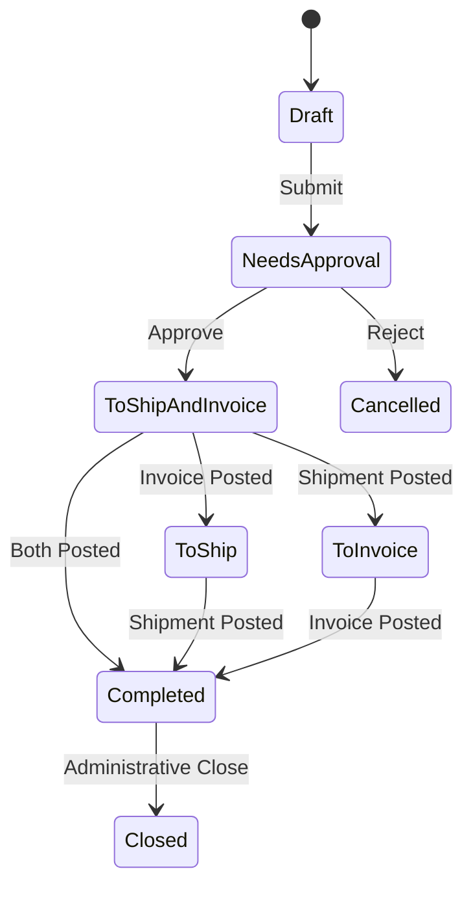

This document defines all business rules, validation logic, authorization requirements, state transitions, and conditional logic for Sales Order management in the Carbon ERP system.

## Permissions & Authorization

### Required Permissions

| Action | Permission | Role Requirement | Notes |
|--------|------------|------------------|-------|
| Create Sales Order | `sales.create` | None | Bypasses RLS |
| View Sales Order | `sales.view` | None | Standard access |
| Update Sales Order | `sales.update` | None | Standard access |
| Update Status | `sales.update` | None | Standard access |
| Delete Sales Order | `sales.delete` | None | If allowed by configuration |

**Source:** `apps/erp/app/routes/x+/sales-order+/new.tsx`

```typescript
const { client, companyId, userId } = await requirePermissions(request, {
  create: "sales",
  bypassRls: true
});
```

**Source:** `apps/erp/app/routes/x+/sales-order+/$orderId.status.tsx`

```typescript
const { client, userId } = await requirePermissions(request, {
  update: "sales"
});
```

---

## Status Transitions

### Available Statuses



### Status List

1. **Draft** - Initial creation state
2. **Needs Approval** - Awaiting management approval
3. **To Ship and Invoice** - Both actions pending
4. **To Ship** - Only shipping pending
5. **To Invoice** - Only invoicing pending
6. **Completed** - All actions complete
7. **Cancelled** - Order cancelled
8. **Closed** - Administrative closure

**Source:** `apps/erp/app/modules/sales/sales.models.ts` (lines 524-536)

```typescript
export const salesOrderStatusType = [
  "Draft",
  "Needs Approval",
  "To Ship and Invoice",
  "To Ship",
  "To Invoice",
  "Completed",
  "Cancelled",
  "Closed"
] as const;
```

### Status Update Rules

**Rule 1: Completed Date Auto-Set**

When status changes to "To Ship" or "To Ship and Invoice", the system automatically sets `completedDate`.

**Source:** `apps/erp/app/modules/sales/sales.service.ts` (lines 2599-2620)

```typescript
export async function updateSalesOrderStatus(
  client: SupabaseClient<Database>,
  update: {
    id: string;
    status: (typeof salesOrderStatusType)[number];
    assignee: null | undefined;
    updatedBy: string;
  }
) {
  const { status, ...rest } = update;

  const updateData = {
    status,
    ...rest,
    ...(["To Ship", "To Ship and Invoice"].includes(status)
      ? { completedDate: now(getLocalTimeZone()).toAbsoluteString() }
      : {})
  };

  return client.from("salesOrder").update(updateData).eq("id", update.id);
}
```

**Rule 2: Assignee Cleared on Closed**

When status changes to "Closed", the assignee is automatically set to null.

---

## Validation Rules

### Header Validation

| Field | Required | Validation | Error Message |
|-------|----------|------------|---------------|
| customerId | Yes | min 1 character | "Customer is required" |
| currencyCode | Yes | Valid currency | Must be valid currency code |
| locationId | No | - | - |
| requestedDate | No | Valid date | - |
| promisedDate | No | Valid date | - |
| customerReference | No | - | - |
| salesPersonId | No | Valid user | - |
| exchangeRate | No | >= 0 | - |

**Source:** `apps/erp/app/modules/sales/sales.models.ts` (lines 551-569)

```typescript
export const salesOrderValidator = z.object({
  id: zfd.text(z.string().optional()),
  salesOrderId: zfd.text(z.string().optional()),
  requestedDate: zfd.text(z.string().optional()),
  promisedDate: zfd.text(z.string().optional()),
  status: z.enum(salesOrderStatusType).optional(),
  notes: zfd.text(z.string().optional()),
  customerId: z.string().min(1, { message: "Customer is required" }),
  customerLocationId: zfd.text(z.string().optional()),
  customerContactId: zfd.text(z.string().optional()),
  customerEngineeringContactId: zfd.text(z.string().optional()),
  customerReference: zfd.text(z.string().optional()),
  quoteId: zfd.text(z.string().optional()),
  locationId: zfd.text(z.string().optional()),
  currencyCode: zfd.text(z.string()),
  exchangeRate: zfd.numeric(z.number().optional()),
  exchangeRateUpdatedAt: zfd.text(z.string().optional()),
  salesPersonId: zfd.text(z.string().optional())
});
```

### Line Item Validation

| Field | Required | Validation | Error Message |
|-------|----------|------------|---------------|
| salesOrderId | Yes | min 1 character | "Order is required" |
| salesOrderLineType | Yes | Valid enum | Must be Part, Material, Tool, Consumable, Comment, Fixed Asset, Service, Fixture |
| itemId | Conditional | Required for inventory types | "Part is required" |
| locationId | Yes | min 0 characters | "Location is required" |
| methodType | Conditional | Required for non-Comment types | "Method type is required" |
| description | Conditional | Required for Comment type | "Comment is required" |
| taxPercent | No | 0-1 range | "Tax percent must be between 0 and 1" |
| saleQuantity | No | Numeric | - |
| unitPrice | No | Numeric | - |

**Source:** `apps/erp/app/modules/sales/sales.models.ts` (lines 602-677)

```typescript
export const salesOrderLineValidator = z
  .object({
    id: zfd.text(z.string().optional()),
    salesOrderId: z.string().min(1, { message: "Order is required" }),
    salesOrderLineType: z.enum(salesOrderLineType),
    itemId: zfd.text(z.string().optional()),
    locationId: z.string().min(0, { message: "Location is required" }),
    methodType: z.enum(methodType).optional(),
    saleQuantity: zfd.numeric(z.number().optional()),
    taxPercent: zfd.numeric(
      z.number().min(0).max(1, { message: "Tax percent must be between 0 and 1" })
    ),
    unitPrice: zfd.numeric(z.number().optional()),
    // ... other fields
  })
  .refine((data) => (data.salesOrderLineType === "Part" ? data.itemId : true), {
    message: "Part is required",
    path: ["itemId"]
  })
  .refine(
    (data) => (data.salesOrderLineType === "Comment" ? data.description : true),
    { message: "Comment is required", path: ["description"] }
  )
  .refine(
    (data) => {
      if (data.salesOrderLineType !== "Comment" && !data.methodType) {
        return false;
      }
      return true;
    },
    { message: "Method type is required", path: ["methodType"] }
  );
```

---

## Conditional Logic

### Rule 1: Item ID Required by Line Type

Item ID is required for all line types EXCEPT "Comment" and "Fixed Asset".

**Logic:**
```
IF lineType === "Part" THEN itemId required
IF lineType === "Material" THEN itemId required
IF lineType === "Tool" THEN itemId required
IF lineType === "Consumable" THEN itemId required
IF lineType === "Service" THEN itemId required
IF lineType === "Fixture" THEN itemId required
IF lineType === "Comment" THEN itemId NOT required
IF lineType === "Fixed Asset" THEN itemId NOT required
```

### Rule 2: Description Required for Comments

When line type is "Comment", description is required.

**Logic:**
```
IF lineType === "Comment" THEN description required
```

### Rule 3: Method Type Required for Non-Comments

Method type is required for all line types except "Comment".

**Logic:**
```
IF lineType !== "Comment" THEN methodType required
```

### Rule 4: Completed Date Auto-Set

Completed date is automatically set when status transitions to "To Ship" or "To Ship and Invoice".

**Logic:**
```
IF status IN ["To Ship", "To Ship and Invoice"] THEN
  completedDate = current timestamp
```

---

## Limits & Thresholds

### Numeric Ranges

| Field | Minimum | Maximum | Notes |
|-------|---------|---------|-------|
| taxPercent | 0 | 1 | Represents 0-100% in decimal form |
| exchangeRate | 0 | None | Cannot be negative |
| saleQuantity | None | None | Can be any numeric value |
| unitPrice | None | None | Can be any numeric value |

### String Lengths

| Field | Minimum | Maximum | Notes |
|-------|---------|---------|-------|
| customerId | 1 | - | Cannot be empty |
| salesOrderId | 1 | - | Cannot be empty |
| locationId | 0 | - | Can be empty string |
| description | 1 | - | Required for Comment lines |

---

## Calculations & Formulas

### Line Total Calculation

```
Line Total = Sale Quantity × Unit Price × (1 + Tax Percent)
```

**Example:**
- Sale Quantity: 10
- Unit Price: $100
- Tax Percent: 0.08 (8%)

```
Line Total = 10 × 100 × 1.08 = $1,080
```

### Net Price (Excluding Tax)

```
Net Price = Sale Quantity × Unit Price
```

### Tax Amount

```
Tax Amount = Net Price × Tax Percent
```

---

## Business Rules Summary

### Multi-Currency Rules

1. Currency code must be valid and exist in currency table
2. Exchange rate captured at order creation
3. Exchange rate timestamp recorded
4. Foreign amounts converted to base currency for reporting

### Line Type Rules

| Line Type | Item Required | Method Required | Description Required |
|-----------|---------------|-----------------|---------------------|
| Part | Yes | Yes | No |
| Material | Yes | Yes | No |
| Tool | Yes | Yes | No |
| Consumable | Yes | Yes | No |
| Service | Yes | Yes | No |
| Fixture | Yes | Yes | No |
| Comment | No | No | Yes |
| Fixed Asset | No | Yes | No |

### Status Transition Triggers

| From Status | To Status | Side Effects |
|-------------|-----------|--------------|
| Draft | Needs Approval | None |
| Needs Approval | To Ship and Invoice | Set completedDate |
| Any | Closed | Clear assignee |
| To Ship and Invoice | To Ship | Invoice posted |
| To Ship and Invoice | To Invoice | Shipment posted |

---

## Error Handling

### Validation Errors

**Customer Required**
```
Message: "Customer is required"
Trigger: customerId is empty or null
Resolution: Select a valid customer
```

**Tax Percent Range**
```
Message: "Tax percent must be between 0 and 1"
Trigger: taxPercent < 0 or taxPercent > 1
Resolution: Enter value between 0 (0%) and 1 (100%)
```

**Item Required**
```
Message: "Part is required"
Trigger: lineType is Part/Material/Tool/etc and itemId is empty
Resolution: Select an item from catalog
```

**Method Type Required**
```
Message: "Method type is required"
Trigger: lineType is not Comment and methodType is empty
Resolution: Select Buy, Make, or Buy and Make
```

---

## Data Integrity Rules

### Audit Trail

All sales orders track:
- `createdBy` - User who created the order
- `createdAt` - Timestamp of creation
- `updatedBy` - User who last modified the order
- `updatedAt` - Timestamp of last modification

### Multi-Tenancy

All sales orders are isolated by `companyId`. Row-Level Security (RLS) ensures users can only access orders within their company.

### Immutability

Once a sales order reaches "Completed" status, it becomes more restricted:
- Cannot delete completed orders
- Changes may require approval or reversal process
- Financial transactions may be posted

---

## Source References

- `apps/erp/app/modules/sales/sales.models.ts` - All Zod validators and type definitions
- `apps/erp/app/modules/sales/sales.service.ts` - Business logic for status updates and order management
- `apps/erp/app/routes/x+/sales-order+/new.tsx` - Order creation route with permission checks
- `apps/erp/app/routes/x+/sales-order+/$orderId.status.tsx` - Status update route with side effects
- `packages/database/supabase/migrations/20240904094118_sales-order-document.sql` - Database schema
