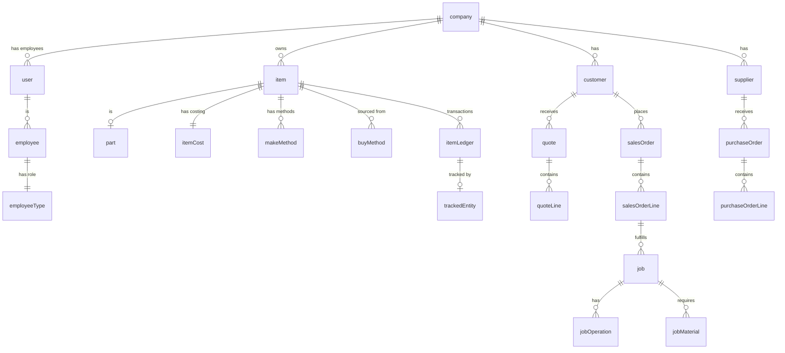

This document defines all core entities in the Carbon Manufacturing System, including field specifications, validation rules, relationships, and audit patterns. Each entity follows a multi-tenant architecture with company isolation and standard audit trails.

## Core System Entities

### Company

Multi-tenant organization entity. All business data belongs to a company.

| Field | Type | Required | Validation | Description |
|-------|------|----------|------------|-------------|
| id | TEXT | Yes | xid() | Primary key |
| name | TEXT | Yes | min: 1 char | Company name |
| taxId | TEXT | No | - | Tax identification number |
| logo | TEXT | No | URL | Company logo URL |
| addressLine1 | TEXT | No | - | Address line 1 |
| addressLine2 | TEXT | No | - | Address line 2 |
| city | TEXT | No | - | City |
| state | TEXT | No | - | State/province |
| postalCode | TEXT | No | - | Postal/ZIP code |
| countryCode | TEXT | No | 2 chars | ISO country code |
| phone | TEXT | No | - | Phone number |
| fax | TEXT | No | - | Fax number |
| email | TEXT | No | email format | Email address |
| website | TEXT | No | URL | Website URL |
| createdAt | TIMESTAMPTZ | Yes | auto | Creation timestamp |

**Relationships:**
- Has many: employees, locations, items, customers, suppliers, etc.
- Cascade delete: All company data deleted when company is deleted

**Source:** `packages/database/supabase/migrations/20230123004339_employee.sql`

---

### User

Authentication and user account entity. Users can belong to multiple companies.

| Field | Type | Required | Validation | Description |
|-------|------|----------|------------|-------------|
| id | TEXT | Yes | xid() | Primary key (matches auth.users.id) |
| email | TEXT | Yes | email, unique | User email |
| firstName | TEXT | No | - | First name |
| lastName | TEXT | No | - | Last name |
| fullName | TEXT | No | computed | Full name (firstName + lastName) |
| avatarUrl | TEXT | No | URL | Avatar image URL |
| active | BOOLEAN | Yes | default: true | Account active status |
| createdAt | TIMESTAMPTZ | Yes | auto | Creation timestamp |
| updatedAt | TIMESTAMPTZ | No | auto | Last update timestamp |

**Relationships:**
- Many-to-many with Company via userToCompany
- Has many: userPermissions, employeeRecords

**Validation Rules:**
- Email must be valid format and unique across system
- Active status controls login ability

**Source:** `packages/database/supabase/migrations/20230123004436_employee.sql`

---

### Employee

Company-specific employee record linked to user account.

| Field | Type | Required | Validation | Description |
|-------|------|----------|------------|-------------|
| id | TEXT | Yes | xid() | Primary key |
| companyId | TEXT | Yes | FK → company | Company reference |
| userId | TEXT | Yes | FK → user | User account reference |
| employeeTypeId | TEXT | Yes | FK → employeeType | Employee type/role |
| createdBy | TEXT | Yes | FK → user | Creator user ID |
| createdAt | TIMESTAMPTZ | Yes | auto | Creation timestamp |
| updatedBy | TEXT | No | FK → user | Last updater user ID |
| updatedAt | TIMESTAMPTZ | No | auto | Last update timestamp |

**Composite Primary Key:** (id, companyId)

**Relationships:**
- Belongs to: Company, User, EmployeeType
- Has one: EmployeeJob (job details)
- Has many: EmployeeAbilities, EmployeeShifts

**Source:** `packages/database/supabase/migrations/20230123004436_employee.sql`

---

## Items & Parts Module

### Item

Master item table for parts, materials, tools, and consumables.

| Field | Type | Required | Validation | Description |
|-------|------|----------|------------|-------------|
| id | TEXT | Yes | xid() | Primary key |
| readableId | TEXT | Yes | auto-generated | Human-readable ID |
| revision | TEXT | Yes | default: '0' | Revision number |
| companyId | TEXT | Yes | FK → company | Company reference |
| name | TEXT | Yes | min: 1, max: 255 | Item name |
| description | TEXT | No | - | Item description |
| type | ENUM | Yes | - | Part, Material, Tool, Consumable, Fixture, Service |
| replenishmentSystem | ENUM | Yes | - | Buy, Make, Buy and Make |
| itemTrackingType | ENUM | Yes | - | Inventory, Non-Inventory, Serial, Batch |
| unitOfMeasureCode | TEXT | Yes | FK → unitOfMeasure | Base unit of measure |
| thumbnailUrl | TEXT | No | URL | Thumbnail image URL |
| blocked | BOOLEAN | Yes | default: false | Item blocked status |
| active | BOOLEAN | Yes | default: true | Active status |
| customFields | JSONB | No | - | Custom field data |
| tags | TEXT[] | No | - | Tag array |
| createdBy | TEXT | Yes | FK → user | Creator |
| createdAt | TIMESTAMPTZ | Yes | auto | Creation timestamp |
| updatedBy | TEXT | No | FK → user | Last updater |
| updatedAt | TIMESTAMPTZ | No | auto | Last update |

**Composite Primary Key:** (id, companyId)

**Unique Constraint:** (readableId, revision, companyId, type)

**Relationships:**
- Belongs to: Company, UnitOfMeasure
- Has one: ItemCost, ItemReplenishment, ItemUnitSalePrice (per revision)
- Has many: ItemPlanning (per location), MakeMethods, BuyMethods

**Validation Rules:**
- Name: 1-255 characters
- ReadableId + Revision must be unique per company and type
- Revision '0' is default, others shown as readableId.revision

**Audit:** Full audit trail (createdBy, createdAt, updatedBy, updatedAt)

**Source:** `packages/database/supabase/migrations/20230123004612_suppliers-and-customers.sql`

---

### Part

Part-specific data extending Item.

| Field | Type | Required | Validation | Description |
|-------|------|----------|------------|-------------|
| id | TEXT | Yes | FK → item | Item ID (PK) |
| itemId | TEXT | Yes | FK → item | Item reference |
| companyId | TEXT | Yes | FK → company | Company reference |
| approved | BOOLEAN | Yes | default: false | Part approval status |
| approvedBy | TEXT | No | FK → user | Approver user ID |
| fromDate | DATE | No | - | Effective from date |
| toDate | DATE | No | - | Effective to date |
| assignee | TEXT | No | FK → user | Assigned user |
| lotSize | NUMERIC | No | min: 0 | Manufacturing lot size |
| modelUploadId | TEXT | No | FK → modelUpload | CAD model reference |
| createdBy | TEXT | Yes | FK → user | Creator |
| createdAt | TIMESTAMPTZ | Yes | auto | Creation timestamp |
| updatedBy | TEXT | No | FK → user | Last updater |
| updatedAt | TIMESTAMPTZ | No | auto | Last update |

**Composite Primary Key:** (id, companyId)

**Relationships:**
- Belongs to: Item (1:1)
- Has one: MakeMethod (auto-created)

**Source:** `packages/database/supabase/migrations/20230704161623_parts-view.sql`

---

### ItemCost

Costing information per item revision.

| Field | Type | Required | Validation | Description |
|-------|------|----------|------------|-------------|
| itemId | TEXT | Yes | FK → item | Item reference (PK) |
| companyId | TEXT | Yes | FK → company | Company reference (PK) |
| costingMethod | ENUM | Yes | default: FIFO | Standard, Average, FIFO, LIFO |
| standardCost | NUMERIC | No | min: 0 | Standard cost |
| unitCost | NUMERIC | No | min: 0 | Current unit cost |
| itemPostingGroupId | TEXT | No | FK → itemPostingGroup | Accounting posting group |
| createdBy | TEXT | Yes | FK → user | Creator |
| createdAt | TIMESTAMPTZ | Yes | auto | Creation timestamp |
| updatedBy | TEXT | No | FK → user | Last updater |
| updatedAt | TIMESTAMPTZ | No | auto | Last update |

**Composite Primary Key:** (itemId, companyId)

**Relationships:**
- Belongs to: Item (1:1), ItemPostingGroup

**Auto-created:** When item is created with default FIFO costing method

**Source:** `packages/database/supabase/migrations/20230123004612_suppliers-and-customers.sql`

---

## Sales Module

### Customer

Customer master entity.

| Field | Type | Required | Validation | Description |
|-------|------|----------|------------|-------------|
| id | TEXT | Yes | xid() | Primary key |
| companyId | TEXT | Yes | FK → company | Company reference |
| name | TEXT | Yes | min: 1 | Customer name |
| customerTypeId | TEXT | No | FK → customerType | Customer type |
| customerStatusId | TEXT | No | FK → customerStatus | Customer status |
| taxId | TEXT | No | - | Tax ID |
| accountManagerId | TEXT | No | FK → user | Account manager |
| logo | TEXT | No | URL | Logo URL |
| phone | TEXT | No | - | Phone number |
| fax | TEXT | No | - | Fax number |
| website | TEXT | No | URL | Website URL |
| taxPercent | NUMERIC | No | 0-1 | Tax percentage (0-100%) |
| currencyCode | TEXT | No | FK → currency | Currency code |
| customFields | JSONB | No | - | Custom fields |
| tags | TEXT[] | No | - | Tags |
| createdBy | TEXT | Yes | FK → user | Creator |
| createdAt | TIMESTAMPTZ | Yes | auto | Creation timestamp |
| updatedBy | TEXT | No | FK → user | Last updater |
| updatedAt | TIMESTAMPTZ | No | auto | Last update |

**Composite Primary Key:** (id, companyId)

**Relationships:**
- Belongs to: Company, CustomerType, CustomerStatus, User (account manager)
- Has many: CustomerLocations, CustomerContacts, Opportunities, Quotes, SalesOrders

**Validation Rules:**
- Name: minimum 1 character
- TaxPercent: 0 to 1 (representing 0-100%)

**Source:** `packages/database/supabase/migrations/20230123004612_suppliers-and-customers.sql`

---

### Quote

Sales quotation entity.

| Field | Type | Required | Validation | Description |
|-------|------|----------|------------|-------------|
| id | TEXT | Yes | xid() | Primary key (UUID) |
| quoteId | TEXT | Yes | sequence | Readable quote ID |
| revisionId | INT | Yes | default: 0 | Revision number |
| companyId | TEXT | Yes | FK → company | Company reference |
| salesRfqId | TEXT | No | FK → salesRfq | Source RFQ |
| customerId | TEXT | Yes | FK → customer | Customer reference |
| customerLocationId | TEXT | No | FK → customerLocation | Customer location |
| customerContactId | TEXT | No | FK → customerContact | Customer contact |
| status | ENUM | Yes | default: Draft | Draft, Sent, Ordered, Partial, Lost, Cancelled, Expired |
| dueDate | DATE | No | - | Quote due date |
| expirationDate | DATE | No | - | Expiration date |
| locationId | TEXT | No | FK → location | Company location |
| salesPersonId | TEXT | No | FK → user | Sales person |
| estimatorId | TEXT | No | FK → user | Estimator |
| assignee | TEXT | No | FK → user | Assigned user |
| currencyCode | TEXT | No | FK → currency | Currency |
| exchangeRate | NUMERIC | No | min: 0 | Exchange rate |
| customFields | JSONB | No | - | Custom fields |
| tags | TEXT[] | No | - | Tags |
| createdBy | TEXT | Yes | FK → user | Creator |
| createdAt | TIMESTAMPTZ | Yes | auto | Creation timestamp |
| updatedBy | TEXT | No | FK → user | Last updater |
| updatedAt | TIMESTAMPTZ | No | auto | Last update |

**Composite Primary Key:** (id, companyId)

**Status Workflow:**
```
Draft → Sent → [Ordered | Partial | Lost | Cancelled | Expired]
```

**Relationships:**
- Belongs to: Company, Customer, SalesRfq
- Has many: QuoteLines, SalesOrders (converted)

**Auto-generated:** quoteId from sequence per company

**Source:** `packages/database/supabase/migrations/20240330164855_quote-documents.sql`

---

### QuoteLine

Individual line item in a quote.

| Field | Type | Required | Validation | Description |
|-------|------|----------|------------|-------------|
| id | TEXT | Yes | xid() | Primary key |
| quoteId | TEXT | Yes | FK → quote | Quote reference |
| companyId | TEXT | Yes | FK → company | Company reference |
| itemId | TEXT | Yes | FK → item | Item reference |
| status | ENUM | Yes | default: Not Started | Not Started, In Progress, Complete, No Quote |
| description | TEXT | Yes | min: 1 | Line description |
| customerPartId | TEXT | No | - | Customer part number |
| methodType | ENUM | Yes | - | Buy, Make, Buy and Make, Outside |
| unitOfMeasureCode | TEXT | Yes | FK → unitOfMeasure | Unit of measure |
| quantities | NUMERIC[] | Yes | min: 0.00001 | Quantity breakpoints |
| taxPercent | NUMERIC | No | 0-1 | Tax percentage |
| estimatorId | TEXT | No | FK → user | Estimator |
| createdBy | TEXT | Yes | FK → user | Creator |
| createdAt | TIMESTAMPTZ | Yes | auto | Creation timestamp |
| updatedBy | TEXT | No | FK → user | Last updater |
| updatedAt | TIMESTAMPTZ | No | auto | Last update |

**Composite Primary Key:** (id, companyId)

**Relationships:**
- Belongs to: Quote, Item
- Has many: QuoteMaterials, QuoteOperations, QuoteMakeMethods

**Validation Rules:**
- Description: minimum 1 character
- Quantities: array with each value >= 0.00001
- TaxPercent: 0 to 1

**Source:** `packages/database/supabase/migrations/20240330164855_quote-documents.sql`

---

### SalesOrder

Customer sales order entity.

| Field | Type | Required | Validation | Description |
|-------|------|----------|------------|-------------|
| id | TEXT | Yes | xid() | Primary key (UUID) |
| salesOrderId | TEXT | Yes | sequence | Readable SO ID |
| revisionId | INT | Yes | default: 0 | Revision number |
| companyId | TEXT | Yes | FK → company | Company reference |
| customerId | TEXT | Yes | FK → customer | Customer reference |
| customerLocationId | TEXT | No | FK → customerLocation | Customer location |
| customerContactId | TEXT | No | FK → customerContact | Customer contact |
| status | ENUM | Yes | default: Draft | Draft, Needs Approval, To Ship and Invoice, To Ship, To Invoice, Completed, Cancelled, Closed |
| orderDate | DATE | Yes | - | Order date |
| requestedDate | DATE | No | - | Requested delivery date |
| promisedDate | DATE | No | - | Promised delivery date |
| locationId | TEXT | No | FK → location | Fulfillment location |
| assignee | TEXT | No | FK → user | Assigned user |
| currencyCode | TEXT | Yes | FK → currency | Currency |
| exchangeRate | NUMERIC | No | min: 0 | Exchange rate |
| customerReference | TEXT | No | - | Customer PO/reference |
| customFields | JSONB | No | - | Custom fields |
| tags | TEXT[] | No | - | Tags |
| createdBy | TEXT | Yes | FK → user | Creator |
| createdAt | TIMESTAMPTZ | Yes | auto | Creation timestamp |
| updatedBy | TEXT | No | FK → user | Last updater |
| updatedAt | TIMESTAMPTZ | No | auto | Last update |

**Composite Primary Key:** (id, companyId)

**Status Workflow:**
```
Draft → Needs Approval → To Ship and Invoice → [To Ship | To Invoice] → Completed → Closed
                                       ↓
                                   Cancelled
```

**Relationships:**
- Belongs to: Company, Customer
- Has many: SalesOrderLines, Shipments, Jobs

**Auto-generated:** salesOrderId from sequence per company

**Validation Rules:**
- Customer: required
- CurrencyCode: required
- OrderDate: required

**Source:** `packages/database/supabase/migrations/20240904094118_sales-order-document.sql`

---

## Purchasing Module

### Supplier

Supplier master entity.

| Field | Type | Required | Validation | Description |
|-------|------|----------|------------|-------------|
| id | TEXT | Yes | xid() | Primary key |
| companyId | TEXT | Yes | FK → company | Company reference |
| name | TEXT | Yes | min: 1 | Supplier name |
| supplierTypeId | TEXT | No | FK → supplierType | Supplier type |
| supplierStatusId | TEXT | No | FK → supplierStatus | Supplier status |
| taxId | TEXT | No | - | Tax ID |
| accountManagerId | TEXT | No | FK → user | Account manager |
| logo | TEXT | No | URL | Logo URL |
| phone | TEXT | No | - | Phone number |
| fax | TEXT | No | - | Fax number |
| website | TEXT | No | URL | Website URL |
| currencyCode | TEXT | No | FK → currency | Currency code |
| customFields | JSONB | No | - | Custom fields |
| tags | TEXT[] | No | - | Tags |
| createdBy | TEXT | Yes | FK → user | Creator |
| createdAt | TIMESTAMPTZ | Yes | auto | Creation timestamp |
| updatedBy | TEXT | No | FK → user | Last updater |
| updatedAt | TIMESTAMPTZ | No | auto | Last update |

**Composite Primary Key:** (id, companyId)

**Relationships:**
- Belongs to: Company, SupplierType, SupplierStatus
- Has many: SupplierLocations, SupplierContacts, BuyMethods, PurchaseOrders

**Source:** `packages/database/supabase/migrations/20230123004612_suppliers-and-customers.sql`

---

### PurchaseOrder

Purchase order entity.

| Field | Type | Required | Validation | Description |
|-------|------|----------|------------|-------------|
| id | TEXT | Yes | xid() | Primary key (UUID) |
| purchaseOrderId | TEXT | Yes | sequence | Readable PO ID |
| revisionId | INT | Yes | default: 0 | Revision number |
| companyId | TEXT | Yes | FK → company | Company reference |
| type | ENUM | Yes | - | Purchase, Outside Processing |
| supplierId | TEXT | Yes | FK → supplier | Supplier reference |
| supplierLocationId | TEXT | No | FK → supplierLocation | Supplier location |
| supplierContactId | TEXT | No | FK → supplierContact | Supplier contact |
| status | ENUM | Yes | default: Draft | Draft, Planned, To Review, To Receive, To Receive and Invoice, To Invoice, Completed, Rejected, Closed |
| orderDate | DATE | Yes | - | Order date |
| receiptPromisedDate | DATE | No | - | Expected receipt date |
| receiptRequestedDate | DATE | No | - | Requested receipt date |
| locationId | TEXT | No | FK → location | Receiving location |
| assignee | TEXT | No | FK → user | Assigned user |
| currencyCode | TEXT | No | FK → currency | Currency |
| exchangeRate | NUMERIC | No | min: 0 | Exchange rate |
| supplierReference | TEXT | No | - | Supplier reference |
| customFields | JSONB | No | - | Custom fields |
| tags | TEXT[] | No | - | Tags |
| createdBy | TEXT | Yes | FK → user | Creator |
| createdAt | TIMESTAMPTZ | Yes | auto | Creation timestamp |
| updatedBy | TEXT | No | FK → user | Last updater |
| updatedAt | TIMESTAMPTZ | No | auto | Last update |

**Composite Primary Key:** (id, companyId)

**Status Workflow:**
```
Draft → Planned → To Review → To Receive → To Receive and Invoice → To Invoice → Completed
                                                       ↓
                                                   Rejected → Closed
```

**Relationships:**
- Belongs to: Company, Supplier
- Has many: PurchaseOrderLines, Receipts

**Auto-generated:** purchaseOrderId from sequence per company

**Source:** `packages/database/supabase/migrations/20230510035345_purchasing.sql`

---

## Production Module

### Job

Production job entity.

| Field | Type | Required | Validation | Description |
|-------|------|----------|------------|-------------|
| id | TEXT | Yes | xid() | Primary key (UUID) |
| jobId | TEXT | Yes | sequence | Readable job ID |
| companyId | TEXT | Yes | FK → company | Company reference |
| itemId | TEXT | Yes | FK → item | Item to produce |
| unitOfMeasureCode | TEXT | Yes | FK → unitOfMeasure | Unit of measure |
| customerId | TEXT | No | FK → customer | Customer |
| locationId | TEXT | Yes | FK → location | Production location |
| status | ENUM | Yes | default: Draft | Draft, Planned, Ready, In Progress, Paused, Completed, Cancelled |
| deadlineType | ENUM | Yes | - | No Deadline, ASAP, Soft Deadline, Hard Deadline |
| dueDate | DATE | No | required for deadlines | Due date |
| startDate | DATE | No | - | Start date |
| quantity | NUMERIC | Yes | min: 0 | Quantity to produce |
| scrapQuantity | NUMERIC | Yes | default: 0, min: 0 | Expected scrap |
| quantityComplete | NUMERIC | Yes | default: 0, min: 0 | Completed quantity |
| quantityShipped | NUMERIC | Yes | default: 0, min: 0 | Shipped quantity |
| salesOrderId | TEXT | No | FK → salesOrder | Source sales order |
| salesOrderLineId | TEXT | No | FK → salesOrderLine | Source SO line |
| assignee | TEXT | No | FK → user | Assigned user |
| modelUploadId | TEXT | No | FK → modelUpload | CAD model |
| configurationInstanceId | TEXT | No | FK → configurationInstance | Configuration |
| customFields | JSONB | No | - | Custom fields |
| tags | TEXT[] | No | - | Tags |
| createdBy | TEXT | Yes | FK → user | Creator |
| createdAt | TIMESTAMPTZ | Yes | auto | Creation timestamp |
| updatedBy | TEXT | No | FK → user | Last updater |
| updatedAt | TIMESTAMPTZ | No | auto | Last update |

**Composite Primary Key:** (id, companyId)

**Status Workflow:**
```
Draft → Planned → Ready → In Progress ⇄ Paused → Completed
                                    ↓
                                Cancelled
```

**Relationships:**
- Belongs to: Company, Item, Location, Customer, SalesOrderLine
- Has many: JobOperations, JobMaterials

**Auto-generated:** jobId from sequence per company

**Validation Rules:**
- Quantity: minimum 0
- ScrapQuantity: minimum 0
- DueDate: required when deadlineType is Hard Deadline or Soft Deadline

**Source:** `packages/database/supabase/migrations/20240924002936_sales-order-jobs.sql`

---

### JobOperation

Individual operation within a production job.

| Field | Type | Required | Validation | Description |
|-------|------|----------|------------|-------------|
| id | TEXT | Yes | xid() | Primary key |
| jobId | TEXT | Yes | FK → job | Job reference |
| companyId | TEXT | Yes | FK → company | Company reference |
| order | INT | Yes | - | Operation sequence |
| processId | TEXT | Yes | FK → process | Process reference |
| workCenterId | TEXT | No | FK → workCenter | Work center (req when released) |
| description | TEXT | No | - | Operation description |
| setupTime | NUMERIC | No | min: 0 | Setup time |
| laborTime | NUMERIC | No | min: 0 | Labor time |
| machineTime | NUMERIC | No | min: 0 | Machine time |
| quotingRate | NUMERIC | No | min: 0 | Quoting rate |
| laborRate | NUMERIC | No | min: 0 | Labor rate |
| overheadRate | NUMERIC | No | min: 0 | Overhead rate |
| operationOrder | ENUM | Yes | default: Sequential | After Previous, With Previous, Sequential |
| createdBy | TEXT | Yes | FK → user | Creator |
| createdAt | TIMESTAMPTZ | Yes | auto | Creation timestamp |
| updatedBy | TEXT | No | FK → user | Last updater |
| updatedAt | TIMESTAMPTZ | No | auto | Last update |

**Composite Primary Key:** (id, companyId)

**Relationships:**
- Belongs to: Job, Process, WorkCenter
- Has many: JobOperationAssignments, JobOperationSteps, ProductionEvents

**Source:** `packages/database/supabase/migrations/20251117015159_job-operation-steps.sql`

---

## Inventory Module

### ItemLedger

Item transaction ledger for quantity tracking.

| Field | Type | Required | Validation | Description |
|-------|------|----------|------------|-------------|
| id | TEXT | Yes | xid() | Primary key |
| entryNumber | INT | Yes | auto-increment | Sequential entry number |
| companyId | TEXT | Yes | FK → company | Company reference |
| postingDate | DATE | Yes | - | Transaction posting date |
| entryType | ENUM | Yes | - | Purchase, Sale, Positive Adjmt, Negative Adjmt, Transfer, Consumption, Output, Assembly Consumption, Assembly Output |
| documentType | ENUM | No | - | Sales Shipment, Purchase Receipt, etc. |
| documentId | TEXT | No | - | Source document UUID |
| itemId | TEXT | Yes | FK → item | Item reference |
| locationId | TEXT | Yes | FK → location | Location reference |
| shelfId | TEXT | No | FK → shelf | Shelf reference |
| quantity | NUMERIC | Yes | - | Transaction quantity (+ or -) |
| trackedEntityId | TEXT | No | FK → trackedEntity | Serial/batch tracking |
| createdBy | TEXT | Yes | FK → user | Creator |
| createdAt | TIMESTAMPTZ | Yes | auto | Creation timestamp |

**Composite Primary Key:** (id, companyId)

**Relationships:**
- Belongs to: Company, Item, Location, Shelf, TrackedEntity
- Has many: CostLedgerEntries

**Immutable:** Ledger entries cannot be updated or deleted after creation

**Source:** `packages/database/supabase/migrations/20230123004612_suppliers-and-customers.sql`

---

### TrackedEntity

Serial number or batch tracking entity.

| Field | Type | Required | Validation | Description |
|-------|------|----------|------------|-------------|
| id | TEXT | Yes | xid() | Primary key |
| companyId | TEXT | Yes | FK → company | Company reference |
| itemId | TEXT | Yes | FK → item | Item reference (specific revision UUID) |
| quantity | NUMERIC | Yes | min: 0 | Current quantity |
| status | ENUM | Yes | default: Available | Available, Consumed, On Hold, Reserved |
| sourceDocument | TEXT | No | - | Creating document type |
| sourceDocumentId | TEXT | No | - | Creating document UUID |
| sourceDocumentReadableId | TEXT | No | - | Creating document readable ID |
| attributes | JSONB | No | - | Serial number, batch number, dates, custom properties |
| createdBy | TEXT | Yes | FK → user | Creator |
| createdAt | TIMESTAMPTZ | Yes | auto | Creation timestamp |
| updatedBy | TEXT | No | FK → user | Last updater |
| updatedAt | TIMESTAMPTZ | No | auto | Last update |

**Composite Primary Key:** (id, companyId)

**Relationships:**
- Belongs to: Company, Item (specific revision via UUID)
- Has many: ItemLedger entries
- Graph: Connected via TrackedActivity (inputs/outputs)

**Traceability:**
- Forms directed acyclic graph (DAG) through TrackedActivity
- Forward tracing: where did this material go?
- Backward tracing: where did this come from?

**Source:** `packages/database/supabase/migrations/20250301125444_tracked-materials.sql`

---

## Quality Module

### NonConformance

Non-conformance report (NCR/Issue) entity.

| Field | Type | Required | Validation | Description |
|-------|------|----------|------------|-------------|
| id | TEXT | Yes | xid() | Primary key |
| companyId | TEXT | Yes | FK → company | Company reference |
| name | TEXT | Yes | - | Issue name/title |
| priority | ENUM | Yes | - | Low, Medium, High, Critical |
| source | ENUM | Yes | - | Internal, External |
| status | ENUM | Yes | default: Registered | Registered, In Progress, Closed |
| locationId | TEXT | Yes | FK → location | Location |
| nonConformanceTypeId | TEXT | Yes | FK → nonConformanceType | NCR type |
| openDate | DATE | Yes | - | Open date |
| dueDate | DATE | No | - | Due date |
| closeDate | DATE | No | - | Close date |
| description | TEXT | No | - | Issue description |
| quantity | NUMERIC | No | min: 0 | Affected quantity |
| customFields | JSONB | No | - | Custom fields |
| tags | TEXT[] | No | - | Tags |
| createdBy | TEXT | Yes | FK → user | Creator |
| createdAt | TIMESTAMPTZ | Yes | auto | Creation timestamp |
| updatedBy | TEXT | No | FK → user | Last updater |
| updatedAt | TIMESTAMPTZ | No | auto | Last update |

**Composite Primary Key:** (id, companyId)

**Status Workflow:**
```
Registered → In Progress → Closed
          ↓ (can reopen)
```

**Relationships:**
- Belongs to: Company, Location, NonConformanceType
- Has many: InvestigationTasks, ActionTasks, ApprovalTasks, NcrReviewers

**Source:** `packages/database/supabase/migrations/20251120214020_action-investigation-merge.sql`

---

## Maintenance Module

### MaintenanceDispatch

Maintenance work order entity.

| Field | Type | Required | Validation | Description |
|-------|------|----------|------------|-------------|
| id | TEXT | Yes | xid() | Primary key (UUID) |
| maintenanceDispatchId | TEXT | Yes | sequence | Readable dispatch ID |
| companyId | TEXT | Yes | FK → company | Company reference |
| content | TEXT | No | - | Work description |
| status | ENUM | Yes | default: Open | Open, Assigned, In Progress, Completed, Cancelled |
| priority | ENUM | Yes | - | Low, Medium, High, Critical |
| source | ENUM | No | - | Scheduled, Reactive, Non-Conformance |
| severity | ENUM | No | - | Preventive, Operator Performed, Support Required, OEM Required |
| oeeImpact | ENUM | No | - | Down, Planned, Impact, No Impact |
| workCenterId | TEXT | No | FK → workCenter | Work center |
| locationId | TEXT | No | FK → location | Location |
| suspectedFailureModeId | TEXT | No | FK → maintenanceFailureMode | Suspected failure |
| plannedStartTime | TIMESTAMPTZ | No | - | Planned start |
| plannedEndTime | TIMESTAMPTZ | No | - | Planned end |
| actualStartTime | TIMESTAMPTZ | No | - | Actual start |
| actualEndTime | TIMESTAMPTZ | No | - | Actual end |
| assignee | TEXT | No | FK → user | Assigned user |
| customFields | JSONB | No | - | Custom fields |
| tags | TEXT[] | No | - | Tags |
| createdBy | TEXT | Yes | FK → user | Creator |
| createdAt | TIMESTAMPTZ | Yes | auto | Creation timestamp |
| updatedBy | TEXT | No | FK → user | Last updater |
| updatedAt | TIMESTAMPTZ | No | auto | Last update |

**Composite Primary Key:** (id, companyId)

**Status Workflow:**
```
Open → Assigned → In Progress → [Completed | Cancelled]
```

**Relationships:**
- Belongs to: Company, WorkCenter, MaintenanceFailureMode
- Has many: MaintenanceEvents, MaintenanceItems

**Auto-generated:** maintenanceDispatchId from sequence per company

**Source:** `packages/database/supabase/migrations/20251231125644_maintenance_dispatch_location.sql`

---

## Accounting Module

### Account

General ledger account entity.

| Field | Type | Required | Validation | Description |
|-------|------|----------|------------|-------------|
| number | TEXT | Yes | no dots at start/end, no consecutive dots | Account number (PK) |
| companyId | TEXT | Yes | FK → company | Company reference (PK) |
| name | TEXT | Yes | - | Account name |
| type | ENUM | Yes | - | Posting, Total, Begin Total, End Total |
| class | ENUM | Yes | - | Asset, Liability, Equity, Revenue, Expense |
| incomeBalance | ENUM | Yes | - | Balance Sheet, Income Statement |
| accountCategoryId | TEXT | No | FK → accountCategory | Account category |
| accountSubcategoryId | TEXT | No | FK → accountSubcategory | Account subcategory |
| directPosting | BOOLEAN | Yes | default: true | Allow direct posting |
| blocked | BOOLEAN | Yes | default: false | Account blocked |
| consolidatedRate | ENUM | No | - | Average, Current, Historical |
| createdBy | TEXT | Yes | FK → user | Creator |
| createdAt | TIMESTAMPTZ | Yes | auto | Creation timestamp |
| updatedBy | TEXT | No | FK → user | Last updater |
| updatedAt | TIMESTAMPTZ | No | auto | Last update |

**Composite Primary Key:** (number, companyId)

**Relationships:**
- Belongs to: Company, AccountCategory, AccountSubcategory
- Has many: JournalLines

**Validation Rules:**
- Account number: cannot start/end with dot, no consecutive dots
- Asset, Liability, Equity must be Balance Sheet accounts
- Revenue, Expense must be Income Statement accounts
- Non-total accounts require accountCategoryId

**Source:** `packages/database/supabase/migrations/20230123004612_suppliers-and-customers.sql`

---

## Common Patterns

### Multi-Tenancy Pattern

All business entities include:

```sql
"companyId" TEXT NOT NULL REFERENCES "company"("id") ON DELETE CASCADE,
PRIMARY KEY ("id", "companyId"),
CREATE INDEX "tableName_companyId_idx" ON "tableName"("companyId");
```

### Audit Trail Pattern

Standard audit fields on all business entities:

```sql
"createdBy" TEXT NOT NULL REFERENCES "user"("id"),
"createdAt" TIMESTAMP WITH TIME ZONE NOT NULL DEFAULT NOW(),
"updatedBy" TEXT REFERENCES "user"("id"),
"updatedAt" TIMESTAMP WITH TIME ZONE
```

### Extensibility Pattern

Most entities include:

```sql
"customFields" JSONB,
"tags" TEXT[]
```

### Soft Delete

Carbon does NOT use soft deletes. Records are permanently deleted with:
- `ON DELETE CASCADE` for child records
- `ON DELETE SET NULL` for optional references
- `ON DELETE RESTRICT` to prevent deletion if referenced

### ID Generation

- **xid()**: Custom function generating 20-character ordered unique IDs
- **Sequences**: Human-readable IDs (quoteId, salesOrderId, etc.) from company-specific sequences
- **UUIDs**: Used for specific revision tracking (item revisions)

---

## Entity Relationships Diagram



---

## Validation Summary by Module

### Sales Module
- Customer name: min 1 char, max 255
- Quote line quantities: array, each >= 0.00001
- Tax percentages: 0-1 (0-100%)
- Email: valid format required
- URLs: valid format required

### Purchasing Module
- Supplier name: min 1 char
- Conversion factors: > 0, default 1
- Exchange rates: >= 0

### Production Module
- Job quantities: >= 0
- Due dates: required for Hard/Soft deadlines
- Setup/labor/machine times: >= 0
- Rates: >= 0

### Inventory Module
- Item name: 1-255 chars
- ReadableId + revision: unique per company and type
- Quantities in ledger: can be negative (adjustments)
- TrackedEntity quantity: >= 0

### Quality Module
- NCR name: required
- Priority: required enum
- Open date: required

### Maintenance Module
- Status: required enum
- Priority: required enum
- End times: must be after start times

---

## Source References

- `packages/database/supabase/migrations/` - All database migrations defining table structures
- `apps/carbon/app/modules/*/[module].models.ts` - Zod validators for form validation
- `apps/carbon/app/types/validators/*.ts` - Shared validation schemas
- `packages/database/supabase/migrations/20230123004612_suppliers-and-customers.sql` - Initial core entities
- `packages/database/supabase/migrations/20240924002936_sales-order-jobs.sql` - Job entity structure
- `packages/database/supabase/migrations/20251120214020_action-investigation-merge.sql` - Quality module entities
