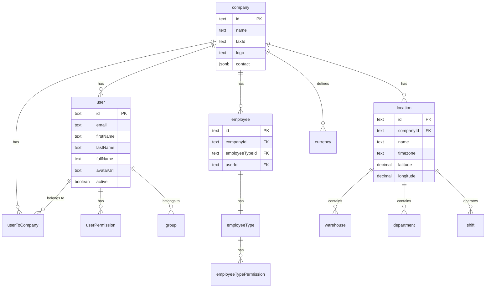
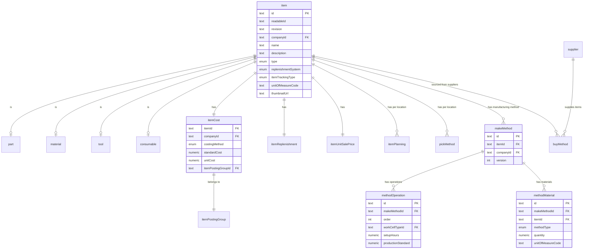
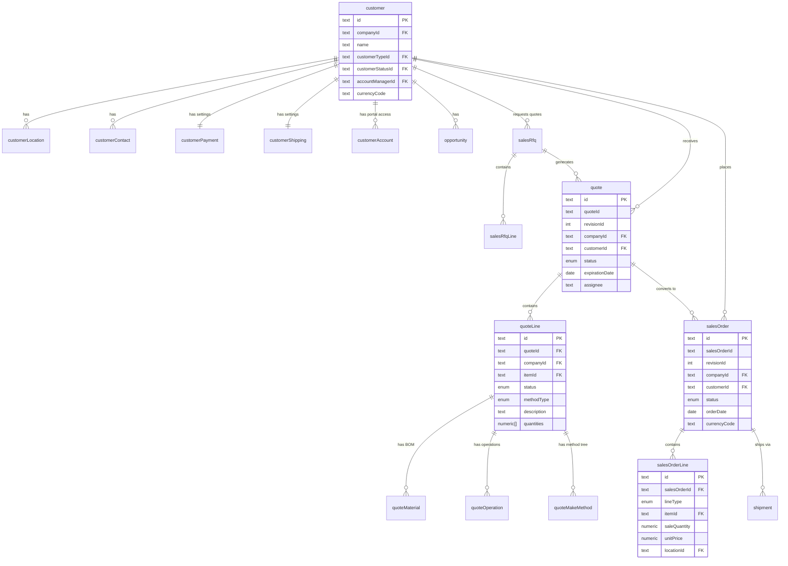
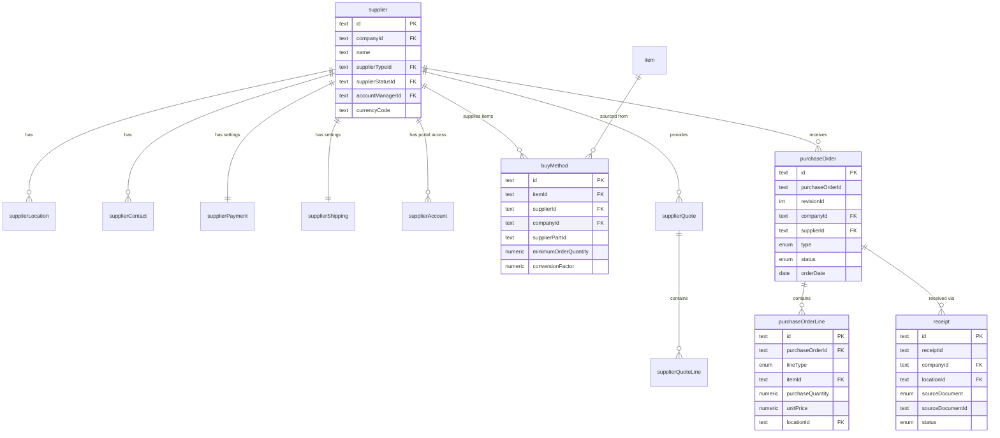
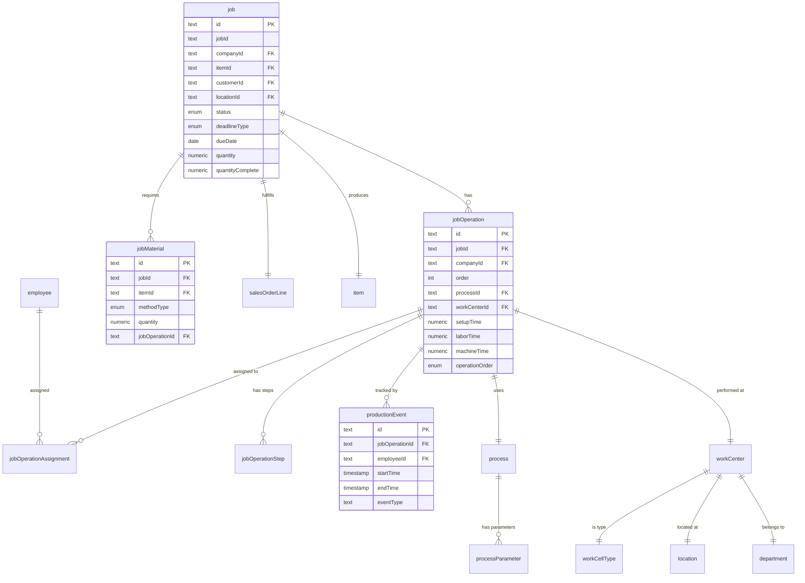
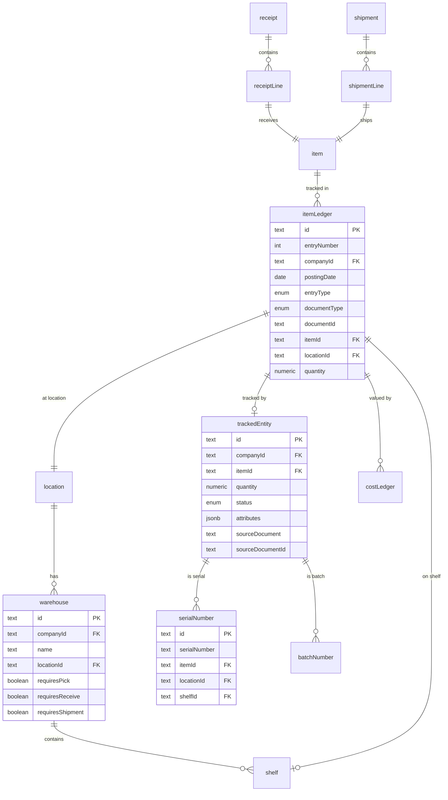
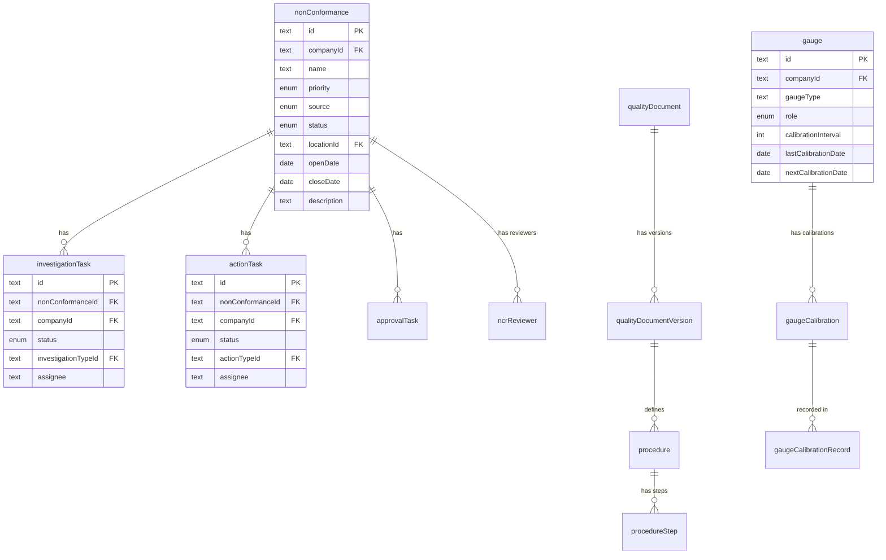
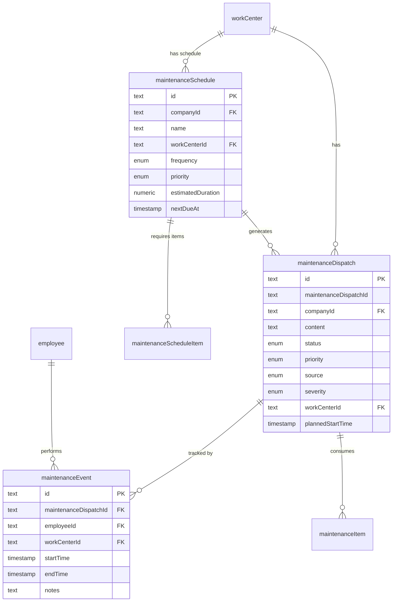
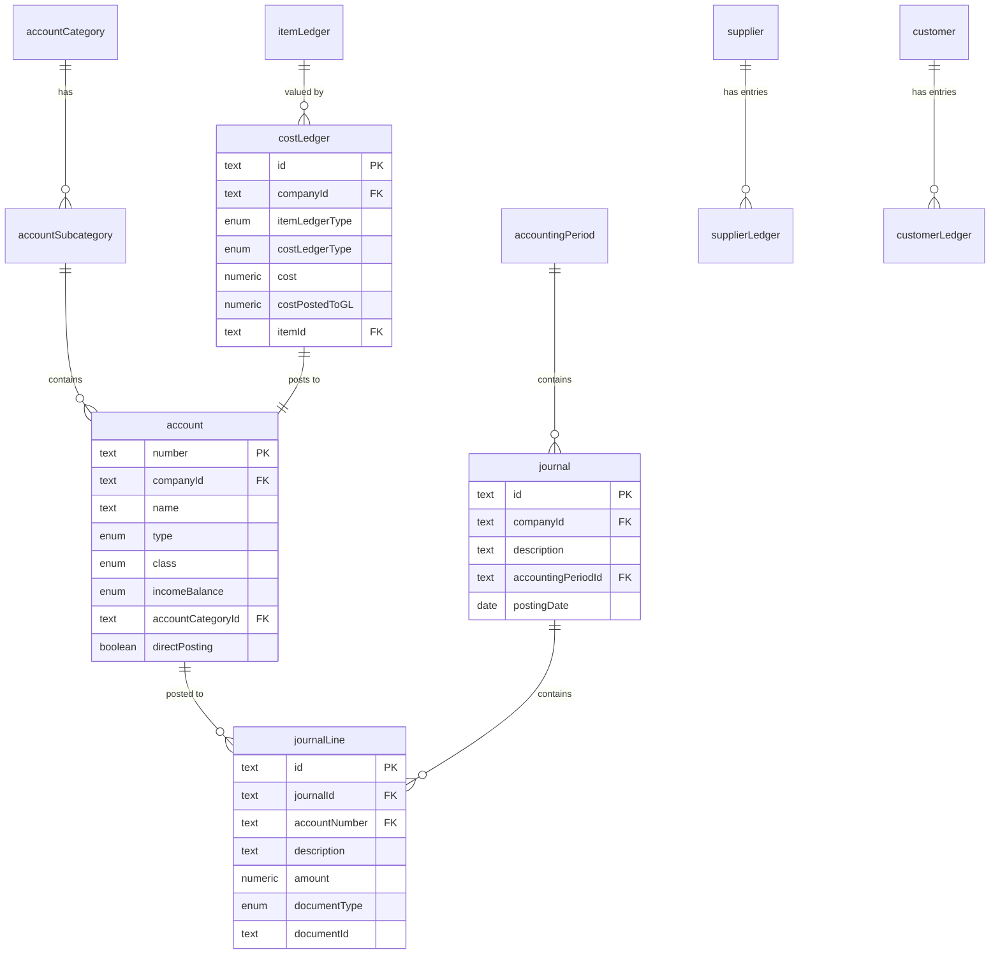
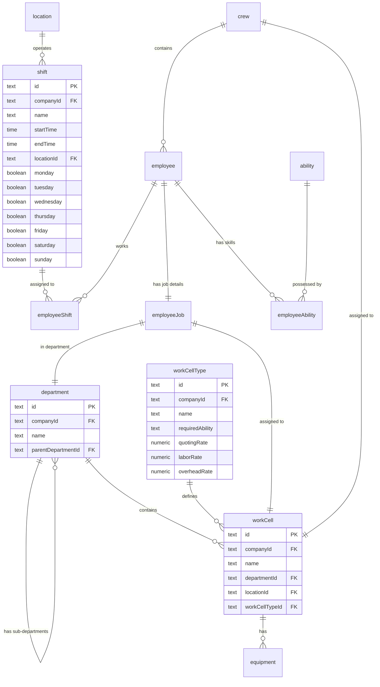

# Carbon Manufacturing System - Database Schema Documentation

## Overview

This document provides a comprehensive overview of the Carbon Manufacturing ERP/MES database schema, including all tables, relationships, and entity diagrams organized by functional module.

## Database Technology

- **Database**: PostgreSQL (via Supabase)
- **ID Generation**: Custom `xid()` function - 20-character ordered unique IDs
- **Multi-Tenancy**: Company-based isolation with Row-Level Security (RLS)
- **Real-time**: Supabase real-time subscriptions enabled on key tables
- **Type Safety**: Full TypeScript types generated from database schema

## Core Patterns

### Multi-Tenancy Pattern
All business tables follow this structure:
```sql
CREATE TABLE "tableName" (
  "id" TEXT NOT NULL DEFAULT xid(),
  "companyId" TEXT NOT NULL REFERENCES "company"("id") ON DELETE CASCADE,
  -- other fields --
  PRIMARY KEY ("id", "companyId")
);
CREATE INDEX "tableName_companyId_idx" ON "tableName"("companyId");
```

### Audit Trail Pattern
Standard audit fields on most tables:
```sql
"createdBy" TEXT NOT NULL REFERENCES "user"("id"),
"createdAt" TIMESTAMP WITH TIME ZONE NOT NULL DEFAULT NOW(),
"updatedBy" TEXT REFERENCES "user"("id"),
"updatedAt" TIMESTAMP WITH TIME ZONE
```

### Extensibility Pattern
```sql
"customFields" JSONB,
"tags" TEXT[]
```

---

## Entity Relationship Diagrams by Module

### 1. Core System & Authentication



### 2. Items & Parts Module



### 3. Sales Module



### 4. Purchasing Module



### 5. Production/MES Module



### 6. Inventory Module



### 7. Quality Module



### 8. Maintenance Module



### 9. Accounting Module



### 10. Resources Module



---

## Key Relationships Summary

### Item/Part Hierarchy
- `item` (master) → `part`, `material`, `tool`, `consumable` (type-specific data)
- `item` → `itemCost`, `itemReplenishment`, `itemUnitSalePrice` (1:1)
- `item` → `itemPlanning` (1:many per location)
- `item` → `makeMethod` → `methodOperation`, `methodMaterial` (manufacturing BOM)
- `item` → `buyMethod` → `supplier` (purchasing)

### Sales Flow
- `customer` → `opportunity` → `salesRfq` → `quote` → `salesOrder` → `shipment`
- `quote` → `quoteLine` → `quoteMaterial`, `quoteOperation`, `quoteMakeMethod`
- `salesOrder` → `salesOrderLine` → `job` (production)

### Purchasing Flow
- `supplier` → `buyMethod` (item sourcing)
- `supplier` → `purchaseOrder` → `purchaseOrderLine` → `receipt`

### Production Flow
- `job` → `jobOperation` → `jobMaterial`
- `jobOperation` → `process`, `workCenter`
- `jobOperation` → `productionEvent` (MES tracking)

### Inventory Flow
- `receipt`, `shipment` → `itemLedger` (quantity tracking)
- `itemLedger` → `costLedger` (valuation)
- `itemLedger` → `trackedEntity` → `serialNumber`, `batchNumber`

### Location Hierarchy
- `company` → `location` → `warehouse` → `shelf`
- `location` → `department` → `workCell`
- `location` → `shift`

---

## Database Functions & Triggers

### Custom Functions
- `xid()` - Generate ordered 20-character unique IDs
- `has_role()` - Check user role in company
- `has_company_permission()` - Check user permission
- `get_companies_with_employee_permission()` - Get accessible companies for user

### Key Triggers
- Auto-create related records on item creation (cost, replenishment, pricing)
- Auto-create makeMethod for parts/tools
- Update search index on record changes
- Audit trail updates (updatedBy, updatedAt)

---

## Row-Level Security (RLS)

All business tables implement RLS policies:
- **SELECT**: Users can view records in companies they have permission to
- **INSERT**: Users can create records in companies they have employee permission
- **UPDATE**: Users can update records they have permission for
- **DELETE**: Users can delete records they have permission for

Policy naming convention (2025+):
- `"SELECT"` - View policy
- `"INSERT"` - Create policy
- `"UPDATE"` - Update policy
- `"DELETE"` - Delete policy

---

## Views

Major aggregated views with proper RLS:
- `parts` - Items with part details
- `suppliers` - Suppliers with type, status, counts
- `customers` - Customers with type, status, counts
- `quotes` - Quotes with customer, assignee details
- `salesOrders` - Sales orders with customer, status
- `jobs` - Jobs with item, customer, operation counts
- `itemQuantities` - Current inventory by item/location
- `itemQuantitiesByTrackingId` - Inventory by serial/batch

---

## Realtime-Enabled Tables

Tables with Supabase realtime enabled:
- `item`
- `part`
- `journal`
- `receipt`
- `salesOrderLine`
- `job`
- `productionEvent`

---

## Migration Conventions

### File Naming
Format: `YYYYMMDDHHMMSS_description.sql`

### Migration Commands
```bash
# Create new migration
npm run db:migrate <name-of-migration>

# Apply migrations
npm run db:push
```

### Best Practices
- Always include RLS policies
- Use composite primary keys for multi-tenant tables
- Include indexes on foreign keys and companyId
- Use ON DELETE CASCADE for child records
- Use ON DELETE SET NULL for optional relationships
