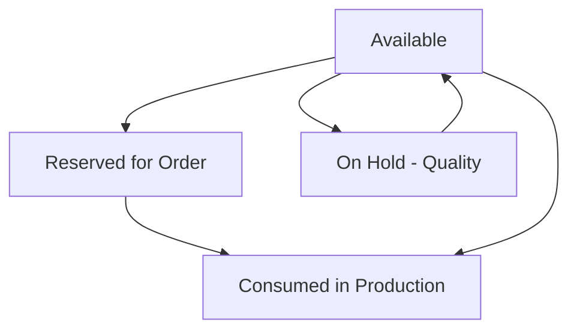

This document contains user stories for the Inventory module, covering inventory tracking, warehouse operations, kanban replenishment, receipts, shipments, and serial/lot tracking. Stories are derived from actual implemented features.

## Inventory Visibility

### Story: View Inventory Quantities

- **As a** warehouse manager
- **I want to** view current inventory quantities by location
- **So that** I know what stock is available

**Acceptance criteria:**
- [ ] Can view quantities for all items
- [ ] Can filter by location
- [ ] Can filter by shelf
- [ ] Quantities shown by item and location combination
- [ ] Can see on-hand, committed, and available quantities
- [ ] Can drill down to see ledger transactions
- [ ] Real-time updates as transactions occur

**Source:** `apps/carbon/app/routes/x+/inventory+/quantities.tsx`

---

### Story: View Tracked Entities

- **As a** warehouse manager
- **I want to** view all serial numbers and lot numbers
- **So that** I can track specific inventory units

**Acceptance criteria:**
- [ ] Can view all tracked entities (serial/batch/lot)
- [ ] Can filter by item
- [ ] Can filter by location
- [ ] Can see entity status: Available, Consumed, On Hold, Reserved
- [ ] Can see quantity per entity
- [ ] Can view traceability graph (forward and backward)
- [ ] Can search by serial/lot number

**Source:** `apps/carbon/app/routes/x+/inventory+/tracked-entities.tsx`

---

## Warehouse Operations

### Story: Receive Inventory

- **As a** receiving clerk
- **I want to** record receipt of inventory
- **So that** stock levels are updated

**Acceptance criteria:**
- [ ] Source document ID is required (PO, production order, transfer)
- [ ] Location ID is required (where receiving)
- [ ] Receipt date is required
- [ ] Can receive partial quantities
- [ ] Can assign items to specific shelves
- [ ] Can create tracked entities during receipt (serial/lot numbers)
- [ ] Receipt creates item ledger entries
- [ ] Receipt updates on-hand quantities
- [ ] Can post multiple receipts against same source document

**Source:** `apps/carbon/app/modules/inventory/inventory.models.ts` - `receiptValidator`

---

### Story: Ship Inventory

- **As a** shipping clerk
- **I want to** record shipment of inventory
- **So that** stock levels are reduced

**Acceptance criteria:**
- [ ] Source document ID is required (sales order, production job, transfer)
- [ ] Location ID is required (shipping from)
- [ ] Shipment date is required
- [ ] Can ship partial quantities
- [ ] Can select items from specific shelves
- [ ] Must consume tracked entities if item requires tracking
- [ ] Shipment creates item ledger entries
- [ ] Shipment reduces on-hand quantities
- [ ] Can track shipment status

**Source:** `apps/carbon/app/modules/inventory/inventory.models.ts` - `shipmentValidator`

---

### Story: Transfer Inventory Between Locations

- **As a** warehouse manager
- **I want to** transfer inventory between locations
- **So that** stock is available where needed

**Acceptance criteria:**
- [ ] From location is required
- [ ] To location is required
- [ ] From and to locations must be different
- [ ] Transfer reduces stock at from location
- [ ] Transfer increases stock at to location
- [ ] Can track transfer in-transit
- [ ] Transfer status: Draft, To Ship and Receive, To Ship, To Receive, Completed
- [ ] Can post partial transfers

**Source:** `apps/carbon/app/routes/x+/inventory+/stock-transfers.tsx`

---

### Story: Move Inventory Within Warehouse

- **As a** warehouse worker
- **I want to** move inventory between shelves in same warehouse
- **So that** stock is organized correctly

**Acceptance criteria:**
- [ ] Can move items from one shelf to another
- [ ] Location remains the same
- [ ] From shelf and to shelf must be different
- [ ] Movement creates ledger entries
- [ ] Can scan barcodes to facilitate movements
- [ ] Quantities automatically adjusted

**Source:** `apps/carbon/app/routes/x+/inventory+/warehouse-transfers.tsx`

---

## Shelf Management

### Story: Create Storage Shelf

- **As a** warehouse manager
- **I want to** define storage shelves/bins
- **So that** I can organize inventory by location

**Acceptance criteria:**
- [ ] Shelf name is required
- [ ] Location ID is required (which warehouse/facility)
- [ ] Can create multiple shelves per location
- [ ] Shelf names must be unique within location
- [ ] Can update and delete unused shelves
- [ ] Shelves appear in location dropdowns

**Source:** `apps/carbon/app/modules/inventory/inventory.models.ts` - `shelfValidator`

---

## Kanban Replenishment

### Story: Create Kanban Card

- **As a** production planner
- **I want to** create a kanban card for an item
- **So that** inventory is replenished automatically

**Acceptance criteria:**
- [ ] Item ID is required
- [ ] Replenishment system is required: Buy, Make, Transfer
- [ ] Quantity is required (integer, >= 1)
- [ ] Location ID is required
- [ ] When replenishment system is "Buy": supplier ID is required
- [ ] When replenishment system is "Make": make method required
- [ ] Can specify shelf for stocking
- [ ] Can set purchase UOM and conversion factor
- [ ] Kanban generates QR codes for triggering

**Source:** `apps/carbon/app/modules/inventory/inventory.models.ts` - `kanbanValidator`

---

### Story: Trigger Kanban Replenishment

- **As a** production operator
- **I want to** scan kanban QR code to trigger replenishment
- **So that** materials are reordered automatically

**Acceptance criteria:**
- [ ] Can scan QR code on kanban card
- [ ] System checks for kanban collision (duplicate active replenishment)
- [ ] For "Buy" system: creates draft purchase order or adds to existing
- [ ] For "Make" system: creates production job
- [ ] Kanban status updated to "In Progress"
- [ ] Can view all active kanbans
- [ ] Notifications sent when replenishment triggered

**Source:** `apps/carbon/app/modules/inventory/inventory.service.ts`

---

### Story: Complete Kanban Cycle

- **As a** warehouse clerk
- **I want to** mark kanban as complete when stock replenished
- **So that** kanban is ready for next cycle

**Acceptance criteria:**
- [ ] Can scan "complete" QR code
- [ ] Kanban status updated to "Complete" then back to "Ready"
- [ ] Cycle time tracked
- [ ] Can view kanban performance metrics
- [ ] Can analyze lead times by item

**Source:** `apps/carbon/app/modules/inventory/inventory.service.ts`

---

## Serial & Lot Tracking

### Story: Enable Serial Tracking

- **As a** quality manager
- **I want to** enable serial number tracking for critical items
- **So that** I can trace individual units

**Acceptance criteria:**
- [ ] Can set item tracking type to "Serial"
- [ ] Serial numbers required at receipt
- [ ] Each serial number unique
- [ ] Can track serial through production, shipment, consumption
- [ ] Forward traceability: where did this serial go?
- [ ] Backward traceability: where did components come from?
- [ ] Traceability forms directed acyclic graph (DAG)

**Source:** `packages/database/supabase/migrations/20250301125444_tracked-materials.sql`

---

### Story: Enable Lot/Batch Tracking

- **As a** quality manager
- **I want to** enable lot number tracking for batch-produced items
- **So that** I can recall specific batches if needed

**Acceptance criteria:**
- [ ] Can set item tracking type to "Batch"
- [ ] Lot numbers assigned at receipt or production
- [ ] Multiple units can share same lot number
- [ ] Can track lot through all transactions
- [ ] Can perform lot recall analysis
- [ ] Can see all locations where lot exists

**Source:** `packages/database/supabase/migrations/20250301125444_tracked-materials.sql`

---

### Story: Trace Material Genealogy

- **As a** quality engineer
- **I want to** trace material genealogy
- **So that** I can investigate quality issues

**Acceptance criteria:**
- [ ] Can select any tracked entity
- [ ] Can view forward trace: what was built from this material?
- [ ] Can view backward trace: what materials went into this?
- [ ] Trace shows complete path through production
- [ ] Can see operations where material was consumed/produced
- [ ] Can export trace for compliance reporting

**Source:** Database functions for traceability traversal

---

## Inventory Adjustments

### Story: Perform Cycle Count

- **As a** warehouse manager
- **I want to** perform inventory count and adjust quantities
- **So that** system matches physical inventory

**Acceptance criteria:**
- [ ] Can record actual counted quantity
- [ ] System calculates variance (counted - system)
- [ ] Can post positive adjustment (increase)
- [ ] Can post negative adjustment (decrease)
- [ ] Adjustments create ledger entries
- [ ] Can require approval for large variances
- [ ] Audit trail of all adjustments

**Source:** Item ledger adjustment functionality

---

## Permissions & Access Control

### Module Permission: `inventory`

| Action | Permission | Description |
|--------|------------|-------------|
| View | `inventory.view` | View quantities, shelves, kanbans |
| Create | `inventory.create` | Create receipts, shelves, kanbans |
| Update | `inventory.update` | Post receipts/shipments, adjust inventory |
| Delete | `inventory.delete` | Delete drafts (posted transactions immutable) |

**Special Permissions:**
- Warehouse workers typically have view and update permissions
- Adjustments may require special approval permissions
- Posting creates immutable ledger entries

**Source:** Permission checks in route loaders via `requirePermissions(request, { view: "inventory" })`

---

## Data Validation Summary

| Field | Validation | Module |
|-------|------------|--------|
| Source Document ID | Required | Receipt, Shipment |
| Location ID | Required | Receipt, Shipment, Shelf |
| Receipt/Shipment Date | Required | Receipt, Shipment |
| Shelf Name | Required | Shelf |
| Kanban Quantity | Integer, >= 1 | Kanban |
| Replenishment System | Enum: Buy, Make, Transfer | Kanban |
| Supplier ID | Required if system=Buy | Kanban |

---

## Item Ledger Entry Types

| Entry Type | Description | Quantity Effect |
|------------|-------------|-----------------|
| Purchase | Receipt from supplier | + |
| Sale | Shipment to customer | - |
| Positive Adjmt. | Count increase | + |
| Negative Adjmt. | Count decrease | - |
| Transfer | Location movement | +/- |
| Consumption | Used in production | - |
| Output | Produced by production | + |
| Assembly Consumption | Used in assembly | - |
| Assembly Output | Produced by assembly | + |

---

## Tracked Entity Status Flow

---

## Source References

- `apps/carbon/app/modules/inventory/inventory.service.ts` - Business logic for inventory operations
- `apps/carbon/app/modules/inventory/inventory.models.ts` - Zod validators for inventory entities
- `apps/carbon/app/routes/x+/inventory+/*.tsx` - Route handlers for inventory pages
- `apps/carbon/app/routes/x+/inventory+/quantities.tsx` - Inventory quantity views
- `apps/carbon/app/routes/x+/inventory+/receipts.tsx` - Receipt management
- `apps/carbon/app/routes/x+/inventory+/shipments.tsx` - Shipment management
- `apps/carbon/app/routes/x+/inventory+/kanbans.tsx` - Kanban management
- `apps/carbon/app/routes/x+/inventory+/shelves.tsx` - Shelf configuration
- `apps/carbon/app/routes/x+/inventory+/tracked-entities.tsx` - Serial/lot tracking
- `packages/database/supabase/migrations/20250301125444_tracked-materials.sql` - Tracked entity schema
