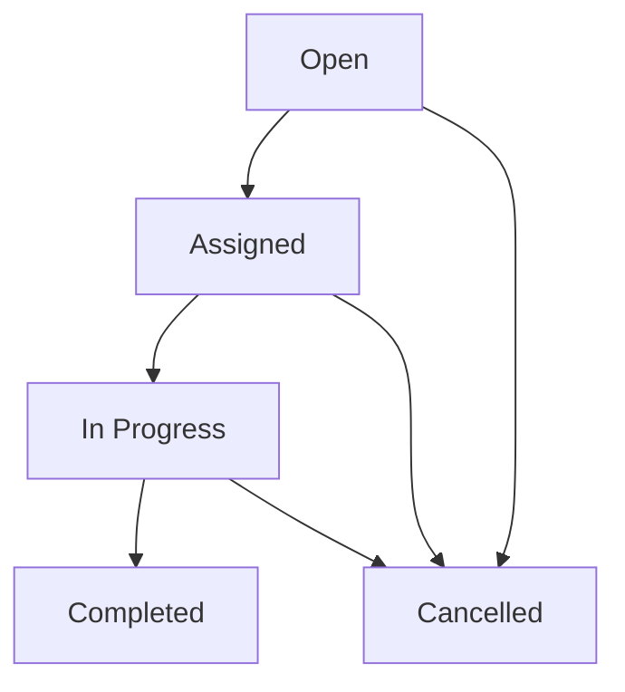

This document contains user stories for the Maintenance and Resources modules, covering maintenance dispatch, preventive maintenance scheduling, work center management, employee skills, training management, and contractor coordination. Stories are derived from actual implemented features.

## Maintenance Dispatch Management

### Story: Create Maintenance Work Order

- **As a** maintenance planner
- **I want to** create a maintenance work order
- **So that** equipment repairs are tracked and completed

**Acceptance criteria:**
- [ ] Status is required: Open, Assigned, In Progress, Completed, Cancelled
- [ ] Priority is required: Low, Medium, High, Critical
- [ ] Can specify severity: Preventive, Operator Performed, Support Required, OEM Required
- [ ] Can specify source: Scheduled, Reactive, Non-Conformance
- [ ] Can specify OEE impact: Down, Planned, Impact, No Impact
- [ ] Can assign to work center
- [ ] Can assign to employee
- [ ] Can set planned start and end times
- [ ] Can provide work description/content
- [ ] System generates unique dispatch ID from sequence

**Source:** `apps/carbon/app/modules/resources/resources.models.ts` - `maintenanceDispatchValidator`

---

### Story: Track Dispatch Status

- **As a** maintenance supervisor
- **I want to** see the current status of each work order
- **So that** I know what requires attention

**Status Workflow:**

**Acceptance criteria:**
- [ ] Status options: Open, Assigned, In Progress, Completed, Cancelled
- [ ] Status transitions follow workflow
- [ ] Cannot reopen completed work orders
- [ ] Status changes tracked with timestamps
- [ ] Notifications sent on status changes

**Source:** Maintenance dispatch status field

---

### Story: Record Maintenance Event

- **As a** maintenance technician
- **I want to** record time spent on maintenance
- **So that** labor hours are tracked

**Acceptance criteria:**
- [ ] Dispatch ID is required
- [ ] Employee ID is required (who performed work)
- [ ] Work center ID is required
- [ ] Start time is required
- [ ] End time is optional (for in-progress work)
- [ ] End time must be after start time when provided
- [ ] Can add notes about work performed
- [ ] Labor hours auto-calculated from start/end times

**Source:** `apps/carbon/app/modules/resources/resources.models.ts` - `maintenanceDispatchEventValidator`

---

### Story: Add Parts to Work Order

- **As a** maintenance technician
- **I want to** record parts used during maintenance
- **So that** inventory is depleted and costs tracked

**Acceptance criteria:**
- [ ] Item ID is required
- [ ] Quantity is required (>= 1)
- [ ] Unit of measure is required
- [ ] Unit cost is optional (defaults from item cost)
- [ ] Parts deducted from inventory when work order completed
- [ ] Parts cost rolled into maintenance cost tracking

**Source:** `apps/carbon/app/modules/resources/resources.models.ts` - `maintenanceDispatchItemValidator`

---

### Story: Add Comments to Work Order

- **As a** maintenance technician
- **I want to** add comments and notes
- **So that** future technicians know what was done

**Acceptance criteria:**
- [ ] Can add multiple comments per work order
- [ ] Comments timestamped and attributed to user
- [ ] Can attach photos to comments
- [ ] Comments visible in work order history
- [ ] Comments printable for work packet

**Source:** `apps/carbon/app/modules/resources/resources.models.ts` - `maintenanceDispatchCommentValidator`

---

### Story: Track Equipment Downtime

- **As a** production manager
- **I want to** see how maintenance affects production
- **So that** I can plan around downtime

**Acceptance criteria:**
- [ ] OEE impact indicates production effect
- [ ] "Down" status blocks production scheduling
- [ ] "Planned" downtime scheduled in advance
- [ ] "Impact" reduces capacity estimates
- [ ] "No Impact" allows continued production
- [ ] Downtime reports available by work center

**Source:** OEE impact field in dispatch model

---

## Preventive Maintenance

### Story: Create Maintenance Schedule

- **As a** maintenance planner
- **I want to** define preventive maintenance schedules
- **So that** equipment is maintained proactively

**Acceptance criteria:**
- [ ] Name is required
- [ ] Work center ID is required
- [ ] Frequency is required: Daily, Weekly, Monthly, Quarterly, Annual
- [ ] Priority is required: Low, Medium, High, Critical
- [ ] Can set specific days of week for weekly frequency
- [ ] Can set active/inactive status
- [ ] Can set estimated duration
- [ ] Can configure to skip holidays
- [ ] Next due date auto-calculated from frequency

**Source:** `apps/carbon/app/modules/resources/resources.models.ts` - `maintenanceScheduleValidator`

---

### Story: Define Schedule Items

- **As a** maintenance planner
- **I want to** specify parts needed for scheduled maintenance
- **So that** materials are available when needed

**Acceptance criteria:**
- [ ] Can add multiple items per schedule
- [ ] Item ID is required
- [ ] Quantity is required (>= 1)
- [ ] Unit of measure is required
- [ ] Items pre-populate work orders generated from schedule
- [ ] Can update item quantities as procedures improve

**Source:** `apps/carbon/app/modules/resources/resources.models.ts` - `maintenanceScheduleItemValidator`

---

### Story: Generate Work Orders from Schedule

- **As a** maintenance planner
- **I want to** automatically generate work orders from schedules
- **So that** PM doesn't get forgotten

**Acceptance criteria:**
- [ ] System generates work orders based on frequency
- [ ] Work orders created with "Scheduled" source
- [ ] Schedule items copied to work order
- [ ] Next due date updated after generation
- [ ] Can generate work orders in advance (planning horizon)
- [ ] Holidays skipped if configured

**Source:** Maintenance schedule automation

---

## Work Center & Equipment Management

### Story: Define Work Center

- **As a** manufacturing engineer
- **I want to** define work centers
- **So that** production and maintenance are organized by area

**Acceptance criteria:**
- [ ] Name is required
- [ ] Location ID is required (which facility)
- [ ] Can set default standard factor for time calculations
- [ ] Can set labor rate ($/hour)
- [ ] Can set machine rate ($/hour)
- [ ] Can set overhead rate ($/hour)
- [ ] Can specify required ability/skill
- [ ] Rates used for job costing

**Source:** `apps/carbon/app/modules/resources/resources.models.ts` - `workCenterValidator`

---

### Story: Track Work Center Maintenance

- **As a** maintenance manager
- **I want to** see all maintenance for a work center
- **So that** I can identify problem equipment

**Acceptance criteria:**
- [ ] Can view all dispatches by work center
- [ ] Can see total downtime per work center
- [ ] Can see maintenance cost per work center
- [ ] Can identify most problematic equipment
- [ ] Can track MTBF (Mean Time Between Failures)
- [ ] Can track MTTR (Mean Time To Repair)

**Source:** Work center association with dispatches

---

## Failure Mode Tracking

### Story: Define Failure Modes

- **As a** maintenance engineer
- **I want to** catalog equipment failure modes
- **So that** we can track failure patterns

**Acceptance criteria:**
- [ ] Can create failure mode
- [ ] Name is required
- [ ] Can specify failure type: Maintenance, Quality, Operations, Other
- [ ] Can provide description
- [ ] Failure modes available when creating work orders
- [ ] Can analyze dispatch frequency by failure mode

**Source:** `apps/carbon/app/modules/resources/resources.models.ts` - `failureModeValidator`

---

## Employee Skills & Abilities

### Story: Define Skill/Ability

- **As an** HR manager
- **I want to** define skills and certifications
- **So that** I know employee capabilities

**Acceptance criteria:**
- [ ] Name is required
- [ ] Can set starting point for learning curve (0-100)
- [ ] Can set weeks to full proficiency (>= 0)
- [ ] Can set shadow weeks (<= total weeks)
- [ ] Can link abilities to work centers
- [ ] Can require certification/training

**Source:** `apps/carbon/app/modules/resources/resources.models.ts` - `abilityValidator`

---

### Story: Assign Ability to Employee

- **As an** HR manager
- **I want to** record employee skills
- **So that** I can assign appropriate work

**Acceptance criteria:**
- [ ] Employee ID is required
- [ ] Ability ID is required
- [ ] Can set training date
- [ ] Can set current proficiency level
- [ ] Can set certified status
- [ ] Can track certification expiration
- [ ] Can require recertification

**Source:** `apps/carbon/app/modules/resources/resources.models.ts` - `employeeAbilityValidator`

---

## Training Management

### Story: Create Training Content

- **As a** training coordinator
- **I want to** create training courses
- **So that** employees can learn required skills

**Acceptance criteria:**
- [ ] Training name is required
- [ ] Status options: Draft, Active, Archived
- [ ] Can set frequency: Once, Quarterly, Annual
- [ ] Can add training materials (videos, documents)
- [ ] Can create quiz questions
- [ ] Question types: Multiple Choice, True/False, Multiple Answers, Matching Pairs, Numerical
- [ ] Can set passing score
- [ ] Only one version active at a time

**Source:** `apps/carbon/app/modules/resources/resources.models.ts` - `trainingValidator`

---

### Story: Create Training Questions

- **As a** training coordinator
- **I want to** add quiz questions to training
- **So that** I can verify employee understanding

**Acceptance criteria:**
- [ ] Training ID is required
- [ ] Question text is required
- [ ] Question type is required
- [ ] Multiple Choice: requires 2+ options, exactly 1 correct
- [ ] Multiple Answers: requires 2+ options, 1+ correct
- [ ] True/False: requires correct boolean
- [ ] Matching Pairs: requires 2+ pairs in JSON format
- [ ] Numerical: requires correct number and optional tolerance
- [ ] Complex validation based on question type

**Source:** `apps/carbon/app/modules/resources/resources.models.ts` - `trainingQuestionValidator`

---

### Story: Assign Training to Employees

- **As an** HR manager
- **I want to** assign training to employees or groups
- **So that** required training is completed

**Acceptance criteria:**
- [ ] Training ID is required
- [ ] Can assign to individual employee or group
- [ ] Can set due date
- [ ] Can track completion status
- [ ] Employees notified of assignment
- [ ] Can send reminders for incomplete training

**Source:** `apps/carbon/app/modules/resources/resources.models.ts` - `trainingAssignmentValidator`

---

### Story: Complete Training

- **As an** employee
- **I want to** complete assigned training
- **So that** I maintain required skills

**Acceptance criteria:**
- [ ] Can view assigned training
- [ ] Can watch videos and review materials
- [ ] Can take quiz
- [ ] Must achieve passing score
- [ ] Can retake if failed
- [ ] Completion recorded with timestamp
- [ ] Certificate generated upon passing
- [ ] Manager notified of completion

**Source:** `apps/carbon/app/modules/resources/resources.models.ts` - `trainingCompletionValidator`

---

## Contractor & Partner Management

### Story: Register Contractor

- **As a** maintenance manager
- **I want to** register outside contractors
- **So that** I can assign overflow maintenance work

**Acceptance criteria:**
- [ ] Contractor name is required
- [ ] Can set hours per week available
- [ ] Can assign abilities/capabilities
- [ ] Can set hourly rate
- [ ] Can track assigned work orders
- [ ] Can measure performance

**Source:** `apps/carbon/app/modules/resources/resources.models.ts` - `contractorValidator`

---

### Story: Define Outside Processing Partner

- **As a** operations manager
- **I want to** register outside processing partners
- **So that** I can outsource operations

**Acceptance criteria:**
- [ ] Partner references supplier location
- [ ] Can set hours per week available
- [ ] Can assign process abilities
- [ ] Partners appear in job operation assignment
- [ ] Can track work sent to partners

**Source:** `apps/carbon/app/modules/resources/resources.models.ts` - `partnerValidator`

---

## Location Management

### Story: Define Facility Location

- **As a** facilities manager
- **I want to** register company locations
- **So that** inventory and operations are organized by site

**Acceptance criteria:**
- [ ] Name is required
- [ ] Address is required (line 1, city, state, postal code, country)
- [ ] Timezone is required
- [ ] Can provide latitude/longitude for mapping
- [ ] Both lat/long required if either provided
- [ ] Locations used throughout system for multi-site operations

**Source:** `apps/carbon/app/modules/resources/resources.models.ts` - `locationValidator`

---

## Permissions & Access Control

### Module Permissions: `resources` and `maintenance`

| Action | Permission | Description |
|--------|------------|-------------|
| View | `resources.view` | View work centers, schedules, employees |
| Create | `resources.create` | Create work centers, schedules |
| Update | `resources.update` | Edit work centers, record maintenance |
| Delete | `resources.delete` | Delete work centers (if unused) |

**Special Permissions:**
- Maintenance technicians need dispatch update permissions
- Training assignments may require HR permissions
- Contractor coordination may require purchasing permissions

**Source:** Permission checks in route loaders

---

## Data Validation Summary

| Field | Validation | Module |
|-------|------------|--------|
| Dispatch Status | Enum required | Maintenance Dispatch |
| Dispatch Priority | Enum required | Maintenance Dispatch |
| Event Start Time | Required | Maintenance Event |
| Event End Time | Must be > start time | Maintenance Event |
| Schedule Frequency | Enum required | Maintenance Schedule |
| Work Center Name | Required | Work Center |
| Labor/Machine/Overhead Rate | >= 0 | Work Center |
| Ability Weeks | >= 0 | Ability |
| Shadow Weeks | <= total weeks | Ability |
| Training Status | Enum: Draft, Active, Archived | Training |
| Question Type | Enum with conditional validation | Training Question |
| Location Address | Required fields | Location |
| Latitude/Longitude | Both required if either provided | Location |

---

## Maintenance Priority Levels

| Priority | Response Time | Use Case |
|----------|--------------|----------|
| Critical | Immediate | Production stopped |
| High | < 4 hours | Production impacted |
| Medium | < 24 hours | Minor issues |
| Low | < 1 week | Preventive maintenance |

---

## Training Question Type Validation

| Type | Required | Validation |
|------|----------|------------|
| Multiple Choice | options, correctAnswerIndex | 2+ options, exactly 1 correct |
| Multiple Answers | options, correctAnswerIndices | 2+ options, 1+ correct |
| True/False | correctBoolean | Boolean value |
| Matching Pairs | matchingPairs | 2+ pairs in JSON |
| Numerical | correctNumber, tolerance | Number and optional range |

---

## Source References

- `apps/carbon/app/modules/resources/resources.service.ts` - Business logic for resources and maintenance
- `apps/carbon/app/modules/resources/resources.models.ts` - Zod validators for all entities
- `apps/carbon/app/routes/x+/maintenance+/*.tsx` - Maintenance dispatch pages
- `apps/carbon/app/routes/x+/resources+/*.tsx` - Resource management pages
- `apps/carbon/app/routes/x+/maintenance+/$dispatchId.tsx` - Dispatch details and tracking
- `packages/database/supabase/migrations/20251231125644_maintenance_dispatch_location.sql` - Dispatch schema
