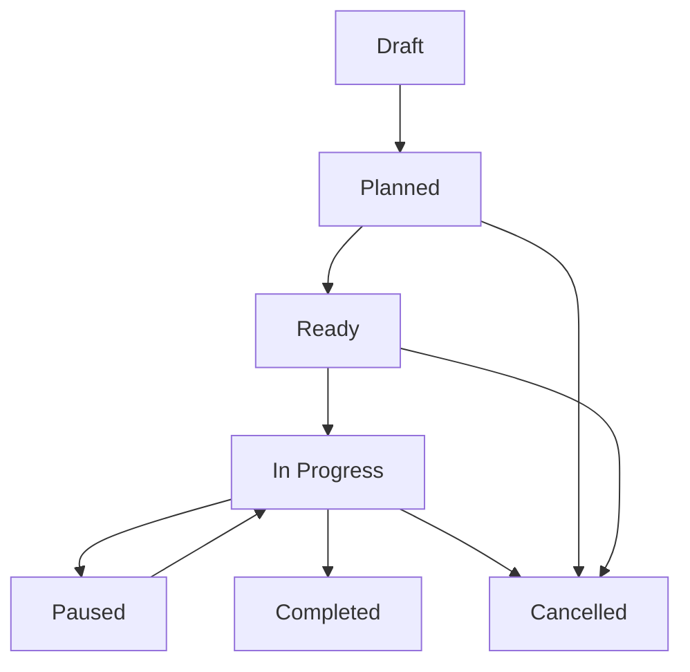

This document contains user stories for the Production module (MES - Manufacturing Execution System), covering job management, production planning, work instructions, demand forecasting, and scrap tracking. Stories are derived from actual implemented features.

## Job Management

### Story: Create Production Job

- **As a** production planner
- **I want to** create a production job
- **So that** I can schedule manufacturing of an item

**Acceptance criteria:**
- [ ] Item ID is required
- [ ] Location ID is required (where to produce)
- [ ] Quantity is required (>= 0)
- [ ] Deadline type is required: No Deadline, ASAP, Soft Deadline, Hard Deadline
- [ ] Due date is required when deadline type is "Hard Deadline" or "Soft Deadline"
- [ ] Due date validation: must be valid date when required
- [ ] Job status defaults to "Draft"
- [ ] Can optionally link to sales order and line
- [ ] Can assign to user
- [ ] System generates unique job ID from sequence
- [ ] Job tracks createdBy, createdAt, updatedBy, updatedAt

**Source:** `apps/carbon/app/modules/production/production.models.ts` - `jobValidator`

---

### Story: Create Bulk Production Jobs

- **As a** production planner
- **I want to** create multiple jobs at once with scheduled dates
- **So that** I can plan recurring production efficiently

**Acceptance criteria:**
- [ ] Start date is required (must be >= today)
- [ ] End date is required (must be >= start date)
- [ ] Frequency is required: Daily, Weekly, Biweekly, Monthly, Quarterly, Annual
- [ ] Quantity per job is required (>= 0)
- [ ] System creates one job per frequency interval
- [ ] Jobs automatically scheduled between start and end dates
- [ ] All jobs share same item, location, and settings
- [ ] Due dates automatically distributed across date range

**Source:** `apps/carbon/app/modules/production/production.models.ts` - `bulkJobValidator`

---

### Story: Track Job Status

- **As a** production supervisor
- **I want to** see the current status of each job
- **So that** I know what action is needed

**Status Workflow:**

**Acceptance criteria:**
- [ ] Status options: Draft, Planned, Ready, In Progress, Paused, Completed, Cancelled
- [ ] Jobs can be paused and resumed
- [ ] Completed jobs cannot be reopened
- [ ] Status transitions follow workflow rules
- [ ] Status history is tracked

**Source:** `apps/carbon/app/modules/production/production.models.ts`

---

### Story: Track Job Operation Status

- **As a** production operator
- **I want to** see the status of each operation in a job
- **So that** I know which operations to work on

**Acceptance criteria:**
- [ ] Operation status options: Pending, Planned, Ready, In Progress, Completed, Cancelled
- [ ] Operations progress in sequence order
- [ ] Cannot start operation until previous complete (if sequential)
- [ ] Can track start time, end time, labor hours
- [ ] Operation status rolls up to job status

**Source:** `apps/carbon/app/modules/production/production.models.ts`

---

### Story: Record Scrap Quantity

- **As a** production operator
- **I want to** record scrap quantities with reasons
- **So that** we can track waste and improve processes

**Acceptance criteria:**
- [ ] Can specify scrap quantity
- [ ] Can select scrap reason from predefined list
- [ ] Scrap quantity reduces completed good quantity
- [ ] Scrap tracked per operation
- [ ] Can report on scrap by reason and operation

**Source:** `apps/carbon/app/routes/x+/production+/scrap-reasons.tsx`

---

## Production Planning

### Story: View Production Schedule

- **As a** production planner
- **I want to** view all planned and active jobs
- **So that** I can manage capacity and workload

**Acceptance criteria:**
- [ ] Can view jobs by date range
- [ ] Can filter by status, item, location
- [ ] Can see job priority (based on deadline type)
- [ ] ASAP jobs appear at top of list
- [ ] Can see jobs by work center
- [ ] Can reschedule jobs by changing due dates

**Source:** `apps/carbon/app/routes/x+/production+/planning.tsx`

---

### Story: View Demand Projections

- **As a** production planner
- **I want to** see future demand for items
- **So that** I can plan production capacity

**Acceptance criteria:**
- [ ] Can view demand by item and location
- [ ] Can see demand by period (week, month)
- [ ] Demand sources visible: sales orders, forecasts
- [ ] Can drill down to see specific orders driving demand
- [ ] Projections update automatically from MRP

**Source:** `apps/carbon/app/routes/x+/production+/projections.tsx`

---

### Story: Create Demand Forecast

- **As a** production planner
- **I want to** create demand forecasts for items
- **So that** I can plan production ahead of orders

**Acceptance criteria:**
- [ ] Can create forecast by item and location
- [ ] Can set forecast quantity by period
- [ ] Can set forecast start and end dates
- [ ] Forecasts feed into MRP calculations
- [ ] Can update and delete forecasts
- [ ] Actual orders consume forecast quantities

**Source:** `apps/carbon/app/routes/x+/production+/projections.tsx`

---

## Work Instructions & Procedures

### Story: Create Work Instruction Procedure

- **As a** manufacturing engineer
- **I want to** create standard work instructions
- **So that** operators know how to perform operations

**Acceptance criteria:**
- [ ] Procedure name is required
- [ ] Status options: Draft, Active, Archived
- [ ] Can add rich text content (instructions)
- [ ] Can add multiple steps
- [ ] Can attach documents and images
- [ ] Can version procedures
- [ ] Only one procedure can be Active at a time per name

**Source:** `apps/carbon/app/modules/production/production.models.ts` - `procedureValidator`

---

### Story: Follow Work Instructions

- **As a** production operator
- **I want to** view work instructions for my operation
- **So that** I perform the work correctly

**Acceptance criteria:**
- [ ] Can access procedures from job operation screen
- [ ] Can view step-by-step instructions
- [ ] Can view attached documents
- [ ] Can mark steps as complete
- [ ] Procedures are view-only for operators
- [ ] Can print procedures

**Source:** `apps/carbon/app/routes/x+/production+/procedures.tsx`

---

### Story: Version Work Instructions

- **As a** manufacturing engineer
- **I want to** create new versions of procedures
- **So that** I can improve instructions while preserving history

**Acceptance criteria:**
- [ ] Can copy existing procedure to create new version
- [ ] New version starts as Draft
- [ ] Must explicitly activate new version
- [ ] Activating new version archives previous version
- [ ] Historical versions remain viewable
- [ ] Jobs reference the active version at creation time

**Source:** `apps/carbon/app/routes/x+/production+/procedures.tsx`

---

## Configuration & Settings

### Story: Manage Scrap Reasons

- **As a** quality manager
- **I want to** define standard scrap reason codes
- **So that** operators can categorize waste consistently

**Acceptance criteria:**
- [ ] Can create scrap reason
- [ ] Reason name is required
- [ ] Can provide description
- [ ] Can update and delete reasons
- [ ] Reasons are company-specific
- [ ] Can report scrap by reason

**Source:** `apps/carbon/app/routes/x+/production+/scrap-reasons.tsx`

---

## Permissions & Access Control

### Module Permission: `production`

| Action | Permission | Description |
|--------|------------|-------------|
| View | `production.view` | View jobs, schedules, procedures |
| Create | `production.create` | Create jobs, procedures |
| Update | `production.update` | Edit jobs, procedures, record production |
| Delete | `production.delete` | Delete jobs, procedures (if allowed) |

**Special Permissions:**
- Operators may have limited permissions (view jobs, record production)
- Planners need create/update permissions
- Engineers need procedure management permissions

**Source:** Permission checks in route loaders via `requirePermissions(request, { view: "production" })`

---

## Data Validation Summary

| Field | Validation | Module |
|-------|------------|--------|
| Item ID | Required | Job |
| Location ID | Required | Job |
| Quantity | >= 0 | Job |
| Due Date | Required for deadlines | Job |
| Bulk Start Date | >= today | Bulk Job |
| Bulk End Date | >= start date | Bulk Job |
| Procedure Name | Required | Procedure |

---

## Job Deadline Priority

| Deadline Type | Priority | Due Date Required |
|---------------|----------|-------------------|
| ASAP | Highest | No |
| Hard Deadline | High | Yes |
| Soft Deadline | Medium | Yes |
| No Deadline | Low | No |

---

## Source References

- `apps/carbon/app/modules/production/production.service.ts` - Business logic for production operations
- `apps/carbon/app/modules/production/production.models.ts` - Zod validators for job, procedure entities
- `apps/carbon/app/routes/x+/production+/*.tsx` - Route handlers for production pages
- `apps/carbon/app/routes/x+/production+/jobs.tsx` - Job list and management
- `apps/carbon/app/routes/x+/production+/planning.tsx` - Production planning dashboard
- `apps/carbon/app/routes/x+/production+/procedures.tsx` - Work instruction management
- `apps/carbon/app/routes/x+/production+/projections.tsx` - Demand projection management
- `apps/carbon/app/routes/x+/production+/scrap-reasons.tsx` - Scrap reason configuration
- `packages/database/supabase/migrations/20240924002936_sales-order-jobs.sql` - Job database schema
