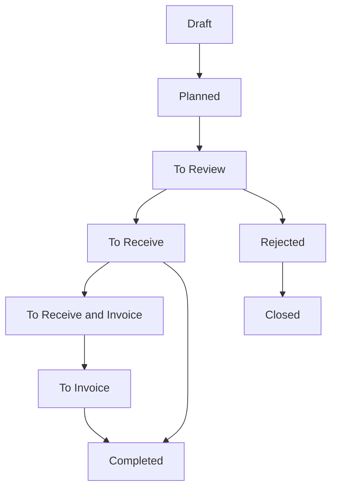

This document contains user stories for the Purchasing module, covering supplier management, supplier quotations, purchase orders, receipts, and purchase planning. Stories are derived from actual implemented features in controllers, services, and validators.

## Supplier Management

### Story: Create New Supplier

- **As a** purchasing agent
- **I want to** create a new supplier record
- **So that** I can purchase materials and services from this vendor

**Acceptance criteria:**
- [ ] Supplier name is required (minimum 1 character)
- [ ] Can optionally assign supplier status
- [ ] Can optionally assign supplier type
- [ ] Can optionally assign account manager from user list
- [ ] Can assign currency code for default pricing
- [ ] System assigns unique supplier ID automatically
- [ ] Record tracks createdBy, createdAt, updatedBy, updatedAt
- [ ] Supplier belongs to current company (multi-tenant isolation)

**Source:** `apps/carbon/app/modules/purchasing/purchasing.models.ts` - `supplierValidator`

---

### Story: Manage Supplier Locations

- **As a** purchasing agent
- **I want to** add multiple locations for a supplier
- **So that** I know where to send purchase orders and receive shipments

**Acceptance criteria:**
- [ ] Can add multiple locations per supplier
- [ ] Each location references an address record
- [ ] Locations are associated with supplier ID
- [ ] Can update and delete locations
- [ ] Can select default location for purchase orders

**Source:** `apps/carbon/app/modules/purchasing/purchasing.models.ts` - `supplierLocationValidator`

---

### Story: Manage Supplier Contacts

- **As a** purchasing agent
- **I want to** maintain contact information for each supplier
- **So that** I can communicate with the right people

**Acceptance criteria:**
- [ ] Can add multiple contacts per supplier
- [ ] Each contact references a contact record
- [ ] Can associate contacts with specific supplier locations
- [ ] Can optionally link contact to a user account (portal access)
- [ ] Can update and delete contacts

**Source:** `apps/carbon/app/modules/purchasing/purchasing.models.ts` - `supplierContactValidator`

---

### Story: Define Supplier Processes

- **As a** purchasing agent
- **I want to** record what processes a supplier can perform
- **So that** I know their capabilities for outside processing

**Acceptance criteria:**
- [ ] Supplier ID is required
- [ ] Process type is required
- [ ] Can set minimum cost (>= 0)
- [ ] Can set lead time in days (>= 0)
- [ ] Can define multiple processes per supplier
- [ ] Processes used for outside processing purchase orders

**Source:** `apps/carbon/app/modules/purchasing/purchasing.models.ts` - `supplierProcessValidator`

---

### Story: Configure Supplier Payment Terms

- **As a** purchasing agent
- **I want to** configure payment terms for each supplier
- **So that** we pay according to agreed terms

**Acceptance criteria:**
- [ ] Can select payment term from predefined list
- [ ] Can specify payment currency code
- [ ] Payment terms apply to all purchase orders for supplier
- [ ] Terms default to new purchase orders

**Source:** `apps/carbon/app/modules/purchasing/purchasing.models.ts` - `supplierPaymentValidator`

---

## Supplier Quote Management

### Story: Request Quote from Supplier

- **As a** purchasing agent
- **I want to** request a quote from a supplier
- **So that** I can compare pricing before purchasing

**Acceptance criteria:**
- [ ] Supplier ID is required
- [ ] Quote type is required: Purchase or Outside Processing
- [ ] Quote status defaults to "Draft"
- [ ] Status options: Draft, Active, Expired, Declined, Cancelled
- [ ] Can set expiration date (must be today or after)
- [ ] Can set currency code and exchange rate
- [ ] System generates unique supplier quote ID
- [ ] Quote tracks createdBy, createdAt, updatedBy, updatedAt

**Source:** `apps/carbon/app/modules/purchasing/purchasing.models.ts` - `supplierQuoteValidator`

---

### Story: Add Supplier Quote Lines

- **As a** purchasing agent
- **I want to** add line items to a supplier quote request
- **So that** I can specify what items I need pricing for

**Acceptance criteria:**
- [ ] Item ID is required
- [ ] Description is required
- [ ] Can specify supplier part number
- [ ] Inventory UOM is required
- [ ] Purchase UOM is required (may differ from inventory UOM)
- [ ] Can set conversion factor (default 1, must be > 0)
- [ ] Can specify quantity array for volume pricing
- [ ] Each quantity must be >= 0.00001
- [ ] Conversion factor handles unit differences (e.g., buy in cases, track in each)

**Source:** `apps/carbon/app/modules/purchasing/purchasing.models.ts` - `supplierQuoteLineValidator`

---

### Story: Send Quote Request to Supplier

- **As a** purchasing agent
- **I want to** finalize and send quote request to supplier
- **So that** they can provide pricing

**Acceptance criteria:**
- [ ] Quote must have at least one line item
- [ ] System validates all required fields
- [ ] Quote status changes to "Active"
- [ ] Email notification sent to supplier contact (if configured)
- [ ] Supplier can submit pricing via portal

**Source:** `apps/carbon/app/modules/purchasing/purchasing.models.ts` - `supplierQuoteFinalizeValidator`

---

### Story: Supplier Submits Quote Digitally

- **As a** supplier
- **I want to** submit pricing through supplier portal
- **So that** the buyer receives my quote quickly

**Acceptance criteria:**
- [ ] Supplier portal accessible with supplier account
- [ ] Can view quote request details
- [ ] Can enter pricing per line item
- [ ] Can enter pricing for multiple quantity breaks
- [ ] Can set lead time per item
- [ ] Quote submission creates supplier quote record
- [ ] Buyer receives notification of quote submission

**Source:** `apps/carbon/app/modules/purchasing/purchasing.models.ts` - `externalSupplierQuoteValidator`

---

### Story: Convert Supplier Quote to Purchase Order

- **As a** purchasing agent
- **I want to** convert an accepted quote to a purchase order
- **So that** I can proceed with the purchase

**Acceptance criteria:**
- [ ] Can select quote lines to include in PO
- [ ] Pricing and terms copied from quote
- [ ] New purchase order created with status "Draft"
- [ ] Quote status updated to reflect conversion
- [ ] Can create multiple POs from one quote (partial ordering)

**Source:** `apps/carbon/app/modules/purchasing/purchasing.service.ts`

---

## Purchase Order Management

### Story: Create Purchase Order

- **As a** purchasing agent
- **I want to** create a purchase order
- **So that** I can order materials from a supplier

**Acceptance criteria:**
- [ ] Purchase order type is required: Purchase or Outside Processing
- [ ] Supplier ID is required
- [ ] Order status defaults to "Draft"
- [ ] Can set order date
- [ ] Can assign to user
- [ ] Can set currency code and exchange rate
- [ ] Can add supplier reference number
- [ ] System generates unique PO ID from sequence
- [ ] PO tracks createdBy, createdAt, updatedBy, updatedAt

**Source:** `apps/carbon/app/modules/purchasing/purchasing.models.ts` - `purchaseOrderValidator`

---

### Story: Add Purchase Order Lines

- **As a** purchasing agent
- **I want to** add line items to a purchase order
- **So that** I can specify what to purchase

**Acceptance criteria:**
- [ ] Line type is required: Part, Material, Tool, Consumable, Comment
- [ ] Item ID required for inventory item types
- [ ] Can specify purchase quantity
- [ ] Can set supplier unit price
- [ ] Can specify conversion factor for unit differences
- [ ] Purchase UOM and Inventory UOM can differ
- [ ] Can set promised delivery date
- [ ] Can assign to specific location and shelf
- [ ] For outside processing: can link to job and operation

**Source:** `apps/carbon/app/modules/purchasing/purchasing.models.ts` - `purchaseOrderLineValidator`

---

### Story: Configure Delivery Details

- **As a** purchasing agent
- **I want to** specify where items should be delivered
- **So that** they arrive at the correct location

**Acceptance criteria:**
- [ ] Can specify receiving location
- [ ] Can specify delivery date
- [ ] Can enable drop shipment to customer
- [ ] When drop shipment enabled: customer ID and location required
- [ ] When drop shipment enabled: receiving location not required
- [ ] Validation prevents conflicting delivery configurations

**Source:** `apps/carbon/app/modules/purchasing/purchasing.models.ts` - `purchaseOrderDeliveryValidator`

---

### Story: Track Purchase Order Status

- **As a** purchasing agent
- **I want to** see the current status of each purchase order
- **So that** I know what action is needed next

**Status Workflow:**



**Acceptance criteria:**
- [ ] Status indicates next required action
- [ ] Transitions follow defined workflow
- [ ] Cannot skip required statuses
- [ ] Status history is tracked
- [ ] Notifications sent on status changes (if configured)

**Source:** `apps/carbon/app/modules/purchasing/purchasing.models.ts`

---

### Story: Send Purchase Order to Supplier

- **As a** purchasing agent
- **I want to** finalize and send purchase order to supplier
- **So that** they know what to ship

**Acceptance criteria:**
- [ ] PO must have at least one line item
- [ ] System validates all required fields
- [ ] PO status changes from "Draft" to "Planned" or "To Review"
- [ ] Email notification sent to supplier contact (if configured)
- [ ] PO becomes harder to modify after sending (may require approval)

**Source:** `apps/carbon/app/modules/purchasing/purchasing.models.ts` - `purchaseOrderFinalizeValidator`

---

## Purchase Planning

### Story: Create Planned Order

- **As a** purchasing planner
- **I want to** create planned orders based on MRP
- **So that** I can meet production demand

**Acceptance criteria:**
- [ ] Period ID is required (planning period)
- [ ] Quantity is required (>= 0)
- [ ] Can set start date
- [ ] Can set due date
- [ ] Planned orders appear in planning dashboard
- [ ] Can convert planned order to purchase order
- [ ] MRP system auto-generates planned orders

**Source:** `apps/carbon/app/modules/purchasing/purchasing.models.ts` - `plannedOrderValidator`

---

### Story: View Purchase Planning Dashboard

- **As a** purchasing planner
- **I want to** view all planned and actual orders
- **So that** I can ensure adequate supply

**Acceptance criteria:**
- [ ] Can view planned orders from MRP
- [ ] Can view actual purchase orders
- [ ] Can filter by item, supplier, date range
- [ ] Can see demand vs supply comparison
- [ ] Can drill down to see demand sources (jobs, sales orders)

**Source:** `apps/carbon/app/routes/x+/purchasing+/planning.tsx`

---

## Purchase Invoice Management

### Story: View Purchase Invoices

- **As an** accounts payable clerk
- **I want to** view all purchase invoices
- **So that** I can track what needs to be paid

**Acceptance criteria:**
- [ ] Can view list of all invoices for my company
- [ ] Can filter invoices by supplier, status, date range
- [ ] Invoice list shows: invoice number, supplier, date, amount, payment status
- [ ] Can search invoices
- [ ] Can access invoice details
- [ ] Can match invoice to purchase order

**Source:** `apps/carbon/app/routes/x+/purchasing+/invoices.tsx`

---

## Configuration & Settings

### Story: Manage Supplier Statuses

- **As a** purchasing manager
- **I want to** define custom supplier statuses
- **So that** I can categorize suppliers by their qualification stage

**Acceptance criteria:**
- [ ] Can create new supplier status
- [ ] Status name is required
- [ ] Can update existing statuses
- [ ] Can delete statuses if not in use
- [ ] Statuses are company-specific
- [ ] Can filter suppliers by status

**Source:** `apps/carbon/app/routes/x+/purchasing+/supplier-statuses.tsx`

---

### Story: Manage Supplier Types

- **As a** purchasing manager
- **I want to** define custom supplier types
- **So that** I can segment suppliers by category

**Acceptance criteria:**
- [ ] Can create new supplier type
- [ ] Type name is required
- [ ] Can update existing types
- [ ] Can delete types if not in use
- [ ] Types are company-specific
- [ ] Can filter suppliers by type

**Source:** `apps/carbon/app/routes/x+/purchasing+/supplier-types.tsx`

---

## Permissions & Access Control

### Module Permission: `purchasing`

| Action | Permission | Description |
|--------|------------|-------------|
| View | `purchasing.view` | View suppliers, quotes, purchase orders |
| Create | `purchasing.create` | Create new suppliers, quotes, POs |
| Update | `purchasing.update` | Edit suppliers, quotes, POs |
| Delete | `purchasing.delete` | Delete suppliers, quotes (if allowed) |

**Special Permissions:**
- Supplier portal users have access to their supplier's quotes and orders
- External quote submission available via supplier portal
- Account managers can be assigned to suppliers

**Source:** Permission checks in route loaders via `requirePermissions(request, { view: "purchasing" })`

---

## Data Validation Summary

| Field | Validation | Module |
|-------|------------|--------|
| Supplier Name | Required, min 1 char | Supplier |
| Conversion Factor | > 0, default 1 | Supplier Quote Line, PO Line |
| Quote Expiration | Today or after | Supplier Quote |
| Quantity | >= 0.00001 | Supplier Quote Line |
| Minimum Cost | >= 0 | Supplier Process |
| Lead Time | >= 0 days | Supplier Process |

---

## Key Formulas

### Unit Price Conversion

When purchase UOM differs from inventory UOM:

```
Inventory Unit Price = (Supplier Unit Price × Exchange Rate) / Conversion Factor
```

**Example:** Buy in cases (100 units), track in each units
- Supplier price: $50 per case
- Conversion factor: 100
- Inventory unit price: $50 / 100 = $0.50 per each

---

## Source References

- `apps/carbon/app/modules/purchasing/purchasing.service.ts` - Business logic for all purchasing operations
- `apps/carbon/app/modules/purchasing/purchasing.models.ts` - Zod validators for supplier, quote, PO entities
- `apps/carbon/app/routes/x+/purchasing+/*.tsx` - Route handlers for purchasing pages
- `apps/carbon/app/routes/x+/purchasing+/suppliers.tsx` - Supplier list and management
- `apps/carbon/app/routes/x+/purchasing+/quotes.tsx` - Supplier quote management
- `apps/carbon/app/routes/x+/purchasing+/orders.tsx` - Purchase order list and management
- `apps/carbon/app/routes/x+/purchasing+/planning.tsx` - Purchase planning dashboard
- `packages/database/supabase/migrations/20230123004612_suppliers-and-customers.sql` - Supplier database schema
- `packages/database/supabase/migrations/20230510035345_purchasing.sql` - Purchase order database schema
