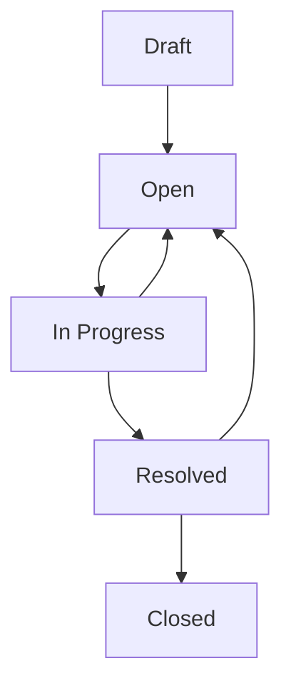

This document contains user stories for the Quality module, covering gauge management, calibration tracking, non-conformance reports (NCRs), quality actions, risk management, and quality documentation. Stories are derived from actual implemented features.

## Gauge & Calibration Management

### Story: Create Measurement Gauge

- **As a** quality engineer
- **I want to** register a measurement gauge
- **So that** I can track its calibration status

**Acceptance criteria:**
- [ ] Gauge type ID is required
- [ ] Gauge role is required: Reference, Process, Test
- [ ] Calibration interval in months is required (>= 1)
- [ ] Name is required
- [ ] Can provide description, serial number, model
- [ ] Can specify supplier (calibration provider)
- [ ] Can set acquisition date
- [ ] Status defaults to "Active"
- [ ] Next calibration date calculated from interval

**Source:** `apps/carbon/app/modules/quality/quality.models.ts` - `gaugeValidator`

---

### Story: Record Gauge Calibration

- **As a** calibration technician
- **I want to** record calibration results
- **So that** gauge status is current

**Acceptance criteria:**
- [ ] Gauge ID is required
- [ ] Calibration date is required
- [ ] Calibrated by user is required
- [ ] Status is required: Pass, Fail, In Progress
- [ ] Can record temperature (-200 to 500 range)
- [ ] Can record humidity (0 to 1 range)
- [ ] Can record multiple repeatability attempts
- [ ] Can flag if adjustment required
- [ ] Can flag if repair required
- [ ] Can specify measurement standard used
- [ ] Next calibration date auto-updated

**Source:** `apps/carbon/app/modules/quality/quality.models.ts` - `gaugeCalibrationRecordValidator`

---

### Story: Track Calibration Due Dates

- **As a** quality manager
- **I want to** see which gauges need calibration
- **So that** all gauges remain in compliance

**Acceptance criteria:**
- [ ] Can view list of all gauges
- [ ] Can filter by calibration status
- [ ] Can see "due soon" gauges (within 30 days)
- [ ] Can see overdue gauges
- [ ] Alerts sent for upcoming calibrations
- [ ] Can generate calibration schedule report

**Source:** `apps/carbon/app/routes/x+/quality+/gauges.tsx`

---

### Story: View Calibration History

- **As a** quality engineer
- **I want to** view complete calibration history for a gauge
- **So that** I can analyze gauge performance trends

**Acceptance criteria:**
- [ ] Can see all past calibration records
- [ ] Can see pass/fail trend
- [ ] Can see drift over time
- [ ] Can export calibration history
- [ ] History includes who performed calibration

**Source:** `apps/carbon/app/routes/x+/quality+/calibrations.tsx`

---

## Non-Conformance Management (Issues)

### Story: Report Non-Conformance

- **As a** quality inspector
- **I want to** create a non-conformance report
- **So that** quality issues are tracked and resolved

**Acceptance criteria:**
- [ ] Name/title is required
- [ ] Location ID is required
- [ ] Non-conformance type ID is required
- [ ] Priority is required: Low, Medium, High, Critical
- [ ] Source is required: Supplier, Internal, Customer, Other
- [ ] Open date is required
- [ ] Status defaults to "Draft"
- [ ] Can provide description
- [ ] Can set due date
- [ ] Can specify affected quantity
- [ ] Can attach photos and documents

**Source:** `apps/carbon/app/modules/quality/quality.models.ts` - `issueValidator`

---

### Story: Associate Issue with Entities

- **As a** quality inspector
- **I want to** link non-conformance to specific items or orders
- **So that** the scope of the issue is clear

**Acceptance criteria:**
- [ ] Can associate with job operations
- [ ] Can associate with purchase order lines
- [ ] Can associate with sales order lines
- [ ] Can associate with shipment lines
- [ ] Can associate with receipt lines
- [ ] Can associate with items
- [ ] Can associate with tracked entities (serial/lot numbers)
- [ ] Issue ID and entity type are required
- [ ] Line ID required for line-level associations

**Source:** `apps/carbon/app/modules/quality/quality.models.ts` - `issueAssociationValidator`

---

### Story: Set Disposition for Non-Conformance

- **As a** quality manager
- **I want to** decide how to handle non-conforming material
- **So that** the issue is properly resolved

**Acceptance criteria:**
- [ ] Disposition options: Pending, Rework, Scrap, Use As Is
- [ ] Disposition can be changed until issue closed
- [ ] Rework requires rework instructions
- [ ] Use As Is may require customer approval
- [ ] Scrap triggers inventory adjustment
- [ ] Disposition tracked in issue history

**Source:** NCR disposition field in issue model

---

### Story: Track Issue Resolution

- **As a** quality manager
- **I want to** track issue status through resolution
- **So that** issues don't fall through the cracks

**Status Workflow:**



**Acceptance criteria:**
- [ ] Status options: Draft, Open, In Progress, Resolved, Closed
- [ ] Can reopen resolved issues if needed
- [ ] Close date auto-set when closed
- [ ] Cannot reopen closed issues
- [ ] Status transitions logged

**Source:** NCR status workflow

---

## Risk Management

### Story: Register Quality Risk

- **As a** quality manager
- **I want to** register potential quality risks
- **So that** we can mitigate them proactively

**Acceptance criteria:**
- [ ] Can create risk in risk register
- [ ] Risk title is required
- [ ] Can set risk source: Customer, General, Item, Job, Quote Line, Supplier, Work Center
- [ ] Can set severity (1-5 scale)
- [ ] Can set likelihood (1-5 scale)
- [ ] Risk score auto-calculated: severity × likelihood
- [ ] Can set status: Open, In Review, Mitigating, Closed, Accepted
- [ ] Can assign owner
- [ ] Can link to source entity

**Source:** Risk register functionality

---

### Story: Track Risk Mitigation

- **As a** quality manager
- **I want to** track risk mitigation actions
- **So that** risks are reduced over time

**Acceptance criteria:**
- [ ] Can define mitigation actions
- [ ] Can assign actions to users
- [ ] Can set due dates for actions
- [ ] Can track action completion
- [ ] Can reassess risk after mitigation
- [ ] Can close risk when adequately mitigated

**Source:** Risk register with actions

---

## Quality Actions

### Story: Create Corrective Action

- **As a** quality manager
- **I want to** create corrective actions for issues
- **So that** root causes are addressed

**Acceptance criteria:**
- [ ] Corrective action linked to non-conformance
- [ ] Can assign to user
- [ ] Can set due date
- [ ] Can track status
- [ ] Can require verification
- [ ] Action closure requires completion evidence

**Source:** Quality action functionality

---

### Story: Create Preventive Action

- **As a** quality manager
- **I want to** create preventive actions
- **So that** issues don't recur

**Acceptance criteria:**
- [ ] Preventive action linked to risk or issue
- [ ] Can assign to user
- [ ] Can set due date
- [ ] Can track implementation status
- [ ] Can measure effectiveness

**Source:** Quality action functionality

---

## Quality Documents

### Story: Manage Quality Documents

- **As a** quality engineer
- **I want to** maintain controlled quality documents
- **So that** everyone uses current procedures

**Acceptance criteria:**
- [ ] Can upload quality documents
- [ ] Can version documents
- [ ] Can set document status: Draft, Active, Archived
- [ ] Only one version active at a time
- [ ] Can view document history
- [ ] Can require acknowledgment/training

**Source:** `apps/carbon/app/routes/x+/quality+/documents.tsx`

---

## Configuration & Settings

### Story: Manage Gauge Types

- **As a** quality manager
- **I want to** define standard gauge types
- **So that** gauges are categorized consistently

**Acceptance criteria:**
- [ ] Can create gauge type
- [ ] Type name is required
- [ ] Can provide description
- [ ] Types are company-specific
- [ ] Can update and delete unused types

**Source:** `apps/carbon/app/routes/x+/quality+/gauge-types.tsx`

---

### Story: Manage Issue Types

- **As a** quality manager
- **I want to** define non-conformance types
- **So that** issues are categorized for analysis

**Acceptance criteria:**
- [ ] Can create issue type
- [ ] Type name is required
- [ ] Can provide description
- [ ] Types are company-specific
- [ ] Can assign workflow to type

**Source:** `apps/carbon/app/routes/x+/quality+/issue-types.tsx`

---

## Permissions & Access Control

### Module Permission: `quality`

| Action | Permission | Description |
|--------|------------|-------------|
| View | `quality.view` | View gauges, calibrations, issues |
| Create | `quality.create` | Create issues, calibration records |
| Update | `quality.update` | Edit issues, update calibrations |
| Delete | `quality.delete` | Delete draft issues (if allowed) |

**Special Permissions:**
- All users may have permission to create issues
- Calibration recording may require specific training
- Issue closure may require quality manager approval

**Source:** Permission checks in route loaders via `requirePermissions(request, { view: "quality" })`

---

## Data Validation Summary

| Field | Validation | Module |
|-------|------------|--------|
| Gauge Type | Required | Gauge |
| Calibration Interval | >= 1 month | Gauge |
| Gauge Role | Enum: Reference, Process, Test | Gauge |
| Calibration Date | Required | Calibration Record |
| Calibration Status | Enum: Pass, Fail, In Progress | Calibration Record |
| Temperature | -200 to 500 | Calibration Record |
| Humidity | 0 to 1 (0-100%) | Calibration Record |
| Issue Name | Required | Issue |
| Priority | Enum: Low, Medium, High, Critical | Issue |
| Source | Enum: Supplier, Internal, Customer, Other | Issue |
| Disposition | Enum: Pending, Rework, Scrap, Use As Is | Issue |

---

## Gauge Roles

| Role | Description | Use Case |
|------|-------------|----------|
| Reference | Master standard | Calibrate other gauges |
| Process | Production measurement | Ongoing production checks |
| Test | Final inspection | Acceptance testing |

---

## Risk Scoring

```
Risk Score = Severity (1-5) × Likelihood (1-5)
```

| Score Range | Priority | Action Required |
|-------------|----------|-----------------|
| 1-5 | Low | Monitor |
| 6-12 | Medium | Plan mitigation |
| 13-25 | High | Immediate mitigation |

---

## Source References

- `apps/carbon/app/modules/quality/quality.service.ts` - Business logic for quality operations
- `apps/carbon/app/modules/quality/quality.models.ts` - Zod validators for quality entities
- `apps/carbon/app/routes/x+/quality+/*.tsx` - Route handlers for quality pages
- `apps/carbon/app/routes/x+/quality+/gauges.tsx` - Gauge management
- `apps/carbon/app/routes/x+/quality+/calibrations.tsx` - Calibration records
- `apps/carbon/app/routes/x+/quality+/issues.tsx` - Non-conformance tracking
- `apps/carbon/app/routes/x+/quality+/actions.tsx` - Quality action management
- `apps/carbon/app/routes/x+/quality+/risks.tsx` - Risk register
- `apps/carbon/app/routes/x+/quality+/documents.tsx` - Quality document management
- `packages/database/supabase/migrations/20251120214020_action-investigation-merge.sql` - NCR schema
- `packages/database/supabase/migrations/20251105203122_calibration.sql` - Calibration schema
