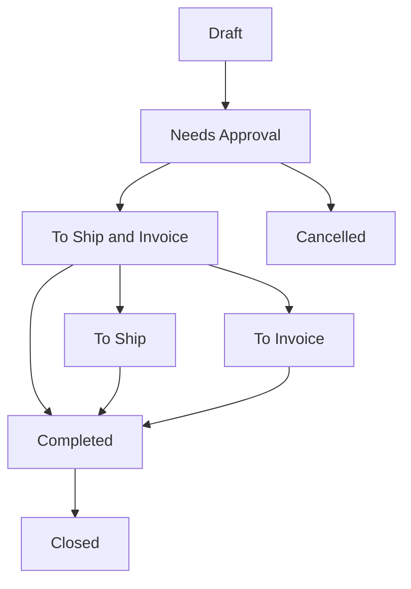

This document contains user stories for the Sales module, covering customer management, quotation workflows, sales orders, and invoicing. Stories are derived from actual implemented features in controllers, services, and validators.

## Customer Management

### Story: Create New Customer

- **As a** sales representative
- **I want to** create a new customer record
- **So that** I can track sales opportunities and orders for this customer

**Acceptance criteria:**
- [ ] Customer name is required (minimum 1 character)
- [ ] Can optionally assign customer status
- [ ] Can optionally assign customer type
- [ ] Can optionally assign account manager from user list
- [ ] Can set tax percentage between 0 and 1 (0-100%)
- [ ] Can assign currency code
- [ ] System assigns unique customer ID automatically
- [ ] Record tracks createdBy, createdAt, updatedBy, updatedAt
- [ ] Customer belongs to current company (multi-tenant isolation)

**Source:** `apps/carbon/app/modules/sales/sales.models.ts` - `customerValidator`

---

### Story: Manage Customer Locations

- **As a** sales representative
- **I want to** add multiple locations for a customer
- **So that** I can ship to and bill different addresses

**Acceptance criteria:**
- [ ] Can add multiple locations per customer
- [ ] Each location references an address record
- [ ] Can designate shipping and billing addresses
- [ ] Locations are associated with customer ID
- [ ] Can update and delete locations

**Source:** `apps/carbon/app/modules/sales/sales.models.ts` - `customerLocationValidator`

---

### Story: Manage Customer Contacts

- **As a** sales representative
- **I want to** maintain contact information for each customer
- **So that** I can communicate with the right people

**Acceptance criteria:**
- [ ] Can add multiple contacts per customer
- [ ] Each contact references a contact record
- [ ] Can associate contacts with specific customer locations
- [ ] Can optionally link contact to a user account (portal access)
- [ ] Can update and delete contacts

**Source:** `apps/carbon/app/modules/sales/sales.models.ts` - `customerContactValidator`

---

### Story: Configure Customer Payment Terms

- **As a** sales representative
- **I want to** configure payment terms for each customer
- **So that** invoices reflect the agreed payment schedule

**Acceptance criteria:**
- [ ] Can select payment term from predefined list
- [ ] Can specify payment currency code
- [ ] Can set invoice grouping preferences
- [ ] Can configure invoice delivery method
- [ ] Payment terms apply to all sales orders for customer

**Source:** `apps/carbon/app/modules/sales/sales.models.ts` - `customerPaymentValidator`

---

### Story: Configure Customer Shipping Details

- **As a** sales representative
- **I want to** configure default shipping settings
- **So that** orders use correct shipping methods

**Acceptance criteria:**
- [ ] Can select default shipping term
- [ ] Can select default shipping method
- [ ] Can configure customer account number for shipping
- [ ] Settings apply as defaults for new sales orders

**Source:** `apps/carbon/app/modules/sales/sales.models.ts` - `customerShippingValidator`

---

## Quote Management

### Story: Create Sales Quote

- **As a** sales estimator
- **I want to** create a quote for a customer
- **So that** I can provide pricing for requested items

**Acceptance criteria:**
- [ ] Customer ID is required
- [ ] Quote status defaults to "Draft"
- [ ] Status options: Draft, Sent, Ordered, Partial, Lost, Cancelled, Expired
- [ ] Can optionally reference source RFQ
- [ ] Can set quote date, due date, and expiration date
- [ ] Expiration date must be today or after if provided
- [ ] Can assign sales person and estimator
- [ ] Can set currency code and exchange rate
- [ ] System generates unique quote ID from sequence
- [ ] Quote tracks createdBy, createdAt, updatedBy, updatedAt

**Source:** `apps/carbon/app/modules/sales/sales.models.ts` - `quoteValidator`

---

### Story: Add Quote Line Items

- **As a** sales estimator
- **I want to** add line items to a quote
- **So that** I can detail what items and services are being quoted

**Acceptance criteria:**
- [ ] Quote ID is required
- [ ] Item ID is required for item-type lines
- [ ] Description is required (minimum 1 character)
- [ ] Method type is required: Buy, Make, Buy and Make, Outside
- [ ] Can specify quantity array for volume pricing breaks
- [ ] Each quantity must be >= 0.00001
- [ ] Can set unit price per quantity break
- [ ] Can set tax percentage (0-1 range)
- [ ] Line status required: Not Started, In Progress, Complete, No Quote
- [ ] Can assign estimator to specific line

**Source:** `apps/carbon/app/modules/sales/sales.models.ts` - `quoteLineValidator`

---

### Story: Send Quote to Customer

- **As a** sales representative
- **I want to** finalize and send a quote to the customer
- **So that** they can review and accept the pricing

**Acceptance criteria:**
- [ ] Quote must have at least one line item
- [ ] System validates all required fields are complete
- [ ] Quote status changes from "Draft" to "Sent"
- [ ] Email notification sent to customer contact (if configured)
- [ ] Quote becomes read-only after sending (requires new revision to modify)
- [ ] Quote date automatically set if not provided

**Source:** `apps/carbon/app/modules/sales/sales.models.ts` - `quoteFinalizeValidator`

---

### Story: Customer Accepts Quote Digitally

- **As a** customer
- **I want to** accept a quote online
- **So that** I can proceed with the order without paper signatures

**Acceptance criteria:**
- [ ] External quote URL accessible without login
- [ ] Must provide signedBy name (required)
- [ ] Must provide digital signature (required)
- [ ] System captures signedAt timestamp automatically
- [ ] Quote status changes to "Ordered" upon acceptance
- [ ] Sales order can be generated from accepted quote

**Source:** `apps/carbon/app/modules/sales/sales.models.ts` - `externalQuoteValidator` (accept variant)

---

### Story: Customer Rejects Quote Digitally

- **As a** customer
- **I want to** reject a quote with a reason
- **So that** the sales team understands why we declined

**Acceptance criteria:**
- [ ] External quote URL accessible without login
- [ ] Must provide rejection reason (required)
- [ ] Quote status changes to "Lost"
- [ ] Rejection reason stored for sales analysis
- [ ] Notification sent to sales team

**Source:** `apps/carbon/app/modules/sales/sales.models.ts` - `externalQuoteValidator` (reject variant)

---

### Story: Mark Quote as Favorite

- **As a** sales representative
- **I want to** mark frequently referenced quotes as favorites
- **So that** I can quickly access them later

**Acceptance criteria:**
- [ ] Can toggle favorite status on any quote
- [ ] Favorites are user-specific (not shared)
- [ ] Favorite quotes appear in dedicated filter/list
- [ ] Can unfavorite at any time

**Source:** `apps/carbon/app/routes/x+/sales+/quotes.tsx`

---

## Sales Order Management

### Story: View Sales Orders

- **As a** sales representative
- **I want to** view all sales orders
- **So that** I can track order fulfillment status

**Acceptance criteria:**
- [ ] Can view list of all sales orders for my company
- [ ] Can filter orders by status
- [ ] Can search orders by customer, order number, or item
- [ ] Order list shows: order ID, customer, status, order date, total value
- [ ] Can sort orders by various fields
- [ ] Can click order to view details

**Source:** `apps/carbon/app/routes/x+/sales+/orders.tsx`

---

### Story: Track Sales Order Status

- **As a** sales representative
- **I want to** see the current status of each order
- **So that** I know what action is needed next

**Status Workflow:**

**Acceptance criteria:**
- [ ] Status indicates next required action
- [ ] Transitions follow defined workflow
- [ ] Cannot skip required statuses
- [ ] Status history is tracked
- [ ] Notifications sent on status changes (if configured)

**Source:** `apps/carbon/app/modules/sales/sales.models.ts`

---

## Sales Invoice Management

### Story: View Sales Invoices

- **As an** accounting clerk
- **I want to** view all sales invoices
- **So that** I can track payments and revenue

**Acceptance criteria:**
- [ ] Can view list of all invoices for my company
- [ ] Can filter invoices by customer, status, date range
- [ ] Invoice list shows: invoice number, customer, date, amount, payment status
- [ ] Can search invoices
- [ ] Can access invoice details

**Source:** `apps/carbon/app/routes/x+/sales+/invoices.tsx`

---

## Configuration & Settings

### Story: Manage Customer Statuses

- **As a** sales manager
- **I want to** define custom customer statuses
- **So that** I can categorize customers by their lifecycle stage

**Acceptance criteria:**
- [ ] Can create new customer status
- [ ] Status name is required
- [ ] Can update existing statuses
- [ ] Can delete statuses if not in use
- [ ] Statuses are company-specific

**Source:** `apps/carbon/app/routes/x+/sales+/customer-statuses.tsx`

---

### Story: Manage Customer Types

- **As a** sales manager
- **I want to** define custom customer types
- **So that** I can segment customers by industry or category

**Acceptance criteria:**
- [ ] Can create new customer type
- [ ] Type name is required
- [ ] Can update existing types
- [ ] Can delete types if not in use
- [ ] Types are company-specific

**Source:** `apps/carbon/app/routes/x+/sales+/customer-types.tsx`

---

### Story: Track No-Quote Reasons

- **As a** sales manager
- **I want to** record why quotes were not provided
- **So that** I can identify process improvements

**Acceptance criteria:**
- [ ] Can define no-quote reason codes
- [ ] Reasons available when declining to quote
- [ ] Can analyze no-quote trends by reason
- [ ] Reasons are company-specific

**Source:** `apps/carbon/app/routes/x+/sales+/no-quote-reasons.tsx`

---

## Permissions & Access Control

### Module Permission: `sales`

| Action | Permission | Description |
|--------|------------|-------------|
| View | `sales.view` | View customers, quotes, orders, invoices |
| Create | `sales.create` | Create new customers, quotes |
| Update | `sales.update` | Edit customers, quotes, orders |
| Delete | `sales.delete` | Delete customers, quotes (if allowed) |

**Special Permissions:**
- Customer portal users have read-only access to their own customer data
- External quote links allow unauthenticated accept/reject
- Account managers can be assigned to customers for ownership

**Source:** Permission checks in route loaders via `requirePermissions(request, { view: "sales" })`

---

## Data Validation Summary

| Field | Validation | Module |
|-------|------------|--------|
| Customer Name | Required, min 1 char | Customer |
| Tax Percent | 0-1 (0-100%) | Customer |
| Quote Expiration | Today or after | Quote |
| Quote Line Quantity | >= 0.00001 | Quote Line |
| Description | Required, min 1 char | Quote Line |

---

## Source References

- `apps/carbon/app/modules/sales/sales.service.ts` - Business logic for all sales operations
- `apps/carbon/app/modules/sales/sales.models.ts` - Zod validators for customer, quote, order entities
- `apps/carbon/app/routes/x+/sales+/*.tsx` - Route handlers and loaders for sales pages
- `apps/carbon/app/routes/x+/sales+/customers.tsx` - Customer list and management
- `apps/carbon/app/routes/x+/sales+/quotes.tsx` - Quote list and management
- `apps/carbon/app/routes/x+/sales+/orders.tsx` - Sales order list and viewing
- `apps/carbon/app/routes/x+/sales+/invoices.tsx` - Sales invoice list and viewing
- `packages/database/supabase/migrations/20230123004612_suppliers-and-customers.sql` - Customer database schema
- `packages/database/supabase/migrations/20240330164855_quote-documents.sql` - Quote database schema
