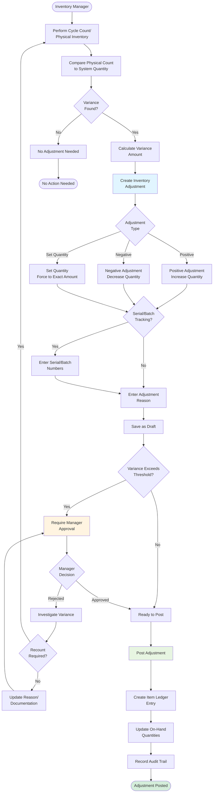

This workflow guides inventory managers through identifying count variances, creating adjustments, obtaining approval, and posting corrections to maintain accurate inventory records.

## User Journey Overview



## Step-by-Step User Flow

### Step 1: Perform Cycle Count

**User Action:** Conduct physical inventory count

**Count Methods:**
- **Cycle Count** - Regular partial counts (ABC classification)
- **Full Physical Inventory** - Complete warehouse count
- **Spot Check** - Random verification
- **Perpetual Inventory** - Continuous counting

**Recording:**
- Item ID
- Location
- Bin/Shelf
- Counted Quantity
- Count Date
- Counter Name

---

### Step 2: Compare to System Quantity

**User Action:** Retrieve system quantity for item/location

**System Query:**
```sql
SELECT SUM(quantityOnHand)
FROM itemLedger
WHERE itemId = ?
  AND locationId = ?
  AND shelfId = ?
```

**Variance Calculation:**
```
Variance = Counted Quantity - System Quantity
```

**Example:**
- System Quantity: 100 units
- Counted Quantity: 95 units
- Variance: -5 units (shortage)

**Decision Point: Variance Found?**

- **No Variance** (Counted = System) → No action needed
- **Variance Exists** → Create adjustment

---

### Step 3: Create Inventory Adjustment

**User Action:** Navigate to Inventory → Item → Adjustments

**API Endpoint:** `GET/POST /x+/inventory+/quantities+/$itemId.adjustment.tsx`

**Permissions Required:** `inventory.create`

**Required Fields:**
- Item ID (pre-selected)
- Location ID (required)
- Adjustment Type (from enum)

**Optional Fields:**
- Shelf ID (bin location)
- Tracked Entity ID (for serial/batch items)
- Quantity (depends on type)
- Reason/Notes

**Validation:**
- "Item ID is required"
- "Location is required"
- "Adjustment type is required"

---

### Step 4: Select Adjustment Type

**Adjustment Types:**

| Type | Effect | Use Case | Quantity Input |
|------|--------|----------|----------------|
| Positive Adjmt. | + | Count higher than system | Enter increase amount |
| Negative Adjmt. | - | Count lower than system | Enter decrease amount |
| Set Quantity | = | Force to exact amount | Enter target quantity |
| Transfer | +/- | Move between locations | Enter transfer quantity |
| Consumption | - | Used/consumed | Enter consumed quantity |
| Output | + | Produced | Enter produced quantity |

**Source:** Item ledger entry types

**Decision Point: Adjustment Type Selection**

**Positive Adjustment:**
- Found extra inventory
- Receiving errors corrected
- Returned items not recorded

**Negative Adjustment:**
- Missing inventory
- Theft or loss
- Damage or obsolescence
- Shipping errors

**Set Quantity:**
- Complete physical inventory
- Reconciliation after system issues
- Initial setup quantities

---

### Step 5: Handle Item Tracking

**Decision Point: Item Requires Tracking?**

**If Serial Tracking:**
- **Positive Adjustment** → Enter new serial numbers
- **Negative Adjustment** → Select existing serials to remove
- System validates serials unique/exist

**If Batch/Lot Tracking:**
- **Positive Adjustment** → Enter batch numbers and quantities
- **Negative Adjustment** → Select batches to consume
- Can split batches across multiple entries

**If No Tracking:**
- Proceed without tracking information
- Quantity adjustment only

**Validation:**
- "Serial number required" - Item has serial tracking
- "Batch number required" - Item has batch tracking
- "Duplicate serial number" - Serial already exists (positive)
- "Serial not found" - Serial doesn't exist (negative)

---

### Step 6: Enter Adjustment Reason

**User Action:** Document reason for variance

**Common Reasons:**
- Count error corrected
- Damaged inventory
- Obsolete/expired items
- Theft or loss
- Receiving error correction
- System data correction
- Reconciliation

**Best Practice:**
- Reference count documentation
- Include counter name and date
- Note any special circumstances
- Link to NCRs if applicable

---

### Step 7: Approval (If Required)

**Decision Point: Approval Threshold**

Approval may be required based on:
- Variance amount ($ value)
- Variance percentage
- Item category (high-value items)
- Location (restricted areas)
- Frequency (repeated adjustments)

**Approval Workflow:**

1. **Submit for Approval**
   - Status remains Draft
   - Notification sent to manager

2. **Manager Review**
   - Review variance amount
   - Review reason/documentation
   - Check count records

3. **Manager Decision**

**Option A: Approve**
- Proceed to posting
- Adjustment authorized

**Option B: Reject**
- Request recount
- Request more documentation
- Adjustment returned to user

**Option C: Modify**
- Adjust quantity or reason
- Resubmit for posting

---

### Step 8: Post Adjustment

**User Action:** Click "Post Adjustment"

**API Endpoint:** `POST /x+/inventory+/quantities+/$itemId.adjustment.post.tsx`

**Permissions Required:** `inventory.update`

**Posting Process:**

1. **Validate Adjustment**
   - All required fields complete
   - Tracking info valid (if required)
   - Quantity valid

2. **Create Item Ledger Entry**

**Ledger Entry Fields:**
- Entry Type: From adjustment type
- Document Type: "Adjustment"
- Item ID
- Location ID
- Shelf ID (optional)
- Quantity: Signed (+ or -)
- Cost: From inventory valuation
- Posting Date: Current date
- Created By: User ID
- Reason: From adjustment notes

3. **Update On-Hand Quantities**

**Calculation:**
```
New On-Hand = Current On-Hand + Adjustment Quantity
```

**Example (Negative Adjustment):**
- Current On-Hand: 100
- Adjustment: -5
- New On-Hand: 95

4. **Update Inventory Valuation**

**FIFO (First In, First Out):**
- Remove oldest cost layers first (negative)
- Add new cost layer (positive)

**Average Cost:**
- Recalculate average cost per unit

5. **Create/Update Tracked Entities**

- Serial tracking: Create/remove tracked entity records
- Batch tracking: Update batch quantities

6. **Record Audit Trail**

- Created By
- Created At
- Posting Date
- Approved By (if applicable)
- Reason

**Result:**
- Adjustment Status → "Posted"
- Item ledger entry created
- Inventory quantities updated
- **Cannot be deleted or modified** (immutable)

**Error States:**
- "Insufficient quantity" - Negative adjustment exceeds available
- "Serial already exists" - Duplicate serial on positive adjustment
- "Batch not found" - Invalid batch reference
- "Posting failed" - Database constraint violation

---

## Alternative Paths

### Path: Void Adjustment

**Trigger:** Adjustment posted in error

**Solution:** Create reversing adjustment
- Same quantity, opposite sign
- Reference original adjustment
- Document reason for reversal

**Note:** Cannot delete posted adjustments (immutable ledger)

---

### Path: Transfer Adjustment

**Trigger:** Move inventory between locations

**User Action:** Create adjustment type "Transfer"

**Process:**
1. Create negative adjustment at source location
2. Create positive adjustment at destination location
3. Link adjustments for traceability

---

### Path: Bulk Adjustments

**Trigger:** Physical inventory (many items)

**User Action:** Import adjustment file

**File Format:**
- Item ID
- Location
- Counted Quantity
- Notes

**System Processing:**
1. Validate all items and locations
2. Calculate variances
3. Create draft adjustments
4. Route for approval
5. Bulk post after approval

---

## Decision Points Summary

| Decision Point | Options | Impact |
|----------------|---------|--------|
| Variance Found | Yes, No | Adjustment needed or not |
| Adjustment Type | Positive, Negative, Set | Direction of change |
| Item Tracking | Serial, Batch, None | Tracking requirements |
| Approval Required | Yes, No | Manager review needed |
| Manager Decision | Approve, Reject, Modify | Posting authorization |

---

## Error Recovery

### Quantity Mismatch After Posting

**Symptom:** Quantities still don't match after adjustment

**Recovery:**
1. Perform recount to verify
2. Create additional adjustment for difference
3. Investigate root cause (system issue, ongoing usage, etc.)

---

### Missing Tracked Entities

**Symptom:** "Serial/batch number required"

**Recovery:**
1. For positive adjustments: Create new tracking numbers
2. For negative adjustments: Verify which serials/batches to remove
3. Document tracking information in notes

---

### Over-Adjustment

**Symptom:** Negative adjustment would result in negative inventory

**Recovery:**
1. Verify counted quantity correct
2. Check for unreported receipts or shipments
3. Investigate usage not recorded
4. Adjust to zero if truly depleted
5. Create NCR if inventory loss unexpected

---

## API Endpoints Reference

| Endpoint | Method | Purpose | Permissions |
|----------|--------|---------|-------------|
| `/x+/inventory+/quantities+/$itemId.adjustment` | GET/POST | Create adjustment | `inventory.create` |
| `/x+/inventory+/quantities+/$itemId.adjustment.post` | POST | Post adjustment | `inventory.update` |

---

## Source References

- `apps/erp/app/routes/x+/inventory+/quantities+/$itemId.adjustment.tsx` - Adjustment creation and posting
- `apps/erp/app/modules/inventory/inventory.models.ts` - Adjustment validators and ledger entry types
- `apps/erp/app/modules/inventory/inventory.service.ts` - Business logic for posting and ledger creation
- `docs/user-stories/inventory.md` - Inventory adjustment user stories (lines 270-287)
