This workflow guides production users through planning, releasing, executing, and completing manufacturing jobs, with distinct paths for Make-to-Order and Make-to-Stock scenarios.

## User Journey Overview

```mermaid
flowchart TD
    Start([Production Planner]) --> CreateJob[Create Job]
    CreateJob --> JobDetails[Enter Job Details]
    JobDetails --> SetDeadline{Deadline<br/>Type?}

    SetDeadline -->|ASAP| NoDate[No Due Date Required]
    SetDeadline -->|Hard/Soft| RequireDate[Due Date Required]
    SetDeadline -->|No Deadline| NoDate

    NoDate --> SaveDraft[Save as Draft]
    RequireDate --> EnterDate[Enter Due Date]
    EnterDate --> SaveDraft

    SaveDraft --> MarkPlanned[Mark as Planned]
    MarkPlanned --> TriggerMRP1[MRP Triggered]
    TriggerMRP1 --> CalcMaterials[Calculate Material<br/>Requirements]
    CalcMaterials --> AddOperations[Add Operations &<br/>Materials]
    AddOperations --> ReviewBOM[Review BOM]

    ReviewBOM --> ReadyCheck{Ready to<br/>Release?}
    ReadyCheck -->|No| AddOperations
    ReadyCheck -->|Yes| MarkReady[Mark as Ready]

    MarkReady --> BlockCheck{Manufacturing<br/>Blocked?}
    BlockCheck -->|Yes| BlockError[Error: Manufacturing<br/>is Blocked]
    BlockCheck -->|No| TriggerMRP2[MRP Triggered Again]

    TriggerMRP2 --> SetReleased[Set Released Date]
    SetReleased --> Schedule{Schedule<br/>Job?}

    Schedule -->|Yes| RunScheduler[Run Scheduler]
    Schedule -->|No| ManualStart[Manual Start]

    RunScheduler --> StartProduction[Start Production]
    ManualStart --> StartProduction

    StartProduction --> InProgress[Status: In Progress]
    InProgress --> WorkExecution[Execute Operations]
    WorkExecution --> RecordTime[Record Labor &<br/>Machine Time]
    RecordTime --> RecordQty[Record Production<br/>Quantities]
    RecordQty --> QualityCheck{Quality<br/>Check Pass?}

    QualityCheck -->|No| RecordScrap[Record Scrap/<br/>Rework]
    RecordScrap --> WorkExecution
    QualityCheck -->|Yes| AllComplete{All Operations<br/>Complete?}

    AllComplete -->|No| WorkExecution
    AllComplete -->|Yes| CompleteJob[Complete Job]

    CompleteJob --> JobType{Job Type?}

    JobType -->|Make-to-Order| MTO[Link to Sales Order]
    JobType -->|Make-to-Stock| MTS[Inventory Receipt]

    MTO --> SetComplete1[Set Status: Completed]
    SetComplete1 --> NoInventory[No Inventory Created]
    NoInventory --> ShipDirect[Ships to Customer]

    MTS --> CreateReceipt[Create Inventory Receipt]
    CreateReceipt --> AddToStock[Add Quantity to Stock]
    AddToStock --> SetComplete2[Set Status: Completed]

    ShipDirect --> Complete([Job Completed])
    SetComplete2 --> Complete

    BlockError --> End([Cannot Proceed])

    style CreateJob fill:#e1f5ff
    style TriggerMRP1 fill:#fff4e1
    style TriggerMRP2 fill:#fff4e1
    style CompleteJob fill:#e7f5e1
    style Complete fill:#d4edda
```



## Step-by-Step User Flow

### Step 1: Create Job

**User Action:** Navigate to Production → Jobs → New Job

**API Endpoint:** `POST /x+/job+/new`

**Permissions Required:** `production.create`

**Required Fields:**
- Item (from catalog)
- Quantity (>= 0)
- Location (production location)
- Unit of Measure
- Deadline Type: ASAP, Hard Deadline, Soft Deadline, No Deadline

**Optional Fields:**
- Job ID (auto-generated from sequence)
- Customer (for Make-to-Order)
- Start Date
- Due Date (required for Hard/Soft Deadline)
- Scrap Quantity

**Initial Status:** Draft

**Decision Point: Deadline Type**

```
IF deadlineType IN ["Hard Deadline", "Soft Deadline"] THEN
  dueDate REQUIRED
ELSE
  dueDate OPTIONAL
```

**Error States:**
- "Item is required"
- "Location is required"
- "Unit of measure is required"
- "Due date is required" - For Hard/Soft Deadline types

**Source:** `apps/erp/app/modules/production/production.models.ts` (lines 175-189)

```typescript
export const jobValidator = baseJobValidator.refine(
  (data) => {
    if (
      ["Hard Deadline", "Soft Deadline"].includes(data.deadlineType) &&
      !data.dueDate
    ) {
      return false;
    }
    return true;
  },
  {
    message: "Due date is required",
    path: ["dueDate"]
  }
);
```

---

### Step 2: Mark Job as Planned (MRP Trigger #1)

**User Action:** Change status from Draft to Planned

**API Endpoint:** `POST /x+/job+/$jobId.status.tsx`

**Permissions Required:** `production.update`

**System Actions:**

1. **Recalculate Job Requirements**
2. **Trigger MRP**

**Source:** `apps/erp/app/routes/x+/job+/$jobId.status.tsx` (lines 60-73)

```typescript
if (["Planned", "Ready"].includes(status)) {
  const serviceRole = getCarbonServiceRole();
  await recalculateJobRequirements(serviceRole, {
    id,
    companyId,
    userId
  });
  await runMRP(getCarbonServiceRole(), {
    type: "job",
    id,
    companyId,
    userId
  });
}
```

**MRP Process:**
- Calculate material requirements for job
- Check availability of materials
- Generate purchase order recommendations (if materials short)
- Update supply projections

**Status Transition:** Draft → Planned

**Redirect:** Redirects to job materials page for BOM entry

---

### Step 3: Add Operations and Materials

**User Action:** Define manufacturing process

**Operations Configuration:**

**Inside Operations:**
- Process (machining, assembly, etc.)
- Work Center
- Setup Time, Labor Time, Machine Time
- Setup Unit, Labor Unit, Machine Unit
- Labor Rate, Machine Rate, Overhead Rate

**Outside Operations:**
- Supplier/Process
- Minimum Cost
- Unit Cost
- Lead Time

**Materials Configuration:**
- Item (part, material, tool, consumable)
- Quantity per unit
- Unit Cost
- Unit of Measure
- Operation assignment (optional)

**Validation:**

Inside operations require:
- Setup unit, time - "Setup unit/time is required"
- Labor unit, time, rate - "Labor unit/time/rate is required"
- Machine unit, time, rate - "Machine unit/time/rate is required"
- Overhead rate - "Overhead rate is required"

Outside operations require:
- Minimum cost - "Minimum is required"
- Unit cost - "Unit cost is required"
- Lead time - "Lead time is required"

---

### Step 4: Mark Job as Ready (MRP Trigger #2)

**User Action:** Change status from Planned to Ready

**API Endpoint:** `POST /x+/job+/$jobId.status.tsx`

**System Actions:**

1. **Manufacturing Blocked Check**

**Source:** `apps/erp/app/routes/x+/job+/$jobId.status.tsx` (lines 45-58)

```typescript
if (status === "Ready") {
  const { data } = await client
    .from("job")
    .select("item(itemReplenishment(manufacturingBlocked))")
    .eq("id", id)
    .single();

  if (data?.item?.itemReplenishment?.manufacturingBlocked) {
    throw redirect(
      requestReferrer(request) ?? path.to.job(id),
      await flash(request, error(null, "Manufacturing is blocked"))
    );
  }
}
```

**Decision Point: Manufacturing Blocked?**

- **IF Blocked** → Error: "Manufacturing is blocked"
- **IF Not Blocked** → Continue to Ready status

2. **Recalculate Job Requirements Again**
3. **Trigger MRP Again**
4. **Set Released Date** (if scheduling enabled)

**Source:** `apps/erp/app/routes/x+/job+/$jobId.status.tsx` (lines 112-119)

```typescript
if (status === "Ready") {
  await client
    .from("job")
    .update({
      releasedDate: new Date().toISOString()
    })
    .eq("id", id);
}
```

**Status Transition:** Planned → Ready

**Error States:**
- "Manufacturing is blocked" - Item flagged as blocked from manufacturing

---

### Step 5: Schedule Job (Optional)

**User Action:** Run scheduler when marking Ready

**System Action:** Call scheduling edge function

**Scheduling Process:**
1. Backward scheduling from due date
2. Forward scheduling from start date
3. Capacity-based scheduling on work centers
4. Operation sequencing
5. Create purchase orders for outside operations

**Scheduler Parameters:**
- Mode: "initial" (first schedule)
- Direction: "backward" (from due date) or "forward" (from start date)

**Edge Function:** `schedule`

---

### Step 6: Start Production

**User Action:** Shop floor worker starts first operation

**MES (Manufacturing Execution System) Actions:**
- Scan job barcode
- Select operation
- Clock in
- Begin work

**Status Transition:** Ready → In Progress

**Production Event Recording:**
- Employee ID
- Work Center
- Start Time
- Event Type: Labor, Machine, Setup

---

### Step 7: Record Production Quantities

**User Action:** Record completed quantities

**API Endpoint:** `POST /x+/production+/quantity.new.tsx`

**Quantity Types:**
- **Production** - Good units produced
- **Scrap** - Defective units (with scrap reason)
- **Rework** - Units requiring rework

**Fields:**
- Quantity (>= 0)
- Job Operation
- Type (Production, Scrap, Rework)
- Scrap Reason (if type = Scrap)
- Notes

**Validation:**
- "Operation is required"
- "Quantity type is required"
- Quantity must be >= 0

---

### Step 8: Complete Job

**User Action:** Click "Complete Job" when all operations finished

**API Endpoint:** `POST /x+/job+/$jobId.complete.tsx`

**Permissions Required:** `production.update`

**Completion Validation:**

**Fields:**
- Quantity Complete (>= 0)
- Sales Order ID (optional)
- Sales Order Line ID (optional)
- Location ID (for Make-to-Stock)
- Shelf ID (for Make-to-Stock)

**Decision Point: Make-to-Order vs Make-to-Stock**

**Detection Logic:**

```typescript
const makeToOrder = !!salesOrderId || !!salesOrderLineId;
```

**Source:** `apps/erp/app/routes/x+/job+/$jobId.complete.tsx` (lines 47-91)

---

### Path A: Make-to-Order Completion

**Trigger:** Job linked to sales order

**System Actions:**

```typescript
if (makeToOrder) {
  const makeToOrderUpdate = await client
    .from("job")
    .update({
      status: "Completed" as const,
      completedDate: new Date().toISOString(),
      quantityComplete,
      updatedAt: new Date().toISOString(),
      updatedBy: userId
    })
    .eq("id", jobId);
}
```

**Result:**
- Job status → "Completed"
- Completed date set
- **No inventory receipt created**
- **No inventory ledger entry**
- Quantity ships directly to customer
- Links to sales order shipment

**Related Workflow:** See Make-to-Order workflow for complete integration

---

### Path B: Make-to-Stock Completion

**Trigger:** Job NOT linked to sales order

**System Actions:**

```typescript
else {
  const serviceRole = await getCarbonServiceRole();
  const issue = await serviceRole.functions.invoke("issue", {
    body: {
      jobId,
      type: "jobCompleteInventory",
      companyId,
      userId,
      quantityComplete,
      shelfId,
      locationId
    },
    region: FunctionRegion.UsEast1
  });
}
```

**Edge Function:** `issue` - Type: `jobCompleteInventory`

**Result:**
- Job status → "Completed"
- **Inventory receipt created**
- **Item ledger entry created**
- Quantity added to stock at locationId/shelfId
- Available for sales orders

**Item Ledger Entry:**
- Entry Type: "Output"
- Document Type: "Job"
- Quantity: Positive (produced quantity)
- Cost: From job cost calculation
- Location: Production location
- Shelf: Assigned bin

---

## Decision Points Summary

| Decision Point | Options | Impact |
|----------------|---------|--------|
| Deadline Type | ASAP, Hard, Soft, None | Due date requirement |
| Manufacturing Blocked | Yes, No | Can release to Ready or error |
| Scheduling | Enabled, Manual | Automatic vs manual start |
| Scrap Handling | Record, Rework | Quantity tracking |
| Job Type | Make-to-Order, Make-to-Stock | Inventory impact |

---

## Alternative Paths

### Path: Job Paused

**Trigger:** Production temporarily stopped

**User Action:** Change status to "Paused"

**System Action:**
- Status → "Paused"
- Production events suspended
- Can resume to "In Progress"

---

### Path: Job Cancelled

**Trigger:** Job no longer needed

**User Action:** Change status to "Cancelled"

**System Action:**
- Status → "Cancelled"
- Assignee cleared
- Material reservations released
- Cannot resume

**Source:** `apps/erp/app/routes/x+/job+/$jobId.status.tsx` (lines 129-134)

```typescript
const update = await updateJobStatus(client, {
  id,
  status,
  assignee: ["Cancelled"].includes(status) ? null : undefined,
  updatedBy: userId
});
```

---

### Path: Bulk Job Creation

**Use Case:** Create multiple jobs for lot sizing

**API Endpoint:** `/x+/job+/bulk.new.tsx`

**Validation:**

```typescript
.refine(
  (data) => {
    if (data.dueDateOfFirstJob && data.dueDateOfLastJob) {
      return data.dueDateOfFirstJob <= data.dueDateOfLastJob;
    }
    return true;
  },
  {
    message: "Due date of first job must be before due date of last job",
    path: ["dueDateOfLastJob"]
  }
)
```

**Calculation:**
```
Total Jobs = CEILING(Total Quantity / Lot Size)
Job Quantity = Lot Size (for jobs 1 to n-1)
Last Job Quantity = Total Quantity - (Lot Size × (Total Jobs - 1))
```

---

## Error Recovery

### Manufacturing Blocked Error

**Symptom:** "Manufacturing is blocked"

**Recovery:**
1. Navigate to Item → Replenishment tab
2. Uncheck "Manufacturing Blocked" flag
3. Retry status change to Ready

---

### MRP Trigger Failure

**Symptom:** Materials not calculated

**Recovery:**
1. Manually run MRP from production planning
2. Type: "job"
3. Select specific job
4. Execute MRP

---

### Completion Failure

**Symptom:** "Failed to complete job"

**Recovery:**
1. Verify all operations marked done
2. Check quantity complete <= quantity ordered
3. For Make-to-Stock: verify location and shelf selected
4. Retry completion

---

## API Endpoints Reference

| Endpoint | Method | Purpose | Permissions |
|----------|--------|---------|-------------|
| `/x+/job+/new` | POST | Create job | `production.create` |
| `/x+/job+/$jobId.status` | POST | Update status (MRP triggers) | `production.update` |
| `/x+/job+/$jobId.complete` | POST | Complete job (MTO/MTS logic) | `production.update` |
| `/x+/production+/quantity.new` | POST | Record production qty | `production.update` |
| `/api+/mrp` | POST | Trigger MRP | `inventory.update` |

---

## Source References

- `apps/erp/app/routes/x+/job+/new.tsx` - Job creation with deadline validation
- `apps/erp/app/routes/x+/job+/$jobId.status.tsx` - Status updates with MRP triggers and manufacturing blocked check
- `apps/erp/app/routes/x+/job+/$jobId.complete.tsx` - Job completion with Make-to-Order vs Make-to-Stock logic
- `apps/erp/app/modules/production/production.service.ts` - Business logic including MRP integration
- `apps/erp/app/modules/production/production.models.ts` - Validators for jobs, operations, materials
- `packages/database/supabase/functions/issue/index.ts` - Edge function for inventory issuance on Make-to-Stock completion
- `docs/business-rules/production-jobs.md` - Complete job business rules
