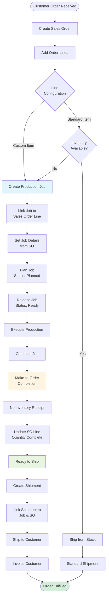

This workflow connects customer orders directly to production, enabling custom manufacturing with traceability from sales order through job completion and shipment.

## User Journey Overview



## Step-by-Step User Flow

### Step 1: Create Sales Order

**User Action:** Create sales order for customer

**API Endpoint:** `POST /x+/sales-order+/new`

**Fields:**
- Customer
- Order Date
- Sales Order Lines (items, quantities, prices)

**Related Workflow:** See Order-to-Cash workflow for sales order creation

---

### Step 2: Create Job from Sales Order Line

**User Action:** Navigate to sales order line → Create Job

**API Endpoint:** `POST /x+/sales-order+/$orderId.$lineId.jobs.tsx`

**Permissions Required:** `production.create`

**Job Creation from SO Line:**

**Auto-Populated Fields:**
- Item: From SO line
- Quantity: From SO line sale quantity
- Customer: From SO header
- Due Date: From SO line promised date or order date
- Sales Order ID: Linked to SO
- Sales Order Line ID: Linked to SO line

**User-Specified Fields:**
- Location (production location)
- Start Date
- Deadline Type
- Scrap Quantity

**Lot Sizing Logic:**

If item has lot size configured:

```typescript
const lotSize = itemManufacturing.data?.lotSize ?? 0;
const totalQuantity = line.saleQuantity ?? 0;
const totalJobs = lotSize > 0 ? Math.ceil(totalQuantity / lotSize) : 1;

const jobsToCreate = Math.max(1, totalJobs);

for await (const index of Array.from({ length: jobsToCreate }).keys()) {
  const isLastJob = index === jobsToCreate - 1;
  const jobQuantity =
    lotSize > 0
      ? isLastJob
        ? totalQuantity - lotSize * (jobsToCreate - 1)
        : lotSize
      : totalQuantity;
}
```

**Example:**
- SO Line Quantity: 250 units
- Item Lot Size: 100 units
- Jobs Created: 3
  - Job 1: 100 units
  - Job 2: 100 units
  - Job 3: 50 units

**Key Linkage:**
- Job.salesOrderId = Sales Order ID
- Job.salesOrderLineId = Sales Order Line ID

---

### Step 3: Plan and Release Job

**User Actions:**
1. Plan job (status → Planned)
2. Add operations and materials
3. Release job (status → Ready)

**Related Workflow:** See Job-to-Completion workflow for production process

**MRP Integration:**
- MRP triggered on Planned status
- Materials requirements calculated
- Purchase orders generated if needed

---

### Step 4: Execute Production

**User Actions:**
1. Start job (status → In Progress)
2. Record labor and machine time
3. Record production quantities
4. Perform quality checks

**System Tracking:**
- Production events logged
- Quantities tracked by operation
- Scrap and rework recorded

---

### Step 5: Complete Job (Make-to-Order Logic)

**User Action:** Click "Complete Job"

**API Endpoint:** `POST /x+/job+/$jobId.complete.tsx`

**Completion Detection:**

```typescript
const makeToOrder = !!salesOrderId || !!salesOrderLineId;
```

**Source:** `apps/erp/app/routes/x+/job+/$jobId.complete.tsx` (lines 47-68)

**Make-to-Order Completion:**

```typescript
if (makeToOrder) {
  const makeToOrderUpdate = await client
    .from("job")
    .update({
      status: "Completed" as const,
      completedDate: new Date().toISOString(),
      quantityComplete,
      updatedAt: new Date().toISOString(),
      updatedBy: userId
    })
    .eq("id", jobId);

  if (makeToOrderUpdate.error) {
    throw redirect(
      requestReferrer(request) ?? path.to.job(jobId),
      await flash(
        request,
        error(makeToOrderUpdate.error, "Failed to complete job")
      )
    );
  }
}
```

**Key Differences from Make-to-Stock:**
- ✗ **No inventory receipt created**
- ✗ **No inventory ledger entry**
- ✗ **No shelf/bin assignment**
- ✓ Job marked completed
- ✓ Quantity complete recorded
- ✓ Links maintained to sales order

**Result:**
- Job Status → "Completed"
- completedDate set
- quantityComplete recorded
- Ready for direct shipment to customer

---

### Step 6: Create Shipment from Job

**User Action:** Create shipment linked to job

**API Endpoint:** `POST /x+/shipment+/new`

**Shipment Configuration:**
- Source Document: Sales Order
- Link to Job
- Quantity: From job quantity complete
- Customer: From sales order
- Ship-to Location: From sales order

**No Inventory Allocation:**
- Items not in warehouse inventory
- Ship directly from production
- Shipment bypasses normal inventory picking

---

### Step 7: Ship to Customer

**User Action:** Post shipment

**API Endpoint:** `POST /x+/shipment+/$shipmentId.post.tsx`

**System Actions:**
- Generate packing slip
- Update sales order line quantities
- Mark line as shipped
- **No inventory ledger impact** (items never in stock)

**Related Workflow:** See Order-to-Cash workflow for shipment posting

---

### Step 8: Invoice Customer

**User Action:** Create and post sales invoice

**API Endpoint:** `POST /x+/sales-invoice+/new`

**Invoice Creation:**
- Source: Sales Order
- Quantities: From shipment
- Pricing: From sales order pricing

**Related Workflow:** See Order-to-Cash workflow for invoicing

---

## Key Characteristics

| Aspect | Make-to-Order | Make-to-Stock |
|--------|---------------|---------------|
| Job Link | Linked to sales order | No sales order link |
| Inventory Receipt | Not created | Created |
| Ledger Entry | Not created | Created (Output) |
| Stock Impact | No impact | Increases on-hand |
| Shipment Source | Direct from job | From warehouse |
| Lead Time | Order-to-ship | Immediate (if in stock) |
| Customization | High (customer-specific) | Low (standard items) |
| Traceability | Job → SO → Shipment | Item → Ledger → Shipment |

---

## Decision Points Summary

| Decision Point | Options | Impact |
|----------------|---------|--------|
| Inventory Available | Yes, No | Ship from stock vs manufacture |
| Lot Sizing | Enabled, Disabled | Single vs multiple jobs |
| Deadline Type | ASAP, Hard, Soft | Scheduling priority |
| Quality Check | Pass, Fail | Ship vs NCR |

---

## Alternative Paths

### Path: Configure-to-Order

**Scenario:** Customer selects configuration options

**Actions:**
1. Customer selects options via configurator
2. Configuration saved with sales order line
3. Job created with configuration data
4. BOM generated based on configuration
5. Production follows configured BOM

---

### Path: Engineer-to-Order

**Scenario:** Custom engineering required

**Actions:**
1. Engineering team designs solution
2. Create quote with custom BOM
3. Quote approved → sales order
4. Job created with engineered BOM
5. Production follows engineering specifications

---

### Path: Partial Shipment

**Scenario:** Some jobs complete before others

**Actions:**
1. Complete first job
2. Create partial shipment
3. Continue production on remaining jobs
4. Create additional shipments as jobs complete
5. Invoice when all shipped or partially

---

### Path: Job Cancellation

**Scenario:** Customer cancels order mid-production

**Actions:**
1. Cancel job (status → Cancelled)
2. Cancel or modify sales order
3. Handle work-in-progress:
   - Scrap partial assemblies
   - Return materials to inventory
   - Credit customer for deposits

---

## Error Recovery

### Job Not Linked to SO

**Symptom:** Job completes as Make-to-Stock instead of Make-to-Order

**Recovery:**
1. Verify salesOrderId and salesOrderLineId on job
2. If missing, cannot retroactively change completion type
3. Create manual adjustment:
   - Consume inventory (negative adjustment)
   - Ship to customer
   - Update sales order manually

---

### Quantity Mismatch

**Symptom:** Job completed quantity doesn't match SO line quantity

**Recovery:**
1. If under-produced:
   - Create additional job for shortage
   - Or update SO line quantity (customer approval)
2. If over-produced:
   - Scrap excess
   - Or keep as Make-to-Stock inventory (create receipt)

---

### Quality Failure Post-Completion

**Symptom:** Items fail inspection after job completed

**Recovery:**
1. Create NCR (Non-Conformance Report)
2. Disposition options:
   - Rework: Reopen job or create new job
   - Scrap: Write off production
   - Use As-Is: Customer approval required
3. Update job quantities and shipment accordingly

---

## Integration Points

### Sales Order Integration

- Job created from SO line
- Quantity synced from sale quantity
- Due date from promised date
- Customer information inherited

### Production Integration

- Standard job planning and execution
- MRP triggered for materials
- Operations and materials managed
- Quality checks enforced

### Inventory Integration

- **No inventory receipt** on completion
- **No stock impact** during process
- Materials consumed from inventory
- Finished goods ship direct

### Shipping Integration

- Shipment linked to both job and SO
- Quantities from job completion
- Packing slip references job number
- Traceability maintained

### Accounting Integration

- Revenue recognized on shipment/invoice
- COGS from actual job costs
- Job cost variance tracked
- Margin calculated per job

---

## API Endpoints Reference

| Endpoint | Method | Purpose | Permissions |
|----------|--------|---------|-------------|
| `/x+/sales-order+/$orderId.$lineId.jobs` | POST | Create job from SO line | `production.create` |
| `/x+/job+/$jobId.complete` | POST | Complete MTO job | `production.update` |
| `/x+/shipment+/new` | POST | Create shipment | `inventory.create` |
| `/x+/shipment+/$shipmentId.post` | POST | Post shipment | `inventory.update` |

---

## Source References

- `apps/erp/app/routes/x+/sales-order+/$orderId.$lineId.jobs.tsx` - Job creation from sales order line with lot sizing
- `apps/erp/app/modules/production/production.service.ts` - Business logic including lot sizing calculation
- `apps/erp/app/routes/x+/job+/$jobId.complete.tsx` - Make-to-Order completion logic (no inventory receipt)
- `docs/business-rules/production-jobs.md` - Complete job business rules
- `docs/user-stories/sales.md` - Make-to-Order user stories
