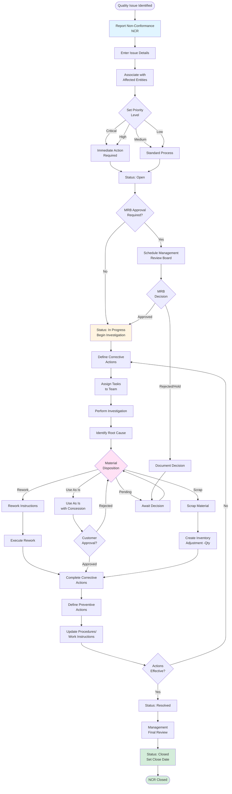

This workflow manages the identification, investigation, disposition, and resolution of quality issues and non-conformances, ensuring product quality and process improvement.

## User Journey Overview



## Step-by-Step User Flow

### Step 1: Report Non-Conformance

**User Action:** Identify and report quality issue

**API Endpoint:** `POST /x+/quality+/issues/new`

**Permissions Required:** `quality.create`

**Required Fields:**
- Name/Title (min 1 character)
- Location ID (where issue occurred)
- Non-Conformance Type (from predefined list)
- Priority: Low, Medium, High, Critical
- Source: Internal or External
- Open Date (required)

**Optional Fields:**
- Description
- Due Date
- Affected Quantity
- Customer (if external)
- Supplier (if receiving issue)

**Validation:**

```typescript
export const nonConformanceValidator = z.object({
  name: z.string().min(1, { message: "Name is required" }),
  locationId: z.string().min(1, { message: "Location is required" }),
  type: z.string().min(1, { message: "Type is required" }),
  priority: z.enum(["Low", "Medium", "High", "Critical"], {
    errorMap: () => ({ message: "Priority is required" })
  }),
  source: z.enum(["Internal", "External"], {
    errorMap: () => ({ message: "Source is required" })
  }),
  openDate: z.string().min(1, { message: "Open date is required" }),
  description: zfd.text(z.string().optional()),
  dueDate: zfd.text(z.string().optional()),
  affectedQuantity: zfd.numeric(z.number().optional())
});
```

**Initial Status:** Draft

**Error States:**
- "Name is required"
- "Location is required"
- "Type is required"
- "Priority is required"
- "Source is required"
- "Open date is required"

---

### Step 2: Associate with Affected Entities

**User Action:** Link NCR to affected items, orders, or operations

**Association Types:**

| Entity Type | Required Fields | Use Case |
|-------------|----------------|----------|
| Item | Item ID | General item quality issue |
| Customer | Customer ID | Customer complaint |
| Supplier | Supplier ID | Supplier quality issue |
| Job Operation | Job ID, Operation ID | Production defect |
| Purchase Order Line | PO ID, Line ID | Receiving defect |
| Sales Order Line | SO ID, Line ID | Customer return |
| Shipment Line | Shipment ID, Line ID | Shipping damage |
| Receipt Line | Receipt ID, Line ID | Receiving damage |
| Tracked Entity | Tracked Entity ID | Serial/batch specific issue |

**Validation:**

```typescript
export const nonConformanceAssociationValidator = z.object({
  nonConformanceId: z.string().min(1),
  type: z.enum([
    "Item",
    "Customer",
    "Supplier",
    "JobOperation",
    "PurchaseOrderLine",
    "SalesOrderLine",
    "ShipmentLine",
    "ReceiptLine",
    "TrackedEntity"
  ]),
  id: z.string().min(1, { message: "ID is required" }),
  lineId: zfd.text(z.string().optional()),
  quantity: zfd.numeric(z.number().optional())
});
```

**Validation Rules:**

```
IF type IN ["PurchaseOrderLine", "SalesOrderLine", "ShipmentLine", "ReceiptLine"]
THEN lineId REQUIRED
```

**Error States:**
- "ID is required"
- "Line ID is required" - For line-level associations

---

### Step 3: Set Priority and Source

**Decision Point: Priority Level**

| Priority | Response Time | Escalation | Impact |
|----------|--------------|------------|--------|
| Critical | Immediate | Executive | Production halt, safety risk |
| High | Same day | Manager | Customer impact, high cost |
| Medium | 48 hours | Supervisor | Process improvement |
| Low | 1 week | Team Lead | Minor defect, documentation |

**Source Classification:**

**Internal:**
- Production defects
- Process failures
- Equipment malfunctions
- Training issues

**External:**
- Customer complaints
- Supplier defects
- Receiving issues
- Field failures

---

### Step 4: Open NCR

**User Action:** Change status from Draft to Open

**API Endpoint:** `POST /x+/quality+/issues/$id.status.tsx`

**Status Transition:** Draft → Open

**System Actions:**
- Activate NCR
- Send notifications to responsible parties
- Start tracking against SLA

---

### Step 5: MRB Approval (If Required)

**Decision Point: MRB Required?**

MRB (Management Review Board) required for:
- Critical priority issues
- Customer-facing defects
- High-value material affected
- Regulatory compliance issues
- Safety concerns

**MRB Process:**

1. **Schedule MRB Meeting**
   - Quality manager
   - Production manager
   - Engineering (if needed)
   - Customer representative (if external)

2. **MRB Review**
   - Review issue details
   - Assess impact and risk
   - Determine disposition approach
   - Authorize investigation

3. **MRB Decision**
   - Approved → Proceed to investigation
   - Rejected → Close NCR or revise
   - Hold → Await more information

---

### Step 6: Investigation

**User Action:** Change status to In Progress

**Status Transition:** Open → In Progress

**Investigation Tasks:**

1. **Define Required Actions**
   - Investigation steps
   - Testing requirements
   - Analysis needed

2. **Assign Tasks**
   - Quality engineer
   - Production supervisor
   - Maintenance (if equipment-related)
   - Engineering (if design-related)

3. **Track Task Status**
   - Pending
   - In Progress
   - Completed
   - Skipped

**Task Fields:**
- Task Description
- Assigned To
- Due Date
- Status
- Completion Notes

---

### Step 7: Root Cause Analysis

**User Actions:**
1. Collect data
2. Perform analysis (5-Why, Fishbone, etc.)
3. Identify root cause
4. Document findings

**Analysis Methods:**
- 5-Why Analysis
- Fishbone Diagram
- Failure Mode Effects Analysis (FMEA)
- Pareto Analysis
- Control Charts

**Documentation:**
- Root cause description
- Contributing factors
- Supporting evidence
- Photos/attachments

---

### Step 8: Material Disposition

**User Action:** Determine what to do with affected material

**API Endpoint:** `POST /x+/quality+/issues/$id.disposition.tsx`

**Disposition Options:**

#### Option A: Rework

**Actions:**
1. Create rework instructions
2. Assign rework task
3. Place inventory on hold
4. Execute rework
5. Re-inspect
6. Release if passed

**Inventory Action:** Hold status

---

#### Option B: Use As-Is

**Actions:**
1. Document concession justification
2. Obtain customer approval (if external)
3. Update specifications (if permanent change)
4. Release material for use

**Customer Approval Required:**
- For customer-owned material
- For customer-specific requirements
- For out-of-spec dimensions

**Decision Point:** Customer approves use as-is?
- **Approved** → Release material
- **Rejected** → Rework or scrap

---

#### Option C: Scrap

**Actions:**
1. Create scrap authorization
2. Create inventory adjustment (negative)
3. Physically dispose of material
4. Update cost records

**Inventory Action:**
- API: `POST /x+/inventory+/quantities+/$itemId.adjustment`
- Adjustment Type: "Negative Adjmt."
- Quantity: Affected quantity
- Reason: Reference NCR number

**Related Workflow:** See Inventory-Adjustment workflow

---

#### Option D: Return to Supplier

**Actions:**
1. Create return shipment
2. Create debit memo
3. Ship material back to supplier
4. Follow up for credit/replacement

**For Receiving Issues:**
- Reference purchase order
- Document supplier responsibility
- Track supplier quality metrics

---

### Step 9: Corrective Actions

**User Action:** Implement corrective actions

**Corrective Action Types:**
- Process changes
- Training
- Equipment calibration
- Procedure updates
- Supplier changes
- Design changes

**Action Fields:**
- Action Description
- Responsible Party
- Due Date
- Status
- Completion Evidence

**Completion Evidence:**
- Photos of corrected condition
- Updated procedures
- Training records
- Calibration certificates

---

### Step 10: Preventive Actions

**User Action:** Implement preventive actions to avoid recurrence

**Preventive Action Types:**
- Standard work updates
- Training programs
- Equipment upgrades
- Process controls (poka-yoke)
- Inspection frequency increase
- Supplier audits

**Process Updates:**
1. Update work instructions
2. Update inspection plans
3. Update training materials
4. Update FMEA documents

**System Updates:**
- Update procedures in system
- Notify affected users
- Schedule training sessions

---

### Step 11: Verify Effectiveness

**User Action:** Verify corrective/preventive actions effective

**Verification Methods:**
- Re-audit process
- Monitor metrics (defect rate, cycle time, etc.)
- Customer feedback
- Follow-up inspection

**Decision Point: Actions Effective?**

- **Yes** → Mark as Resolved
- **No** → Define additional actions

**Effectiveness Period:** Monitor for 30-90 days typically

---

### Step 12: Mark as Resolved

**User Action:** Change status to Resolved

**API Endpoint:** `POST /x+/quality+/issues/$id.status.tsx`

**Status Transition:** In Progress → Resolved

**Requirements:**
- All tasks completed
- Disposition finalized
- Corrective actions implemented
- Preventive actions implemented
- Effectiveness verified

---

### Step 13: Final Review and Closure

**User Action:** Management reviews and closes NCR

**Final Review:**
- Verify all actions complete
- Review effectiveness data
- Approve closure

**User Action:** Change status to Closed

**Status Transition:** Resolved → Closed

**System Actions:**
- Set close date
- Lock NCR from further changes
- Archive NCR
- **Cannot reopen** once closed

**Audit Trail:**
- Created by, created at
- Updated by, updated at
- Closed by, close date
- All status changes logged
- All task completions logged

---

## Decision Points Summary

| Decision Point | Options | Impact |
|----------------|---------|--------|
| Priority | Critical, High, Medium, Low | Response time and escalation |
| Source | Internal, External | Investigation approach |
| MRB Required | Yes, No | Approval workflow |
| Disposition | Rework, Use As-Is, Scrap, Return | Material handling |
| Customer Approval | Approved, Rejected | Use as-is authorization |
| Actions Effective | Yes, No | Resolution or additional work |

---

## Alternative Paths

### Path: Reopen Closed NCR

**Trigger:** Issue recurs after closure

**Limitation:** **Cannot reopen closed NCRs**

**Solution:**
1. Create new NCR
2. Reference original NCR
3. Document recurrence
4. Re-investigate root cause

---

### Path: Supplier Corrective Action Request

**Trigger:** Supplier quality issue

**Actions:**
1. Create NCR for internal tracking
2. Issue SCAR (Supplier Corrective Action Request)
3. Request supplier root cause analysis
4. Request supplier corrective actions
5. Verify supplier actions effective
6. Close NCR when resolved

---

### Path: Customer Return

**Trigger:** Customer returns defective product

**Actions:**
1. Create NCR linked to sales order
2. Receive returned material
3. Investigate defect
4. Disposition (rework, credit, replace)
5. Implement corrective actions
6. Follow up with customer

---

## Error Recovery

### Cannot Close NCR

**Symptom:** System won't allow status change to Closed

**Recovery:**
1. Verify all tasks marked completed or skipped
2. Verify disposition set
3. Verify status is "Resolved" (not Open or In Progress)
4. Check required fields complete

---

### Lost Root Cause Documentation

**Symptom:** Insufficient documentation for closure

**Recovery:**
1. Re-investigate if needed
2. Interview involved parties
3. Review any available evidence
4. Document based on memory/notes
5. Note documentation limitations

---

## Integration Points

### Inventory Integration

- Scrap disposition creates inventory adjustment
- Hold status prevents usage
- Tracked entities linked for traceability

### Production Integration

- NCRs linked to jobs and operations
- Production may pause pending disposition
- Process updates flow to work instructions

### Purchasing Integration

- Supplier NCRs tracked
- Supplier quality metrics updated
- SCARs generated

### Sales Integration

- Customer complaints tracked
- Returns processed
- Customer satisfaction monitoring

### Risk Management Integration

- NCRs linked to risk register
- Risk assessments updated
- Mitigation actions tracked

---

## API Endpoints Reference

| Endpoint | Method | Purpose | Permissions |
|----------|--------|---------|-------------|
| `/x+/quality+/issues/new` | POST | Create NCR | `quality.create` |
| `/x+/quality+/issues/$id.status` | POST | Update NCR status | `quality.update` |
| `/x+/quality+/issues/$id.disposition` | POST | Set disposition | `quality.update` |
| `/x+/quality+/issues/$id.actions` | POST | Create corrective action | `quality.update` |
| `/x+/quality+/issues/$id.associations` | POST | Link to entities | `quality.update` |

---

## Source References

- `apps/erp/app/routes/x+/quality+/issues/new.tsx` - NCR creation with validation
- `apps/erp/app/routes/x+/quality+/issues/$id.status.tsx` - Status workflow transitions
- `apps/erp/app/modules/quality/quality.models.ts` (lines 170-193) - NCR validators
- `docs/user-stories/quality.md` (lines 93-225) - Non-conformance user stories with detailed workflow
