This workflow guides sales users through the complete order-to-cash cycle: creating sales orders, fulfilling shipments, generating invoices, and receiving payment.

## User Journey Overview

```mermaid
flowchart TD
    Start([Sales User Starts]) --> CreateOrder[Create Sales Order]
    CreateOrder --> AddLines[Add Order Lines]
    AddLines --> SetTerms[Set Payment &<br/>Shipping Terms]
    SetTerms --> ReviewOrder{Order<br/>Review}

    ReviewOrder -->|Changes Needed| AddLines
    ReviewOrder -->|Approved| ApprovalCheck{Needs<br/>Approval?}

    ApprovalCheck -->|Yes| SubmitApproval[Submit for Approval]
    ApprovalCheck -->|No| ReadyToShip[Status: To Ship<br/>and Invoice]
    SubmitApproval --> ManagerReview{Manager<br/>Decision}

    ManagerReview -->|Approved| ReadyToShip
    ManagerReview -->|Rejected| EditOrder[Revise Order]
    EditOrder --> AddLines

    ReadyToShip --> CreateShipment[Create Shipment]
    CreateShipment --> AddShipmentLines[Add Items to Ship]
    AddShipmentLines --> Tracking{Add Tracking<br/>Numbers?}

    Tracking -->|Yes| AddTracking[Enter Serial/Batch<br/>Numbers]
    Tracking -->|No| CarrierInfo[Enter Carrier &<br/>Tracking Number]
    AddTracking --> CarrierInfo

    CarrierInfo --> PostShipment[Post Shipment]
    PostShipment --> GeneratePacking[Generate Packing Slip]
    GeneratePacking --> UpdateInventory[Update Inventory<br/>Ledger]
    UpdateInventory --> ShipmentComplete{All Lines<br/>Shipped?}

    ShipmentComplete -->|No| StatusToInvoice[Order Status:<br/>To Invoice]
    ShipmentComplete -->|Yes, Invoice Pending| StatusToInvoice

    StatusToInvoice --> CreateInvoice[Create Sales Invoice]
    CreateInvoice --> InvoiceLines[Review Invoice Lines]
    InvoiceLines --> InvoiceTerms[Verify Payment Terms<br/>& Amounts]
    InvoiceTerms --> PostInvoice[Post Invoice]

    PostInvoice --> GenerateInvoicePDF[Generate Invoice PDF]
    GenerateInvoicePDF --> CreateGLEntries[Create GL Entries]
    CreateGLEntries --> EmailDecision{Email<br/>Customer?}

    EmailDecision -->|Yes| SendInvoiceEmail[Send Invoice Email<br/>with PDF]
    EmailDecision -->|No| InvoiceComplete[Invoice Posted]
    SendInvoiceEmail --> InvoiceComplete

    InvoiceComplete --> OrderStatusCheck{All Shipped<br/>& Invoiced?}

    OrderStatusCheck -->|No| MoreShipments[Create Additional<br/>Shipments]
    OrderStatusCheck -->|Yes| CompleteOrder[Order Status:<br/>Completed]

    MoreShipments --> CreateShipment

    CompleteOrder --> PaymentWait[Wait for Payment]
    PaymentWait --> PaymentReceived{Payment<br/>Received?}

    PaymentReceived -->|Yes| RecordPayment[Record Payment<br/>in Accounting]
    PaymentReceived -->|No| FollowUp[Follow Up<br/>with Customer]

    RecordPayment --> CloseOrder[Close Order]
    FollowUp --> PaymentWait

    CloseOrder --> Complete([Order Closed])

    style CreateOrder fill:#e1f5ff
    style PostShipment fill:#fff4e1
    style PostInvoice fill:#ffe1f5
    style CompleteOrder fill:#e7f5e1
    style Complete fill:#d4edda
```



## Step-by-Step User Flow

### Step 1: Create Sales Order

**User Action:** Navigate to Sales Orders → New Order

**System Action:** Display order creation form

**Required Fields:**
- Customer (required)
- Currency Code (required, defaults to customer currency or USD)
- Sales Person (optional, defaults to current user)
- Customer Location (optional)
- Customer Contact (optional)
- Order Date (defaults to today)

**API Endpoint:** `POST /x+/sales-order+/new`

**Permissions Required:** `sales.create`

**Initial Status:** Draft

**Decision Point:** Customer selection determines:
- Default currency and exchange rate
- Payment terms
- Shipping preferences
- Tax rates

**Error States:**
- "Customer is required" - Must select a customer
- "Currency Code is required" - Must have valid currency
- Sequence generation failure - Cannot create order ID

---

### Step 2: Add Order Lines

**User Action:** Click "Add Line" and configure line items

**System Action:** Create sales order line with specified attributes

**Line Types:**
- **Part** - Physical inventory items
- **Material** - Raw materials or components
- **Tool** - Tooling or equipment
- **Consumable** - Consumable supplies
- **Service** - Service items
- **Comment** - Text-only comment line
- **Fixed Asset** - Capital equipment

**Required Fields (for inventory types):**
- Item (from catalog)
- Sale Quantity
- Unit Price
- Unit of Measure
- Method Type (Make, Buy, Buy and Make)

**Required Fields (for Comment type):**
- Description only

**API Endpoint:** `POST /x+/sales-order+/$orderId.$lineId.details.tsx`

**Calculation:**
```
Line Total = Sale Quantity × Unit Price × (1 + Tax Percent)
Order Total = SUM(Line Totals)
```

**Decision Point:** Line type determines required fields

**Error States:**
- "Part is required" - Must select item for inventory line types
- "Method type is required" - Must select Make, Buy, or Buy and Make
- "Comment is required" - Comment lines need description text
- "Tax percent must be between 0 and 1" - Invalid tax percentage

---

### Step 3: Set Payment & Shipping Terms

**User Action:** Configure payment and shipping details on separate tabs

#### Payment Configuration

**API Endpoint:** `POST /x+/sales-order+/$orderId.payment.tsx`

**Fields:**
- Invoice Customer (defaults to order customer)
- Invoice Customer Location (optional)
- Invoice Customer Contact (optional)
- Payment Term (from predefined terms)

**Payment Term Types:**
- **Net** - Days from invoice date (e.g., Net 30)
- **End of Month (EOM)** - Due at end of month + days
- **Day of Month** - Due on specific day

**Payment Term Calculation:**
```
Due Date = Invoice Date + Payment Term Days
(Or calculated per EOM/Day of Month rules)
```

#### Shipping Configuration

**API Endpoint:** `POST /x+/sales-order+/$orderId.shipment.tsx`

**Fields:**
- Ship From Location
- Shipping Method
- Receipt Requested Date (customer desired date)
- Shipping Cost
- Shipping Customer (defaults to order customer)
- Shipping Customer Location
- Drop Shipment (checkbox for direct to customer shipping)

**Error States:**
- Invalid payment term selection
- Missing required shipping location for drop shipment

---

### Step 4: Order Review & Approval

**User Action:** Review order totals and submit for approval if required

**Decision Point: Needs Approval?**

Approval may be required based on:
- Order total exceeds limit
- Customer credit hold
- Special pricing
- Manual approval flag

**Path A: No Approval Required**

**User Action:** Mark order as ready

**System Action:** Status changes to "To Ship and Invoice"

**API Endpoint:** `POST /x+/sales-order+/$orderId.status.tsx`

**Path B: Approval Required**

**User Action:** Change status to "Needs Approval"

**System Action:**
- Status → "Needs Approval"
- Notification sent to approvers
- Order locked from editing

**Manager Action:** Review and approve/reject

**If Approved:**
- Status → "To Ship and Invoice"
- User receives approval notification

**If Rejected:**
- Status → "Draft"
- User receives rejection with notes
- Order can be edited and resubmitted

**Error States:**
- "Cannot change status" - Insufficient permissions
- "Order validation failed" - Missing required fields

---

### Step 5: Create Shipment

**User Action:** Navigate to order → Create Shipment

**System Action:** Create shipment record with Draft status

**API Endpoint:** `GET/POST /x+/shipment+/new`

**Permissions Required:** `inventory.create`

**Shipment Fields:**
- Source Document: Sales Order (auto-linked)
- Carrier: UPS, FedEx, USPS, DHL, Other
- Tracking Number
- Shipment Date (defaults to today)
- Customer (from sales order)
- Location (ship-from location)

**Decision Point:** Partial or full shipment?
- **Full** - Ship all order lines
- **Partial** - Ship subset of lines or quantities

**Error States:**
- "Source document required" - Must link to sales order
- "No lines to ship" - Must have at least one line item

---

### Step 6: Add Items to Shipment

**User Action:** Add lines from sales order to shipment

**System Action:** Create shipment lines linked to order lines

**API Endpoint:** `POST /x+/shipment+/lines.update.tsx`

**Fields per Line:**
- Item (from sales order line)
- Quantity (≤ remaining quantity on order line)
- Unit of Measure
- Bin/Shelf Location

**Decision Point: Item Tracking**

**If item requires serial tracking:**
- User must enter serial numbers
- Route: `/x+/shipment+/lines.tracking.tsx`
- System validates serial numbers exist in inventory

**If item requires batch tracking:**
- User must select batch/lot numbers
- Route: `/x+/shipment+/lines.tracking.tsx`
- System validates batch quantities

**If no tracking required:**
- System auto-allocates from available inventory

**Error States:**
- "Insufficient quantity available" - Not enough inventory
- "Serial number required" - Item tracking not specified
- "Batch number required" - Batch tracking not specified
- "Invalid serial number" - Serial doesn't exist in inventory

---

### Step 7: Post Shipment

**User Action:** Click "Post Shipment" button

**System Action:** Finalize shipment and update inventory

**API Endpoint:** `POST /x+/shipment+/$shipmentId.post.tsx`

**Edge Function:** `post-shipment`

**Permissions Required:** `inventory.update`

**Posting Process:**

1. **Validate Shipment**
   - Status must be "Draft" or "Pending"
   - All lines have valid quantities
   - Tracking numbers entered (if required)

2. **Update Shipment Status** → "Pending"

3. **Call Edge Function** - `post-shipment`
   - Fetch shipment header
   - Fetch shipment lines
   - Fetch tracking entities

4. **Create Item Ledger Entries**
   - For each line, create ledger entry:
     - Entry Type: "Sales"
     - Document Type: "Shipment"
     - Quantity: Negative (outbound from inventory)
     - Cost: From inventory valuation
     - Posting Date: Shipment date

5. **Update Job Quantities** (if linked to production jobs)
   - Increment `quantityShipped`
   - Increment `quantityComplete` (if applicable)

6. **Generate Packing Slip PDF**
   - Route: `/file+/shipment+/$id[.]pdf`
   - Store in Supabase storage: `{companyId}/shipment/{shipmentId}.pdf`
   - Create document record

7. **Update Shipment Status** → "Posted"

8. **Update Sales Order Status**

**Decision Point: All Lines Shipped?**

```
IF all order lines fully shipped THEN
  IF invoice already posted THEN
    Order Status = "Completed"
  ELSE
    Order Status = "To Invoice"
ELSE
  Order Status = "To Ship and Invoice" (remains unchanged)
```

**Error States:**
- "Failed to fetch shipment" - Shipment not found
- "Failed to update item ledger" - Inventory transaction failed (rollback)
- "PDF generation fails" - Non-blocking, logged but posting continues
- "Status update fails" - Flash message with error details

**Success State:**
- Shipment status → "Posted"
- Packing slip PDF generated
- Inventory reduced
- Sales order status updated appropriately
- Redirect to shipment detail page with success message

---

### Step 8: Create Sales Invoice

**User Action:** Navigate to order → Create Invoice (or auto-create from shipment)

**System Action:** Create invoice from shipment or order

**API Endpoint:** `GET/POST /x+/sales-invoice+/new`

**Edge Function:** `convert` - Type: varies

**Permissions Required:** `sales.create`

**Invoice Creation Options:**

**Option A: From Shipment**

**Service Function:** `createSalesInvoiceFromShipment()`

- Auto-populates invoice lines from shipment
- Quantities match shipped quantities
- Unit prices from sales order
- Shipping costs from shipment

**Option B: From Sales Order**

**Service Function:** `createSalesInvoiceFromSalesOrder()`

- User selects which lines to invoice
- Supports partial invoicing
- Can invoice before shipping (prepayment)

**Invoice Fields:**
- Customer (from order)
- Invoice Date (defaults to today)
- Due Date (calculated from payment terms)
- Currency & Exchange Rate (from order)
- Invoice Lines with quantities and prices

**Decision Point:** Timing of invoice vs shipment

- **Invoice After Shipment** - Standard flow
- **Invoice Before Shipment** - Prepayment or deposit
- **Progress Billing** - Partial invoicing during fulfillment

---

### Step 9: Post Invoice

**User Action:** Review invoice totals and click "Post Invoice"

**System Action:** Finalize invoice and create accounting entries

**API Endpoint:** `POST /x+/sales-invoice+/$invoiceId.post.tsx`

**Edge Function:** `post-sales-invoice`

**Permissions Required:** `sales.update`

**Posting Process:**

1. **Validate Invoice**
   - Status must be "Draft" or "Pending"
   - All lines have valid quantities and prices
   - Customer information complete

2. **Update Invoice Status** → "Pending"

3. **Call Edge Function** - `post-sales-invoice`
   - Fetch invoice header
   - Fetch invoice lines
   - Fetch linked shipment data
   - Fetch sales order lines

4. **Calculate Invoice Totals**
   ```
   Line Total = Quantity × Unit Price
   Subtotal = SUM(Line Totals)
   Shipping = Shipment Shipping Cost
   Tax = Subtotal × Tax Percent
   Total = Subtotal + Shipping + Tax
   ```

5. **Create General Ledger Entries**
   - **Debit** Accounts Receivable (customer balance)
   - **Credit** Revenue (sales income)
   - **Credit** Deferred Revenue (if applicable)
   - Additional entries for tax and shipping

6. **Generate Invoice PDF**
   - Route: `/file+/sales-invoice+/$id[.]pdf`
   - Store in Supabase storage: `{companyId}/opportunity/{opportunityId}/{invoiceId}.pdf`
   - Create document record

7. **Send Email Notification** (Optional)
   - Template: `SalesInvoiceEmail` from `@carbon/documents/email`
   - Trigger: `send-email-resend` task via Trigger.dev
   - Recipient: Customer contact
   - Attachment: Invoice PDF

8. **Update Invoice Status** → "Posted"

9. **Update Sales Order Status**

**Decision Point: All Lines Invoiced?**

```
IF all order lines fully invoiced THEN
  IF shipment already posted THEN
    Order Status = "Completed"
  ELSE
    Order Status = "To Ship"
ELSE
  Order Status = "To Ship and Invoice" (remains)
```

**Error States:**
- "Status update to Pending fails" - Return error, don't proceed
- "Posting function invocation fails" - Revert status to Draft
- "PDF generation fails" - Return error, don't finalize
- "Email sending fails" - Log error but posting completes
- "GL entry creation fails" - Transactional rollback

**Success State:**
- Invoice status → "Posted"
- Invoice PDF generated and emailed (if selected)
- GL entries created
- Sales order status updated
- Due date calculated based on payment terms
- Redirect to invoice detail page with success message

---

### Step 10: Payment Processing

**User Action:** Record payment when received from customer

**External Integration:** Xero (optional)

**Webhook:** `/api+/webhook.xero.ts`

**Xero Sync Process:**

1. **Invoice Sync to Xero**
   - Posted sales invoices sync to Xero as ACCREC invoices
   - Customer contact information synced
   - Line items with GL codes

2. **Payment Notification**
   - Xero sends webhook when payment received
   - Webhook signature verified (HMAC-SHA256)
   - Payment linked to Carbon invoice

3. **Accounting Sync**
   - Background job: `accounting-sync`
   - Updates invoice payment status
   - Creates payment ledger entries

**Manual Payment Recording:**

- User creates payment record in accounting module
- Links payment to invoice(s)
- Records payment method and date
- Updates invoice as paid

**Decision Point:** Payment method
- Credit card
- ACH/bank transfer
- Check
- Wire transfer

**Error States:**
- "Webhook signature invalid" - Security verification failed
- "Invoice not found" - Xero invoice doesn't match Carbon invoice
- "Payment amount mismatch" - Payment doesn't match invoice total

---

### Step 11: Order Completion

**System Action:** Order automatically transitions to "Completed" when:
- All lines fully shipped (shipment(s) posted)
- All lines fully invoiced (invoice(s) posted)

**User Action:** Review completed order and close if needed

**API Endpoint:** `POST /x+/sales-order+/$orderId.status.tsx`

**Status Change:** Completed → Closed

**Service Function:** `closeSalesOrder()`

**Close Action:**
- Status → "Closed"
- Assignee cleared (set to null)
- Closed date timestamp recorded
- Order locked from further changes

**Decision Point:** Leave open or close?
- **Leave Open** - May need to reference or add notes
- **Close** - Administrative closure for reporting

**Final State:**
- Financial transactions finalized
- Inventory adjustments complete
- Revenue recognized
- Customer balance updated
- Audit trail complete

---

## Decision Points Summary

| Decision Point | Options | Impact |
|----------------|---------|--------|
| Needs Approval | Yes, No | Approval workflow vs direct to fulfillment |
| Item Tracking | Serial, Batch, None | Shipment tracking requirements |
| Partial Shipment | Partial, Full | Multiple shipments vs single shipment |
| Invoice Timing | Before Ship, After Ship, Progress | Cash flow and revenue recognition |
| Email Invoice | Yes, No | Customer notification method |
| Payment Method | Multiple types | Accounting and reconciliation process |
| Order Closure | Open, Closed | Administrative status for reporting |

---

## Alternative Paths

### Path: Order Cancelled

**Trigger:** Customer cancels order before shipment

**User Action:** Change order status to "Cancelled"

**System Action:**
- Status → "Cancelled"
- Inventory reservations released
- Open shipments voided
- Open invoices voided
- Notification to customer (optional)

**API Endpoint:** `POST /x+/sales-order+/$orderId.status.tsx`

### Path: Partial Returns

**Trigger:** Customer returns items after shipment

**User Action:** Create return shipment

**System Action:**
- Create shipment with negative quantities
- Link to original sales order
- Update inventory (increase)
- Create credit memo
- Reverse GL entries

**Routes:**
- Return shipment creation
- Credit memo generation

### Path: Void Shipment

**Trigger:** Shipment posted in error

**User Action:** Click "Void Shipment"

**API Endpoint:** `POST /x+/shipment+/$shipmentId.void.tsx`

**System Action:**
- Reverse item ledger entries
- Status → "Voided"
- Inventory quantities restored
- Sales order status reverted

**Restrictions:** Can only void if invoice not yet posted

### Path: Void Invoice

**Trigger:** Invoice posted in error

**User Action:** Click "Void Invoice"

**API Endpoint:** `POST /x+/sales-invoice+/$invoiceId.void.tsx`

**System Action:**
- Reverse GL entries
- Status → "Voided"
- Sales order status reverted
- Customer balance adjusted

**Restrictions:** Can only void if payment not yet received

---

## Error Recovery

### Shipment Posting Failure

**Symptom:** "Failed to update item ledger"

**Recovery Steps:**
1. Verify inventory quantities available
2. Check item posting group configuration
3. Retry shipment posting
4. If persistent, check item ledger table constraints
5. Contact system administrator if unresolved

### Invoice Posting Failure

**Symptom:** "Posting function invocation fails"

**Recovery Steps:**
1. Verify all invoice lines have valid GL codes
2. Check customer posting group setup
3. Verify currency and exchange rate valid
4. Retry invoice posting
5. Check accounting period not closed
6. Review edge function logs if persistent

### PDF Generation Failure

**Symptom:** "Failed to generate PDF"

**Recovery Steps:**
1. Verify all required fields populated
2. Check document template configuration
3. Retry PDF generation
4. Manual PDF creation as fallback
5. Email customer separately if needed

### Email Delivery Failure

**Symptom:** "Failed to send email"

**Recovery Steps:**
1. Verify customer contact email address valid
2. Check email service status (Trigger.dev)
3. Invoice still posted successfully
4. Manually send PDF to customer
5. Customer can access via portal if enabled

---

## API Endpoints Reference

| Endpoint | Method | Purpose | Permissions |
|----------|--------|---------|-------------|
| `/x+/sales-order+/new` | POST | Create new sales order | `sales.create` |
| `/x+/sales-order+/$orderId.status` | POST | Update order status | `sales.update` |
| `/x+/sales-order+/$orderId.payment` | POST | Configure payment terms | `sales.update` |
| `/x+/sales-order+/$orderId.shipment` | POST | Configure shipping | `sales.update` |
| `/x+/shipment+/new` | POST | Create new shipment | `inventory.create` |
| `/x+/shipment+/$shipmentId.post` | POST | Post shipment (finalize) | `inventory.update` |
| `/x+/shipment+/$shipmentId.void` | POST | Void shipment | `inventory.update` |
| `/x+/shipment+/lines.update` | POST | Update shipment lines | `inventory.update` |
| `/x+/shipment+/lines.tracking` | POST | Manage tracking numbers | `inventory.update` |
| `/x+/sales-invoice+/new` | POST | Create new invoice | `sales.create` |
| `/x+/sales-invoice+/$invoiceId.post` | POST | Post invoice (finalize) | `sales.update` |
| `/x+/sales-invoice+/$invoiceId.void` | POST | Void invoice | `sales.update` |
| `/file+/shipment+/$id[.]pdf` | GET | Generate packing slip | - |
| `/file+/sales-invoice+/$id[.]pdf` | GET | Generate invoice PDF | - |
| `/api+/webhook.xero` | POST | Xero webhook receiver | Public (verified) |

---

## Source References

- `apps/erp/app/routes/x+/sales-order+/new.tsx` - Sales order creation with customer and line validation
- `apps/erp/app/routes/x+/shipment+/$shipmentId.post.tsx` - Shipment posting route triggering edge function
- `apps/erp/app/routes/x+/sales-invoice+/$invoiceId.post.tsx` - Invoice posting route with PDF and email
- `packages/database/supabase/functions/post-shipment/index.ts` - Edge function for shipment finalization and inventory ledger
- `packages/database/supabase/functions/post-sales-invoice/index.ts` - Edge function for invoice finalization and GL entries
- `apps/erp/app/modules/sales/sales.service.ts` - `closeSalesOrder()` and status update logic
- `apps/erp/app/modules/invoicing/invoicing.service.ts` - `createSalesInvoiceFromShipment()` and `createSalesInvoiceFromSalesOrder()`
- `apps/erp/app/modules/sales/sales.models.ts` - Validators: `salesOrderValidator`, `salesOrderLineValidator`, `salesOrderShipmentValidator`
- `docs/business-rules/sales-orders.md` - Complete sales order business rules with validation and calculations
- `llm/cache/shipments-receipts-ui-patterns.md` - Shipment UI patterns and route structure
