This workflow guides purchasing users through creating purchase orders, planning materials via MRP, receiving inventory from suppliers, and completing the procurement cycle.

## User Journey Overview

```mermaid
flowchart TD
    Start([Purchasing User Starts]) --> CreatePO[Create Purchase Order]
    CreatePO --> AddLines[Add PO Lines]
    AddLines --> SetPricing[Set Unit Prices &<br/>Quantities]
    SetPricing --> SetDelivery[Configure Delivery<br/>Details]
    SetDelivery --> ReviewPO{PO Review}

    ReviewPO -->|Changes Needed| AddLines
    ReviewPO -->|Ready| MarkPlanned[Mark as Planned]

    MarkPlanned --> TriggerMRP[MRP Triggered]
    TriggerMRP --> MaterialCalc[Calculate Material<br/>Requirements]
    MaterialCalc --> ApprovalCheck{Requires<br/>Approval?}

    ApprovalCheck -->|Yes| SendForReview[Send for Review]
    ApprovalCheck -->|No| ReadyToReceive[Status: To Receive]

    SendForReview --> ManagerReview{Manager<br/>Decision}
    ManagerReview -->|Approved| ReadyToReceive
    ManagerReview -->|Rejected| RejectPO[Status: Rejected]

    RejectPO --> ClosePO[Close PO]
    ClosePO --> End([Workflow Ends])

    ReadyToReceive --> CreateReceipt[Create Receipt]
    CreateReceipt --> AddReceiptLines[Add Items Received]
    AddReceiptLines --> QualityCheck{Quality<br/>Inspection?}

    QualityCheck -->|Yes| Inspect[Perform Inspection]
    QualityCheck -->|No| TrackingCheck{Serial/Batch<br/>Tracking?}

    Inspect --> InspectionResult{Pass<br/>Inspection?}
    InspectionResult -->|Failed| CreateNCR[Create NCR]
    InspectionResult -->|Passed| TrackingCheck

    CreateNCR --> TrackingCheck

    TrackingCheck -->|Yes| EnterTracking[Enter Serial/Batch<br/>Numbers]
    TrackingCheck -->|No| BinLocation[Assign Bin Location]

    EnterTracking --> BinLocation
    BinLocation --> PostReceipt[Post Receipt]
    PostReceipt --> UpdateInventory[Update Inventory<br/>Ledger]
    UpdateInventory --> ReceiptComplete{All Lines<br/>Received?}

    ReceiptComplete -->|No| MoreReceipts[Create Additional<br/>Receipts]
    ReceiptComplete -->|Yes, Invoice Pending| StatusToInvoice[PO Status:<br/>To Invoice]

    MoreReceipts --> CreateReceipt

    StatusToInvoice --> ProcessInvoice[Process Supplier<br/>Invoice]
    ProcessInvoice --> MatchInvoice[Match to<br/>Receipt]
    MatchInvoice --> PostInvoice[Post Purchase<br/>Invoice]
    PostInvoice --> CreateAPEntry[Create AP Ledger<br/>Entry]
    CreateAPEntry --> CompletePO[PO Status:<br/>Completed]

    CompletePO --> Complete([PO Completed])

    style CreatePO fill:#e1f5ff
    style TriggerMRP fill:#fff4e1
    style PostReceipt fill:#e7f5e1
    style CompletePO fill:#d4edda
    style Complete fill:#d4edda
```



## Step-by-Step User Flow

### Step 1: Create Purchase Order

**User Action:** Navigate to Purchase Orders → New PO

**System Action:** Display PO creation form

**Required Fields:**
- Supplier (required)
- PO Type: "Purchase" or "Outside Processing"
- Order Date (defaults to today)
- Location (required for standard PO, not for drop shipment)

**Optional Fields:**
- Buyer (defaults to current user)
- Payment Terms
- Shipping Method
- Notes

**API Endpoint:** `POST /x+/purchase-order+/new`

**Permissions Required:** `purchasing.create`

**Initial Status:** Draft

**Decision Point:** PO Type selection
- **Purchase** - Standard inventory procurement
- **Outside Processing** - Send items to supplier for processing (plating, machining, etc.)

**Error States:**
- "Supplier is required" - Must select a supplier
- "Location is required" - Required for non-drop-shipment POs

---

### Step 2: Add Purchase Order Lines

**User Action:** Click "Add Line" and configure line items

**System Action:** Create PO line record

**Required Fields:**
- Item (from catalog)
- Purchase Quantity
- Unit of Measure
- Supplier Unit of Measure (can differ from inventory UOM)
- Conversion Factor (defaults to 1)

**Optional Fields:**
- Unit Price (can be populated from supplier pricing)
- Requested Receipt Date
- Location (defaults from header)
- Shelf (bin location)

**API Endpoint:** `POST /x+/purchase-order+/$orderId.$lineId.details.tsx`

**Permissions Required:** `purchasing.update`

**Conversion Factor Logic:**

The conversion factor allows buying in different units than inventory tracking:

```
Inventory Unit Price = (Supplier Unit Price × Exchange Rate) / Conversion Factor
```

**Example:**
- Buy in cases of 100 units
- Track in inventory as each
- Conversion Factor = 100
- Supplier price: $50/case
- Inventory unit price: $50 ÷ 100 = $0.50/each

**Decision Point:** Conversion factor required?
- **Same UOM** - Conversion factor = 1
- **Different UOM** - Calculate conversion factor

**Error States:**
- "Item is required" - Must select an item
- "Purchase quantity must be greater than 0"
- "Unit price must be greater than or equal to 0"
- "Conversion factor must be greater than 0"

---

### Step 3: Configure Delivery Details

**User Action:** Navigate to Delivery tab and configure shipping

**API Endpoint:** `POST /x+/purchase-order+/$orderId.delivery.tsx`

**Standard PO Fields:**
- Receiving Location (required)
- Shelf/Bin (optional)
- Requested Receipt Date

**Drop Shipment Fields:**
- Drop Shipment checkbox (true/false)
- Customer (required for drop shipment)
- Customer Location (ship-to address, required)
- Receiving Location (NOT required for drop shipment)

**Validation Rules:**

```typescript
IF dropShipment === true THEN
  customerId required - "Customer is required for drop shipment"
  customerLocationId required - "Customer location is required for drop shipment"
  locationId NOT required
ELSE
  locationId required - "Location is required"
  customerId NOT required
  customerLocationId NOT required
```

**Decision Point:** Drop shipment or standard receipt?
- **Standard** - Items received to warehouse
- **Drop Shipment** - Items ship directly to customer (see Drop-Shipment workflow)

---

### Step 4: Set Pricing

**User Action:** Enter or verify unit prices for each line

**System Action:** Calculate extended amounts

**Pricing Sources:**
- Manual entry
- Supplier pricing agreements
- Historical pricing
- RFQ responses

**Calculation:**
```
Line Extended Amount = Purchase Quantity × Supplier Unit Price
PO Total = SUM(Line Extended Amounts)
```

**Multi-Currency Support:**
- Currency Code (defaults to supplier currency)
- Exchange Rate (auto-populated or manual)
- Conversion: `Home Currency Amount = Foreign Amount × Exchange Rate`

---

### Step 5: Mark as Planned (MRP Trigger)

**User Action:** Change PO status from "Draft" to "Planned"

**System Action:** Trigger Material Requirements Planning

**API Endpoint:** `POST /x+/purchase-order+/$orderId.status.tsx`

**Permissions Required:** `purchasing.update`

**MRP Trigger Logic:**

```typescript
if (status === "Planned") {
  await runMRP(getCarbonServiceRole(), {
    type: "purchaseOrder",
    id,
    companyId,
    userId
  });
}
```

**MRP Process:**
1. Recalculate material requirements across company
2. Update supply projections for PO items
3. Adjust demand recommendations
4. Update related production jobs if applicable

**Status Transition:** Draft → Planned

**Decision Point:** After planning, order may need approval

---

### Step 6: Submit for Review (Optional)

**User Action:** Change status to "To Review" if approval required

**System Action:** Notify approvers

**API Endpoint:** `POST /x+/purchase-order+/$orderId.status.tsx`

**Status Transition:** Planned → To Review

**Approval Criteria:**
- Order total exceeds approval limit
- New supplier
- Special terms
- Manual approval flag

**Manager Actions:**

**Option A: Approve**
- Status → "To Receive"
- User notified
- Ready for receiving

**Option B: Reject**
- Status → "Rejected"
- User notified with rejection notes
- Can revise and resubmit or close PO

**Rejection Path:**
- Rejected → Closed (terminal state)
- Cannot receive against rejected POs

---

### Step 7: Create Receipt

**User Action:** Navigate to PO → Create Receipt

**System Action:** Create receipt record with Draft status

**API Endpoint:** `GET/POST /x+/receipt+/new`

**Permissions Required:** `inventory.create`

**Receipt Fields:**
- Source Document: Purchase Order (auto-linked)
- Receipt Date (defaults to today)
- Supplier (from PO)
- Location (from PO or delivery config)

**Decision Point:** Partial or full receipt?
- **Full** - Receive all PO lines
- **Partial** - Receive subset of lines or quantities
- **Over-Receipt** - Receive more than ordered (if allowed)

---

### Step 8: Add Receipt Lines

**User Action:** Add items being received

**System Action:** Create receipt lines linked to PO lines

**API Endpoint:** `POST /x+/receipt+/lines.update.tsx`

**Fields per Line:**
- Item (from PO line)
- Received Quantity (≤ or > ordered quantity, depending on policy)
- Unit of Measure
- Bin/Shelf Location
- Unit Cost (from PO line)

**Decision Point: Item Tracking Requirements**

**If Serial Tracking Required:**
- Route: `/x+/receipt+/lines.tracking.tsx`
- User enters serial numbers for each unit
- System validates serials are unique and not already in inventory

**If Batch/Lot Tracking Required:**
- Route: `/x+/receipt+/lines.tracking.tsx`
- User enters batch/lot numbers
- System creates tracked entity records
- Can receive multiple batches in single receipt

**If No Tracking:**
- System auto-processes without tracking numbers

**Error States:**
- "Received quantity must be greater than 0"
- "Serial number required" - Item requires serial tracking
- "Batch number required" - Item requires batch tracking
- "Duplicate serial number" - Serial already exists
- "Quantity exceeds PO quantity" - Over-receipt not allowed (if configured)

---

### Step 9: Quality Inspection (Optional)

**User Action:** Perform quality inspection on received items

**Decision Point: Inspection Required?**

Inspection may be required based on:
- Item configuration (inspection required flag)
- Supplier quality rating
- Critical materials
- New supplier
- Random sampling

**Inspection Results:**

**Pass:**
- Proceed to posting
- Items available for use

**Fail:**
- Create Non-Conformance Report (NCR)
- Route: `/x+/quality+/issues/new`
- Items placed on hold
- Disposition decision required:
  - **Return to Supplier** - Create return shipment
  - **Scrap** - Destroy material
  - **Use As Is** - Approve with concession
  - **Rework** - Correct defects

**Related Workflow:** See Non-Conformance-Resolution workflow

---

### Step 10: Post Receipt

**User Action:** Click "Post Receipt" button

**System Action:** Finalize receipt and update inventory

**API Endpoint:** `POST /x+/receipt+/$receiptId.post.tsx`

**Edge Function:** `post-receipt`

**Permissions Required:** `inventory.update`

**Posting Process:**

1. **Validate Receipt**
   - Status must be "Draft" or "Pending"
   - All lines have valid quantities
   - Tracking numbers entered (if required)
   - Bin locations assigned

2. **Update Receipt Status** → "Pending"

3. **Call Edge Function** - `post-receipt`
   - Fetch receipt header
   - Fetch receipt lines
   - Fetch tracking entities
   - Fetch linked PO lines

4. **Create Item Ledger Entries**
   - For each line, create ledger entry:
     - Entry Type: "Purchase"
     - Document Type: "Receipt"
     - Quantity: Positive (inbound to inventory)
     - Cost: From PO line unit price
     - Posting Date: Receipt date
     - Apply conversion factor to quantities

5. **Update Inventory On-Hand Quantities**
   - Increment available quantity
   - Update location/shelf balances
   - Create/update tracked entities (serial/batch)

6. **Update PO Line Quantities**
   - Increment `quantityReceived`
   - Calculate remaining: `Remaining = Purchase Quantity - Quantity Received`

7. **Update Receipt Status** → "Posted"

8. **Update PO Status**

**Decision Point: All Lines Received?**

```
IF all PO lines fully received THEN
  IF invoice already posted THEN
    PO Status = "Completed"
  ELSE
    PO Status = "To Invoice"
ELSE
  PO Status = "To Receive" (remains unchanged)
```

**Error States:**
- "Failed to fetch receipt" - Receipt not found
- "Failed to update item ledger" - Inventory transaction failed (rollback)
- "Status update fails" - Database error
- "Insufficient storage space" - Location capacity exceeded (warning)

**Success State:**
- Receipt status → "Posted"
- Inventory increased
- PO status updated appropriately
- Items available for use in production/sales
- Redirect to receipt detail page with success message

---

### Step 11: Process Supplier Invoice

**User Action:** Enter supplier invoice when received

**System Action:** Create purchase invoice linked to receipt

**API Endpoint:** `GET/POST /x+/purchase-invoice+/new`

**Permissions Required:** `purchasing.create`

**Invoice Fields:**
- Supplier
- Invoice Number (from supplier)
- Invoice Date
- Due Date (calculated from payment terms)
- Currency & Exchange Rate

**Invoice Matching:**
- **Three-Way Match:** PO → Receipt → Invoice
  - Verify quantities match
  - Verify prices match
  - Verify totals match
- **Variance Handling:** Price or quantity differences
  - Small variances auto-approved
  - Large variances require approval
  - Adjustments to ledger entries

**Decision Point:** Variance resolution
- **Accept** - Post invoice with variances
- **Reject** - Return to supplier for correction
- **Partial Accept** - Post partial amount

---

### Step 12: Post Purchase Invoice

**User Action:** Click "Post Invoice"

**System Action:** Create accounts payable entries

**API Endpoint:** `POST /x+/purchase-invoice+/$invoiceId.post.tsx`

**Edge Function:** `post-purchase-invoice`

**Posting Process:**

1. **Create GL Entries**
   - **Credit** Accounts Payable (supplier balance)
   - **Debit** Inventory (or expense accounts)
   - Additional entries for tax and freight

2. **Update Invoice Status** → "Posted"

3. **Update PO Status**

```
IF all PO lines fully invoiced THEN
  IF receipt already posted THEN
    PO Status = "Completed"
  ELSE
    PO Status = "To Receive and Invoice" (remains)
ELSE
  PO Status = "To Invoice" (remains)
```

**Error States:**
- "Invoice amount mismatch" - Doesn't match PO/receipt
- "GL posting failed" - Accounting period closed or other GL error
- "Supplier account not found" - AP setup issue

---

### Step 13: PO Completion

**System Action:** PO automatically transitions to "Completed" when:
- All lines fully received (receipt(s) posted)
- All lines fully invoiced (invoice(s) posted)

**User Action:** Review completed PO and close if needed

**API Endpoint:** `POST /x+/purchase-order+/$orderId.status.tsx`

**Status Change:** Completed → Closed

**Close Action:**
- Status → "Closed"
- Assignee cleared (set to null)
- Closed date timestamp recorded
- PO locked from further changes

**Decision Point:** Leave open or close?
- **Leave Open** - May need to reference or add notes
- **Close** - Administrative closure for reporting

---

## Decision Points Summary

| Decision Point | Options | Impact |
|----------------|---------|--------|
| PO Type | Purchase, Outside Processing | Workflow behavior |
| Drop Shipment | Yes, No | Receiving location requirements |
| Conversion Factor | Same UOM, Different UOM | Price calculation |
| Approval Required | Yes, No | Review workflow |
| Item Tracking | Serial, Batch, None | Receipt entry requirements |
| Quality Inspection | Required, Not Required | NCR creation |
| Partial Receipt | Partial, Full, Over | Multiple receipts |
| Invoice Variance | Accept, Reject, Partial | Payment processing |
| PO Closure | Open, Closed | Administrative status |

---

## Alternative Paths

### Path: PO Rejected

**Trigger:** Manager rejects PO during review

**User Action:** Status changes to "Rejected"

**System Action:**
- Cannot receive against rejected PO
- Cannot invoice rejected PO
- Must close PO to complete workflow

**Recovery:** Revise and create new PO

---

### Path: Receipt Voiding

**Trigger:** Receipt posted in error

**User Action:** Click "Void Receipt"

**API Endpoint:** `POST /x+/receipt+/$receiptId.void.tsx`

**System Action:**
- Reverse item ledger entries
- Status → "Voided"
- Inventory quantities restored
- PO quantities adjusted

**Restrictions:** Can only void if invoice not yet posted

---

### Path: Over-Receipt

**Trigger:** Receive more than ordered quantity

**System Action:**
- If over-receipt allowed: Process normally
- If not allowed: Error message "Quantity exceeds PO quantity"

**Configuration:** Item or location setting controls over-receipt policy

---

### Path: Return to Supplier

**Trigger:** Defective items need return

**User Action:** Create return shipment

**System Action:**
- Create outbound shipment to supplier
- Negative quantity receipt
- Update PO quantities
- Create debit memo

---

## Error Recovery

### MRP Trigger Failure

**Symptom:** "Failed to run MRP"

**Recovery Steps:**
1. Verify PO status is "Planned"
2. Check material requirements setup
3. Retry status change
4. If persistent, manually run MRP from production planning

---

### Receipt Posting Failure

**Symptom:** "Failed to update item ledger"

**Recovery Steps:**
1. Verify item posting group configuration
2. Check inventory valuation method
3. Verify bin/location setup
4. Retry receipt posting
5. Check item ledger table for constraints
6. Contact system administrator if unresolved

---

### Three-Way Match Failure

**Symptom:** "Invoice amount mismatch"

**Recovery Steps:**
1. Compare PO prices to invoice prices
2. Verify quantities received vs invoiced
3. Check for freight/tax differences
4. Create variance approval request
5. Adjust invoice or request supplier correction

---

## API Endpoints Reference

| Endpoint | Method | Purpose | Permissions |
|----------|--------|---------|-------------|
| `/x+/purchase-order+/new` | POST | Create new PO | `purchasing.create` |
| `/x+/purchase-order+/$orderId.status` | POST | Update PO status (MRP trigger) | `purchasing.update` |
| `/x+/purchase-order+/$orderId.delivery` | POST | Configure delivery/drop shipment | `purchasing.update` |
| `/x+/purchase-order+/$orderId.$lineId.details` | POST | Update PO line | `purchasing.update` |
| `/x+/receipt+/new` | POST | Create new receipt | `inventory.create` |
| `/x+/receipt+/$receiptId.post` | POST | Post receipt (finalize) | `inventory.update` |
| `/x+/receipt+/$receiptId.void` | POST | Void receipt | `inventory.update` |
| `/x+/receipt+/lines.update` | POST | Update receipt lines | `inventory.update` |
| `/x+/receipt+/lines.tracking` | POST | Manage serial/batch tracking | `inventory.update` |
| `/x+/purchase-invoice+/new` | POST | Create purchase invoice | `purchasing.create` |
| `/x+/purchase-invoice+/$invoiceId.post` | POST | Post invoice | `purchasing.update` |
| `/api+/mrp` | POST | Trigger MRP calculation | `inventory.update` |

---

## Source References

- `apps/erp/app/routes/x+/purchase-order+/new.tsx` - PO creation with supplier validation
- `apps/erp/app/routes/x+/purchase-order+/$orderId.status.tsx` - Status update triggering MRP
- `apps/erp/app/routes/x+/receipt+/$receiptId.post.tsx` - Receipt posting route
- `packages/database/supabase/functions/post-receipt/index.ts` - Edge function for receipt finalization and inventory ledger
- `apps/erp/app/modules/purchasing/purchasing.service.ts` - Business logic including MRP trigger
- `apps/erp/app/modules/purchasing/purchasing.models.ts` - Validators: `purchaseOrderValidator`, `purchaseOrderLineValidator`, drop shipment validation
- `docs/business-rules/purchase-orders.md` - Complete PO business rules with MRP integration and conversion factors
- `llm/cache/mrp-system.md` - MRP system documentation including PO integration
