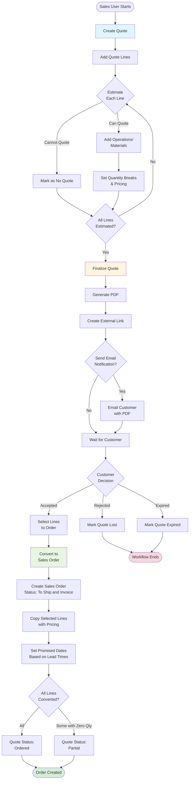

This workflow guides sales users through creating a quote, estimating costs, finalizing for customer review, and converting accepted quotes into sales orders.

## User Journey Overview



## Step-by-Step User Flow

### Step 1: Create Quote

**User Action:** Navigate to Quotes → New Quote

**System Action:** Display quote creation form

**Required Fields:**
- Customer (required)
- Sales Person (optional, defaults to current user)
- Estimator (optional)
- Customer Location (optional)
- Customer Contact (optional)
- Due Date (optional)
- Expiration Date (optional)

**API Endpoint:** `POST /x+/quote+/new.tsx`

**Permissions Required:** `sales.create`

**Decision Point:** Customer selection determines currency and contact defaults

**Error States:**
- "Customer is required" - Must select a customer before proceeding
- Sequence generation failure - Cannot create quote ID

---

### Step 2: Add Quote Lines

**User Action:** Click "Add Line" and fill in line details

**System Action:** Create quote line record with status "Not Started"

**Required Fields:**
- Item (part number from catalog)
- Description
- Method Type (Make, Buy, Service)
- Unit of Measure
- Quantity array (supports multiple quantity breaks: [100, 500, 1000])
- Tax Percent (0-1 range)

**API Endpoint:** `POST /x+/quote+/$quoteId.$lineId.details.tsx`

**Permissions Required:** `sales.create` or `sales.update`

**Decision Point:** Method Type determines next steps:
- **Make** → Add operations and materials
- **Buy** → Set supplier and unit cost
- **Service** → Define service parameters

**Error States:**
- "Part is required" - Must select an item
- "Description is required" - Cannot be blank
- "Method is required" - Must choose Make/Buy/Service
- "Unit of measure is required" - Must select UOM
- "Quantity is required" - Must have at least one positive quantity
- "Tax percent must be between 0 and 1" - Invalid tax percentage

---

### Step 3: Estimate Costs

**User Action:** For each line, define manufacturing process or purchase costs

#### Option A: Make Items

**User Action:** Add operations to make method

**Required for Inside Operations:**
- Setup time, unit, rate
- Labor time, unit, rate
- Machine time, unit, rate
- Overhead rate
- Work center (optional at quote stage)

**Required for Outside Operations:**
- Supplier/process
- Minimum cost
- Unit cost
- Lead time

**API Endpoint:** `POST /x+/quote+/$quoteId.$lineId.cost.new.tsx`

**User Action:** Add materials to make method

**Required Fields:**
- Item ID
- Quantity
- Unit cost
- Unit of measure

**Error States:**

Inside Operations:
- "Setup unit is required"
- "Setup time is required"
- "Labor unit is required"
- "Labor time is required"
- "Machine unit is required"
- "Machine time is required"
- "Labor rate is required"
- "Machine rate is required"
- "Overhead rate is required"

Outside Operations:
- "Minimum is required"
- "Unit cost is required"
- "Lead time is required"

#### Option B: Buy Items

**User Action:** Set supplier unit cost

**System Action:** Calculate total cost based on quantity

#### Option C: Cannot Quote

**User Action:** Change line status to "No Quote"

**System Action:** Prompt for no quote reason

**Field:** `noQuoteReason` (text field)

**Note:** Lines marked "No Quote" are excluded from finalization and conversion

---

### Step 4: Set Pricing and Discounts

**User Action:** Navigate to line pricing table

**System Action:** Display quantity breaks with editable pricing

**Fields per Quantity Break:**
- Quantity
- Unit Price (calculated from costs + markup)
- Discount Percent (0-100%)
- Net Unit Price (auto-calculated: unitPrice × (1 - discountPercent))
- Lead Time (days)
- Shipping Cost
- Add-on charges

**Calculation:**
```
Net Unit Price = Unit Price × (1 - Discount Percent)
Line Total = Quantity × Net Unit Price × (1 + Tax Percent)
```

**API Endpoint:** `POST /x+/quote+/$quoteId.$lineId.recalculate-price.tsx`

**Decision Point:** Different pricing for different quantities allows volume discounts

---

### Step 5: Finalize Quote

**User Action:** Click "Finalize Quote" button

**System Action:** Validate all lines and prepare for customer

**Pre-Finalization Validation:**
- At least one line must have status "Complete" or "In Progress"
- Lines with "No Quote" status are excluded

**Finalization Steps:**

1. **Update Quote Status** → "Sent"
2. **Update Line Statuses** → All non-"No Quote" lines → "Complete"
3. **Set Completion Date** → Current timestamp
4. **Generate PDF** → Quote document from template
5. **Upload to Storage** → `{companyId}/opportunity/{opportunityId}/{fileName}.pdf`
6. **Create External Link** → Customer portal access URL
7. **Create Document Record** → Metadata tracking
8. **(Optional) Send Email** → Customer notification with PDF attachment

**API Endpoint:** `POST /x+/quote+/$quoteId.finalize.tsx`

**Permissions Required:** `sales.create` (employee role)

**Decision Point: Email Notification**

If user selects "Email" notification:
- **Required:** Customer contact with email address
- **System Action:** Send email via Trigger.dev task `send-email-resend`
- **Recipients:** User email + Customer contact email
- **Attachment:** Quote PDF

**Email Validation:**
- "Supplier contact is required for email" - Must select contact if email chosen

**Error States:**
- "Failed to generate PDF" - PDF generation failure
- "Failed to upload file" - Storage upload error
- "Failed to create document" - Document record creation error
- "Failed to send email" - Email delivery failure
- "Failed to finalize quote" - Database update failure

**Success State:**
- Quote status → "Sent"
- External link created for customer portal access
- Redirect to quote detail page with success message

---

### Step 6: Customer Review (External)

**User Action (Customer):** Access quote via external link

**External URL:** `/share+/quote.$id.tsx`

**Customer View:**
- Read-only quote details
- All line items with pricing
- Quantity break options
- PDF download
- Digital acceptance form (optional)

**Decision Point:** Customer decides to accept, reject, or request changes

**Digital Acceptance:**
- Customer enters name and email
- System records `digitalQuoteAcceptedBy` and `digitalQuoteAcceptedByEmail`
- Timestamp recorded

---

### Step 7: Convert to Sales Order

**User Action:** Navigate to quote → Click "Convert to Order"

**System Action:** Display line selection drawer

**User Selections:**
- Select which lines to convert
- Select quantity for each line (from quantity breaks)
- Verify pricing and lead times
- Enter customer PO number (optional)

**API Endpoint:** `POST /x+/quote+/$quoteId.convert.tsx`

**Edge Function:** `convert` - Type: `quoteToSalesOrder`

**Permissions Required:** `sales.create`

**Conversion Process:**

1. **Validate Selected Lines**
   - Each line must have: quantity, netUnitPrice, addOn, shippingCost, leadTime
   - Lines with quantity = 0 are marked as not converted

2. **Create Sales Order Header**
   - Status: "To Ship and Invoice"
   - Order Date: Current date
   - Copy customer, contacts, locations from quote
   - Copy currency and exchange rate
   - Copy sales person (or default to current user)
   - Store customer PO number in `customerReference`

3. **Copy Payment Terms**
   - Source: `quotePayment` table
   - Destination: `salesOrderPayment` table
   - Fields: invoice customer, location, contact, payment terms

4. **Copy Shipping Information**
   - Source: `quoteShipment` table
   - Destination: `salesOrderShipment` table
   - Fields: location, shipping method, requested date, shipping cost

5. **Create Sales Order Lines**
   - Filter: Only lines with quantity > 0
   - Status: "Ordered"
   - Calculate promised date: order date + lead time days
   - Copy pricing: unit price, add-on, shipping cost, tax percent
   - Auto-activate items in inventory

6. **Map Customer Part Numbers**
   - Create/update `customerPartToItem` records
   - Link customer part ID and revision to inventory items
   - Upserts to avoid duplicates

7. **Transfer 3D Models**
   - Update `item.modelUploadId` if models attached to quote lines
   - Supports CAD/model file association

8. **Update Quote Status**

**Decision Point: Full or Partial Conversion**

```
IF all selected lines have quantity > 0 THEN
  Quote Status = "Ordered"
ELSE
  Quote Status = "Partial"
```

**Error States:**
- "Invalid selected lines data" - JSON parsing/validation failure
- "Quote with id {id} not found" - Quote doesn't exist
- "Quote Lines with id {id} not found" - No lines found
- "Quote payment with id {id} not found" - Payment data missing
- "Quote shipping with id {id} not found" - Shipping data missing
- "sales order is not created" - Insert failure
- "Failed to convert quote to order" - Transaction rollback

**Success State:**
- Sales order created with status "To Ship and Invoice"
- Redirect to sales order detail page: `/x+/sales-order+/{orderId}`
- Flash message: "Successfully converted quote to order"
- Quote status updated to "Ordered" or "Partial"

---

## Decision Points Summary

| Decision Point | Options | Impact |
|----------------|---------|--------|
| Method Type | Make, Buy, Service | Determines cost estimation process |
| Can Quote Line? | Yes, No | "No Quote" lines excluded from finalization |
| Email Notification | Yes, No | Customer receives email with PDF or just external link |
| Customer Decision | Accept, Reject, Expired | Determines next workflow step |
| Lines to Convert | All, Some, Zero Qty | Determines quote final status (Ordered vs Partial) |

---

## Alternative Paths

### Path: Quote Lost

**Trigger:** Customer declines quote

**User Action:** Change quote status to "Lost"

**API Endpoint:** `POST /x+/quote+/$quoteId.status.tsx`

**System Action:** Quote marked as lost, workflow ends

### Path: Quote Expired

**Trigger:** Expiration date passes

**System Action:** Quote status automatically changed to "Expired"

**Note:** Expired quotes cannot be converted to sales orders

### Path: Quote Cancelled

**Trigger:** User cancels quote before finalization

**User Action:** Change quote status to "Cancelled"

**System Action:** Quote marked as cancelled, workflow ends

### Path: Partial Conversion

**Trigger:** Some lines converted with zero quantity

**System Action:**
- Quote status → "Partial"
- Converted lines linked to sales order
- Remaining lines stay with quote
- Quote can be re-converted later for remaining lines

---

## Error Recovery

### PDF Generation Failure

**Symptom:** "Failed to generate PDF"

**Recovery Steps:**
1. Verify all quote lines have complete data
2. Check quote header has customer information
3. Retry finalization
4. If persistent, contact system administrator

### Email Delivery Failure

**Symptom:** "Failed to send email"

**Recovery Steps:**
1. Verify customer contact has valid email address
2. Check email service status
3. Quote is still finalized - manually send PDF to customer
4. Customer can still access via external link

### Conversion Failure

**Symptom:** "Failed to convert quote to order"

**Recovery Steps:**
1. Verify all selected lines have valid pricing
2. Check customer has valid data (location, contacts)
3. Ensure quote status is "Sent"
4. Retry conversion with same or different line selection
5. If persistent, check database constraints and logs

---

## API Endpoints Reference

| Endpoint | Method | Purpose | Permissions |
|----------|--------|---------|-------------|
| `/x+/quote+/new.tsx` | POST | Create new quote | `sales.create` |
| `/x+/quote+/$quoteId.details.tsx` | POST | Update quote header | `sales.update` |
| `/x+/quote+/$quoteId.$lineId.details.tsx` | POST | Update quote line | `sales.update` |
| `/x+/quote+/$quoteId.$lineId.cost.new.tsx` | POST | Add operation/material | `sales.update` |
| `/x+/quote+/$quoteId.$lineId.cost.delete.tsx` | POST | Remove operation/material | `sales.update` |
| `/x+/quote+/$quoteId.$lineId.recalculate-price.tsx` | POST | Recalculate line pricing | `sales.update` |
| `/x+/quote+/$quoteId.finalize.tsx` | POST | Finalize quote (PDF, email) | `sales.create` (employee) |
| `/x+/quote+/$quoteId.convert.tsx` | POST | Convert to sales order | `sales.create` |
| `/x+/quote+/$quoteId.status.tsx` | POST | Update quote status | `sales.update` |
| `/file+/quote+/$id[.]pdf` | GET | Download quote PDF | Public (with link) |
| `/share+/quote.$id.tsx` | GET | Customer portal view | Public (with link) |
| `/api+/sales.digital-quote.$id.tsx` | POST | Digital acceptance API | Public (with link) |

---

## Source References

- `apps/erp/app/routes/x+/quote+/new.tsx` - Quote creation route with customer validation
- `apps/erp/app/routes/x+/quote+/$quoteId.finalize.tsx` - Finalization with PDF generation and email
- `apps/erp/app/routes/x+/quote+/$quoteId.convert.tsx` - Quote to sales order conversion UI
- `packages/database/supabase/functions/convert/index.ts` - Edge function implementing conversion logic
- `apps/erp/app/modules/sales/sales.service.ts` - `finalizeQuote()` and conversion business logic
- `apps/erp/app/modules/sales/sales.models.ts` - Validators: `quoteValidator`, `quoteLineValidator`, `quoteFinalizeValidator`
- `packages/database/supabase/migrations/20240715024405_quotes.sql` - Quote schema definition
- `packages/database/supabase/migrations/20240715134816_quote-pricing.sql` - Quote pricing table schema
